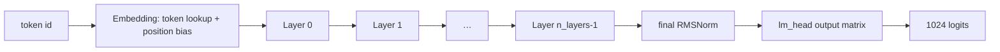
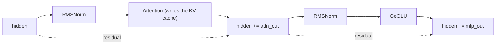

# 00 · Overview: What an Inference Engine Does

> By the end of this article you will know: what the full text-generation pipeline looks like, what each step is called, and a map of this repository's code.
> Corresponding source: `src/main.cpp` (main flow), `src/model.cpp` (forward pass).

## 1. Start with a question

You type into a terminal:

```bash
./build/gemma --weights_path weights/tiny_weights.bin \
    --tok_path weights/tiny_tokenizer.bin \
    --prompt "The meaning of life" --n_dec 64
```

The program prints a stretch of text. What happened behind the scenes? Broken down, it's six steps:

```mermaid
flowchart LR
    A["Text prompt<br/>'The meaning of life'"] -->|"① Tokenizer"| B["Number sequence<br/>[6, 800, 112, ...]"]
    B -->|"② Embedding + per-layer forward (prefill)"| C["Probability distribution"]
    C -->|"③ Sample"| D["One new number"]
    D -->|"④ Decode: run forward on one more number"| C2["New probability distribution"]
    C2 -->|"③ Sample"| D2["Next number"]
    D2 -.->|"Repeat ③④, until long enough / EOS"| C2
    D2 -->|"⑤ Detokenizer"| O["Text output"]
```



| Step | Name | Input → Output | Details in |
|---|---|---|---|
| ① | Tokenizer | text → number sequence | [01 - Tokenizer](01-Tokenizer.md) |
| ② | Embedding + per-layer forward (prefill) | number sequence → probability distribution | [03](03-Embeddings-and-Positional-Encoding.md)–[08](08-MLP-and-GeGLU.md) |
| ③ | Sampling | probability distribution → one new number | [11 - Sampling](11-Sampling.md) |
| ④ | Decode: forward one more step | sequence + new number → new distribution | [06](06-Attention.md), [07](07-KV-Cache-and-GQA.md) |
| ⑤ | Detokenizer | number sequence → text | [01 - Tokenizer](01-Tokenizer.md) |

The engine's job is exactly three things: **turn text into numbers, push the numbers through a neural network, turn the new numbers back into text**. All the fancy techniques (quantization, SIMD, KV cache…) serve steps ② and ④ — because those two are the slowest and the most memory-hungry.

## 2. What each step does (intuition first; each later article expands one step)

### ① Tokenizer: text → numbers

A neural network only understands numbers, not letters. The tokenizer looks up a "dictionary" (the vocabulary) and turns "The" into 6, " " into 800, "meaning" into 112… The dictionary has 1024 entries (we call them tokens). Details in [01 - Tokenizer](01-Tokenizer.md).

### ② Forward pass: numbers → probability distribution

Given a number sequence, the model's job is to answer one question: **"What is the most likely next number?"**

- First, look each number up to turn it into a vector ([03 - Embeddings and Positional Encoding](03-Embeddings-and-Positional-Encoding.md))
- Then push the vectors through N "transformer" blocks. Inside each block there are two big things:
  - **Attention**: lets each word "look at" every word before it ([06 - Attention](06-Attention.md))
  - **MLP**: transforms each word independently ([08 - MLP and GeGLU](08-MLP-and-GeGLU.md))
- Finally, map the vector to 1024 scores (the **logits**); the higher a score, the more likely that word is the next one

This full pass over the entire prompt is called **prefill**.

### ③ Sampling: probability distribution → one new number

Logits are not probabilities yet. First softmax converts them into probabilities, then some rule picks one number ([11 - Sampling](11-Sampling.md)):
- **Greedy**: just take the highest-probability word
- **Min-P / temperature**: add randomness so answers aren't identical every time

### ④ Decode: new number → forward again

Append the newly picked number to the end of the sequence and run the forward pass again, producing the distribution for the *next* number… and so on, one number at a time — this is **autoregressive generation**. Note: step ④ is nearly identical to step ②, but it processes only **one** new number — and a huge optimization opportunity hides in exactly that ([07 - KV Cache and GQA](07-KV-Cache-and-GQA.md)).

### ⑤ Detokenizer: numbers → text

Look the generated number sequence up in the dictionary and output it as text.

## 3. Why talk about "prefill" and "decode" separately?

Same forward-pass code, very different workload:

| | Prefill (consumes the prompt) | Decode (generates one word per pass) |
|---|---|---|
| Words processed per pass | 7 (the whole prompt) | 1 |
| How many times it runs | 1 | n_dec times (tens to hundreds) |
| Bottleneck | compute | compute + memory bandwidth |

"58.8 tokens/second" refers to decode speed — you need roughly 60 characters per second for chat not to feel laggy. So the engine's optimization focus is always the decode path.

## 4. What our forward pass looks like (the shape)

Open `Model::forward_token` in `src/model.cpp` — it is the heart of the whole engine, and it's only 30 lines. With the details stripped away:

```cpp
void Model::forward_token(uint32_t token, uint32_t pos) {
    // 1. Embedding: token lookup + position bias → a 256-dim hidden vector
    dequant_row(embed_tokens + token * dim, ..., hidden);   // token vector
    dequant_row(embed_positions + pos * dim, ..., pos_emb); // position vector
    hidden += pos_emb;

    // 2. Per layer: attention + MLP, with RMSNorm in between to keep the
    //    numbers stable
    for (uint32_t l = 0; l < cfg.n_layers; l++) {
        rmsnorm(hidden, gamma_attn[l], h_norm);            // normalize
        attention_block(..., pos, kvc[l], rope, ...);      // attention (writes the KV cache)
        hidden += attn_out;                                 // residual connection

        rmsnorm(hidden, gamma_ffn[l], ffn_norm);
        mlp_block(..., gate, up);                           // GeGLU
        hidden += mlp_out;                                  // residual connection
    }

    // 3. Output: normalize, then multiply by the "output matrix" → 1024 logits
    rmsnorm(hidden, final_norm_gamma, h_norm);
    gemv_i8_f32(lm_head, h_norm, logits);
}
```

The shape of the whole pipeline:



Inside each layer (one complete loop between layers):



It's fine if the terms don't mean anything yet — the next 12 articles unpack each one. For now, just memorize this **shape**: embedding → N layers (normalize → attention → residual → normalize → MLP → residual) → output matrix → logits.

## 5. Repository map

```
src/
  main.cpp      main flow: CLI parsing, generation loop (this article)
  config.h      model config (layer counts, dims), binary-format header structs
  tensor.h      aligned buffers, tensor descriptors (minimal utility classes)
  weights.cpp   weights file loader (02)
  tokenizer.cpp text ↔ numbers (01)
  kernel.cpp    SIMD matrix-multiply kernels (09, 10)
  ops.cpp       RMSNorm / RoPE / SiLU / softmax (04, 05, 06)
  kv_cache.h    KV cache (07)
  sampler.cpp   sampling (11)
  model.cpp     forward pass (03, 06, 07, 08)
py/
  common.py            quantization, binary writing (02, 09)
  make_test_weights.py test model generation (random weights)
  reference_model.py   NumPy reference implementation — the C++ "answer key" (12)
  generate_golden.py   golden test-data generation (12)
  e2e_reference.py     end-to-end reference (12)
tests/
  unit_tests.cpp     13 unit tests (12)
  integration.cpp    end-to-end integration test (12)
```

## 6. Suggested verification

After reading this, run the full pipeline once and match each step against what you learned:

```bash
make test                     # all tests pass
./build/gemma --weights_path weights/tiny_weights.bin \
    --tok_path weights/tiny_tokenizer.bin --dump   # model config and tensor layout
./build/gemma --weights_path weights/tiny_weights.bin \
    --tok_path weights/tiny_tokenizer.bin \
    --prompt "The meaning of life" --n_dec 16 --seed 42   # a real inference run
```

> The "gibberish" output is normal: the test model's weights are random numbers — it has never learned anything. This engine validates that the **pipeline is correct**, not that the model is smart. Plug in real Gemma weights and the output becomes fluent text.

## Exercises

1. With `--n_dec 0` (generate no words at all), what work does the program still do? (Hint: prefill)
2. Why does decoding generate one word at a time instead of a whole sentence at once? (Hint: the choice of the next word depends on the words already generated)
