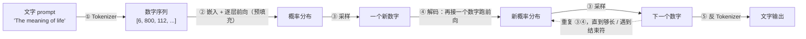
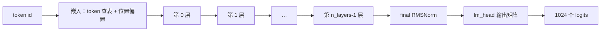
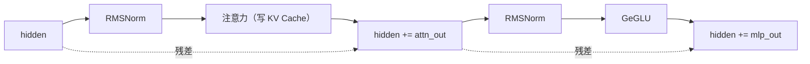

# 00 · 总览：一个推理引擎在做什么

> 读完这篇你会知道：大模型生成文本的完整流程长什么样、每一步叫什么名字、本仓库的代码地图。
> 对应源码：`src/main.cpp`（主流程）、`src/model.cpp`（前向计算）。

## 一、从一个问题开始

你在终端里敲下：

```bash
./build/gemma --weights_path weights/tiny_weights.bin \
    --tok_path weights/tiny_tokenizer.bin \
    --prompt "The meaning of life" --n_dec 64
```

程序会输出一段文本。这背后发生了什么？拆开来看，一共六个步骤：



| 步骤 | 名字 | 输入 → 输出 | 细节见 |
|---|---|---|---|
| ① | Tokenizer | 文字 → 数字序列 | 《01-Tokenizer》 |
| ② | 嵌入 + 逐层前向（预填充） | 数字序列 → 概率分布 | 《03》~《08》 |
| ③ | 采样 | 概率分布 → 一个新数字 | 《11-采样》 |
| ④ | 解码：再前向一步 | 序列 + 新数字 → 新概率分布 | 《06》《07》 |
| ⑤ | 反 Tokenizer | 数字序列 → 文字 | 《01-Tokenizer》 |

引擎的职责只有三件事：**把文字变成数字、让数字穿过神经网络、把新数字变回文字**。所有复杂技术（量化、SIMD、KV Cache……）都是为第②④步服务的——因为那两步最慢、最耗内存。

## 二、每一步在干什么（先建立直觉，细节后面各篇展开）

### ① Tokenizer：文字 → 数字

神经网络只认识数字，不认识字母。Tokenizer 查一本"词典"（词表），把 "The" 变成 6、" " 变成 800、"meaning" 变成 112……词典有 1024 个词条（我们叫 token）。细节见《01-Tokenizer》。

### ② 前向计算（forward）：数字 → 概率分布

输入一个数字序列，模型要做的是回答一个问题：**"下一个数字最可能是几？"**

- 先把每个数字查表变成向量（《03-嵌入与位置编码》）
- 然后让向量穿过 N 层"变换器"（Transformer block）。每层内部有两件大事：
  - **注意力**：让每个词"看看"它前面的所有词（《06-注意力》）
  - **MLP**：对每个词独立做一轮变换（《08-MLP与GeGLU》）
- 最后把向量映射成 1024 个分数（叫 **logits**），分数越高代表"下一个词是它"的可能性越大

这一遍把整个 prompt 处理完的过程叫**预填充（prefill）**。

### ③ 采样：概率分布 → 一个新数字

logits 还不是概率。先用 softmax 转成概率，再按规则选一个数字（《11-采样》）：
- **贪心**：直接选概率最高的
- **Min-P / 温度**：引入随机性，让回答不千篇一律

### ④ 解码（decode）：新数字 → 再前向

把新选出的数字接在序列末尾，再跑一遍前向，得到"再下一个数字"的概率……如此循环，一次生成一个数字，这叫**自回归生成（autoregressive）**。注意：第 4 步和第 2 步几乎一样，但只处理**一个**新数字——这里藏着巨大的优化空间（《07-KV-Cache与GQA》）。

### ⑤ 反 Tokenizer：数字 → 文字

把生成的数字序列查词典变回文字，输出。

## 三、为什么"预填充"和"解码"要分开说？

同一段 forward 代码，但工作量差别很大：

| | 预填充（吃 prompt） | 解码（每次生成 1 个词） |
|---|---|---|
| 一次处理多少词 | 7 个（整个 prompt） | 1 个 |
| 发生几次 | 1 次 | n_dec 次（几十到几百） |
| 瓶颈 | 计算量 | 计算量 + 内存带宽 |

"58.8 token/秒"说的就是解码速度——你输出 60 个字/秒，聊天才不卡顿。所以引擎优化的重点永远是解码路径。

## 四、我们的前向计算长什么样（结构）

打开 `src/model.cpp` 的 `Model::forward_token`，它是整个引擎最核心的代码，一共只有 30 行。去掉细节后：

```cpp
void Model::forward_token(uint32_t token, uint32_t pos) {
    // 1. 嵌入：token 查表 + 位置偏置，得到 256 维向量 hidden
    dequant_row(embed_tokens + token * dim, ..., hidden);   // token 向量
    dequant_row(embed_positions + pos * dim, ..., pos_emb); // 位置向量
    hidden += pos_emb;

    // 2. 逐层：注意力 + MLP，每层之间用 RMSNorm 稳定数值
    for (uint32_t l = 0; l < cfg.n_layers; l++) {
        rmsnorm(hidden, gamma_attn[l], h_norm);            // 归一化
        attention_block(..., pos, kvc[l], rope, ...);      // 注意力（写入KV Cache）
        hidden += attn_out;                                 // 残差连接

        rmsnorm(hidden, gamma_ffn[l], ffn_norm);
        mlp_block(..., gate, up);                           // GeGLU
        hidden += mlp_out;                                  // 残差连接
    }

    // 3. 输出：归一化后乘"输出矩阵"，得到 1024 个 logits
    rmsnorm(hidden, final_norm_gamma, h_norm);
    gemv_i8_f32(lm_head, h_norm, logits);
}
```

整条流水线的形状是：



每一层的内部（两层之间的一个完整循环）：



看不懂每个名词没关系——后面 12 篇文章就是逐个把这些名词讲透。现在只需要记住这个**形状**：嵌入 → N 层（归一化→注意力→残差→归一化→MLP→残差）→ 输出矩阵 → logits。

## 五、仓库地图

```
src/
  main.cpp      主流程：命令行解析、生成循环（本篇）
  config.h      模型配置（层数、维度）、二进制格式的头结构
  tensor.h      对齐缓冲区、张量描述符（最小的工具类）
  weights.cpp   权重文件加载器（02篇）
  tokenizer.cpp 文字↔数字（01篇）
  kernel.cpp    SIMD 矩阵乘法内核（09、10篇）
  ops.cpp       RMSNorm / RoPE / SiLU / softmax（04、05、06篇）
  kv_cache.h    KV 缓存（07篇）
  sampler.cpp   采样（11篇）
  model.cpp     前向计算（03、06、07、08篇）
py/
  common.py           量化、二进制写出（02、09篇）
  make_test_weights.py 生成测试模型（随机权重）
  reference_model.py  NumPy 参考实现——C++ 的"参考答案"（12篇）
  generate_golden.py  生成测试基准数据（12篇）
  e2e_reference.py    端到端参考（12篇）
tests/
  unit_tests.cpp     13 个单元测试（12篇）
  integration.cpp    端到端集成测试（12篇）
```

## 六、建议的验证方式

读完本篇，跑一次完整流程，对照看每一步：

```bash
make test                     # 全部测试通过
./build/gemma --weights_path weights/tiny_weights.bin \
    --tok_path weights/tiny_tokenizer.bin --dump   # 看模型配置和张量布局
./build/gemma --weights_path weights/tiny_weights.bin \
    --tok_path weights/tiny_tokenizer.bin \
    --prompt "The meaning of life" --n_dec 16 --seed 42   # 真实跑一次推理
```

> 输出的"乱码"是正常的：测试模型的权重是随机数，它没有学会任何知识。这个引擎验证的是**管线对不对**，不是模型聪不聪明。等你有真实 Gemma 权重时，换上去输出的就是通顺文本。

## 思考题

1. 如果 `--n_dec 0`（不生成任何词），程序还会做哪些工作？（提示：预填充）
2. 为什么解码每次只生成 1 个词，而不是一次生成一整句？（提示：下一个词的选择依赖于已经生成的词）
