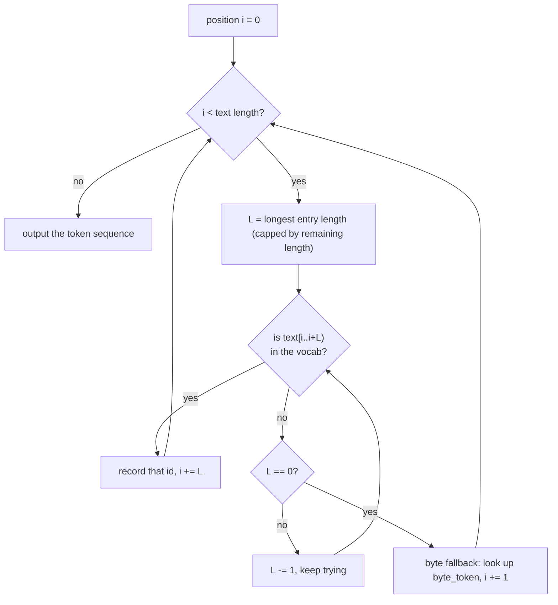

# 01 · Tokenizer: How Text Becomes Numbers

> By the end of this article you will know: why the model only understands numbers, what tokens and a vocabulary are, how the longest-prefix-match algorithm works, and why byte fallback is an indispensable safety net.
> Corresponding source: `src/tokenizer.h` `src/tokenizer.cpp`, `py/make_test_weights.py` (generates the test vocabulary), `TokenizerRef` in `py/reference_model.py` (the Python counterpart).

## 1. Why can't the model read text directly?

In a computer, text is just a sequence of bytes — `"The"` is the three bytes `0x54 0x68 0x65`. Technically the model could eat raw bytes, but the results are poor: a byte has only 256 possibilities and carries almost no semantics — "t" and "h" mean nothing on their own; "th" is where meaning starts to appear.

So large models do this instead: prepare a **dictionary (the vocabulary, or vocab)** that assigns a number to common "chunks of words":

```
Vocabulary (excerpt from our test model's 1024 entries):
id 6     → "The"
id 10    → "of"
id 89    → "life"
id 112   → "meaning"
id 289   → " "  (even a space can be an entry!)
id 768   → byte 0x00   ← ids 768–1023 are the 256 "byte entries"
id 800   → byte 0x20 (space)
...
id 0–5   → "<pad>" "<eos>" "<bos>" "<unk>" "<start_of_turn>" "<end_of_turn>" (control entries)
```

Each entry is a **token**. Splitting text into a token sequence is called **tokenizing**; the reverse is **detokenizing**:

```
"The meaning of life"  →  [6, 289, 112, 289, 10, 289, 89]
```

> Real models have much bigger vocabularies: the GPT family has tens to hundreds of thousands of entries; Gemma 3n has 262K. Entries are not "words" either, but finer-grained **subwords**: "learning" might be split into "learn" + "ing". Subwords let the model spell out rare words it has never seen. Our test model mixes whole words and byte entries, but the principle is the same.

## 2. The encoding algorithm: greedy longest-prefix matching

Given text, how do we slice it using the dictionary? The naive idea is "left to right, at each step take the longest prefix that matches a dictionary entry". That is **greedy longest-prefix matching**.

Take `"The meaning"` as an example (assume the vocab contains "The", " ", "meaning", "Th", "The m"):

```
Position 0: "The meaning..." — try from the longest possible length
  Try "The mea" → not in the vocab
  Try "The me"  → not in the vocab
  Try "The m"   → match! assume id 500
  ✗ Note: "The m" swallows "The" and the space together.
```

The full algorithm:



So "longest match" has a key property: **first come, first served — once a match is made there is no backtracking** (greedy). `"The m"` is longer, so it wins and we continue from position 5. This is the standard approach: the algorithm is simple and O(n). The downside is that it's locally optimal and not necessarily the globally best segmentation — but for large models that's perfectly fine.

Our implementation (`encode` in `src/tokenizer.cpp`):

```cpp
std::vector<uint32_t> Tokenizer::encode(const std::string& text) const {
    std::vector<uint32_t> ids;
    size_t i = 0;
    while (i < text.size()) {
        size_t L = max_piece_len < text.size() - i ? max_piece_len : text.size() - i;
        bool matched = false;
        for (; L > 0; L--) {                       // try from longest to shortest
            auto it = piece_to_id.find(std::string_view(text.data() + i, L));
            if (it != piece_to_id.end()) {         // hit!
                ids.push_back(it->second);
                i += L;                            // consume L bytes, continue
                matched = true;
                break;
            }
        }
        if (!matched) {                            // nothing matched → byte fallback
            uint32_t bt = byte_token[(uint8_t)text[i]];
            ids.push_back(bt == UINT32_MAX ? unk_id : bt);
            i += 1;
        }
    }
    return ids;
}
```

`piece_to_id` is a hash table (`unordered_map<string_view, uint32_t>`): entry text → id. Lookup is O(1) on average, so the whole encoding is O(n × longest entry length).

## 3. Byte fallback: why does the dictionary carry 256 "byte entries"?

Imagine a user types a character that isn't in the dictionary: "世界". There is no entry for it, nor for "世" or "界". Relying on entry matching alone, the only output would be `<unk>` (unknown) — and **the information is lost**: the model has no idea what the user said.

The fix: the dictionary **always guarantees 256 special entries, one for each byte 0x00–0xFF**. Any text is a byte sequence, so:

```
The UTF-8 encoding of "世界" is 6 bytes: E4 B8 96 E7 95 8C
Each byte is looked up individually: E4 → id 996, B8 → id 952, ...
```

**Any input can be encoded, and any encoding can be restored to the original text.** This property is called a lossless "round-trip", and it's an iron rule of vocabulary design. Our tests verify it explicitly (`tokenizer_test` in `tests/unit_tests.cpp`):

```cpp
// Chinese round-trip test: "hello 世界 test" encoded then decoded must be byte-for-byte identical
const std::string s2 = "hello \xe4\xb8\x96\xe7\x95\x8c test";
CHECK(tok.decode(tok.encode(s2)) == s2);
// The most extreme test: all 256 raw bytes, one at a time
std::string s3;
for (int i = 0; i < 256; i++) s3 += (char)i;
CHECK(tok.decode(tok.encode(s3)) == s3);
```

In real Gemma's vocabulary these 256 byte entries are written `<0x00>` through `<0xFF>`; the conversion script (`py/convert_tokenizer.py`) turns them back into real bytes.

## 4. Decoding: numbers → text

`decode_id` treats entry types differently (`src/tokenizer.cpp`):

```cpp
std::string Tokenizer::decode_id(uint32_t id) const {
    if (id >= entries.size()) return "";
    const Entry& e = entries[id];
    if (e.type == fmt::kControl) return "";   // control entries produce no text
    return std::string(e.piece);              // normal/byte entries are concatenated
}
```

The three entry types (`fmt::TokenType` in `src/config.h`):

| Type | Meaning | Decode behavior | Example |
|---|---|---|---|
| 0 normal | word/subword | concatenate its text | "The" |
| 1 byte | a single raw byte | concatenate that byte | 0xE4 |
| 2 control | special marker | **skipped, not output** | `<eos>` `<start_of_turn>` |

Control entries steer the generation flow but never enter the text: the generation loop stops when it hits `<eos>` (that's what `--terminate_on_eos` implements), and `<start_of_turn>` in the chat template marks "it's the model's turn to speak".

## 5. Binary format: what does the vocabulary file look like?

We didn't want the C++ engine to depend on Python's protobuf library to parse HuggingFace vocabulary files (sentencepiece is a protobuf format), so we defined our own format, **GMT1** (`fmt::TokenizerHeader` in `src/config.h`):

| Offset | Size | Field | Meaning |
|---|---|---|---|
| 0 | 4 | magic = "GMT1" | identifies "this is my format" |
| 4 | 4 | version = 1 | format version |
| 8 | 4 | vocab_size = 1024 | number of entries |
| 12 | 4 | bos_id | id of the beginning-of-sequence marker |
| 16 | 4 | eos_id | id of the end-of-sequence marker |
| 20 | 4 | unk_id | unknown marker |
| 24 | 4 | pad_id | padding marker |
| 28 | 20 | reserved | reserved, must be all 0 |
| — | — | — | **the above 48 bytes are the fixed header** — |
| 48 | dynamic | vocab_size records | each: u32 len (text length in bytes) + u32 type (0 normal / 1 byte / 2 control) + f32 score (frequency score; real SentencePiece has it, we don't use it yet) + len bytes of UTF-8 text |

**The first principle of format design**: don't read files by guessing — validate. Magic mismatch → error; version mismatch → error; reserved non-zero → error. Any "wrong file / corrupted file" surfaces immediately instead of quietly producing garbage. (The weights format takes this principle even further — see [02 - Binary Format](02-Binary-Format.md).)

## 6. Two details of loading the vocabulary

Look at `Tokenizer::load` (`src/tokenizer.cpp`):

```cpp
blob.reserve(blob_len);          // 1. compute the total length up front, reserve
for (uint32_t i = 0; i < h.vocab_size; i++) {
    ...
    size_t at = blob.size();
    blob.append(piece.data(), piece.size());
    entries[i].piece = std::string_view(blob.data() + at, len);
    auto [it, inserted] = piece_to_id.emplace(entries[i].piece, i);
    if (!inserted)
        warn("tokenizer has duplicate pieces; longest-match may be ambiguous");
    ...
}
```

- **`string_view` points into `blob`**: all entry texts are concatenated into one big string, and the hash table's keys are just "windows" into it — no text is copied. `reserve(blob_len)` guarantees no reallocation during the appends — otherwise a reallocation would invalidate every pointer stored so far (the classic C++ "iterator invalidation" problem, wearing a pointer costume).
- **Duplicate entry detection**: if the same text appears twice, encoding becomes ambiguous.

## 7. A real bug we hit: duplicate entries

This is a true story from development, with real teaching value. The first version of the test vocabulary contained both:

- id 289: entry `" "` (a space, as a normal word)
- id 800: entry byte 0x20 (a space, as the byte fallback)

Two entries with identical text! So:

- **C++** uses `emplace` on its hash table: duplicate insert fails, **the first one stays** → `" "` encodes to 289
- The **Python reference** builds its dict with a comprehension: duplicate keys, **the last write wins** → `" "` encodes to 800

| | C++ loader | Python reference |
|---|---|---|
| Data structure | unordered_map + emplace | dict comprehension |
| Duplicate-key semantics | insert fails, keeps the **first** | **last write wins** |
| Result | `" "` → 289 | `" "` → 800 |

Result: the C++ engine and the Python reference encoded the same prompt into different token sequences, and the two models' states diverged from the 2nd token onward. In the integration test this showed up as token sequences that didn't match — **but not entirely** (a detail in the logits comparison masked the problem), and the investigation took a while.

Fix (`py/make_test_weights.py`): when generating the vocabulary, **exclude all single-byte word entries** — every byte already has a byte entry, so a single-byte word entry is guaranteed to be a duplicate. In addition, both loaders got duplicate detection (a warning in C++, a hard error in Python).

**Lesson**: for any "keyed" system (vocab, dict, mapping table), ask up front: "are duplicate keys allowed, and when they happen, who wins?" Both implementations must give the same answer.

## 8. Summary

1. Tokenizer = dictionary + lookup. Encoding uses greedy longest-prefix matching, O(n)
2. The dictionary must contain 256 byte entries → any input can be encoded and restored losslessly (round-trip)
3. Control entries produce no text but drive the flow (`<eos>` stops generation; `<start_of_turn>` marks chat turns)
4. Custom binary format = fixed header (magic/version/control ids) + variable-length records, with every field validated on load
5. Vocabulary keys must be unique, and the C++/Python sides must agree on duplicate-key semantics

## Exercises

1. `max_piece_len` is the byte length of the longest entry in the vocabulary. If you set it to 1, what does the encoding output look like?
2. Why do control entries like `<start_of_turn>` live in the vocabulary instead of being hard-coded in C++ like a newline? (Hint: different models may use different control-entry text)
3. When encoding `"hello 世界"`, the Chinese part goes through byte fallback. If we added an entry `"世界"` to the dictionary, would the encoding get shorter? Why? (Hint: longest match wins)
