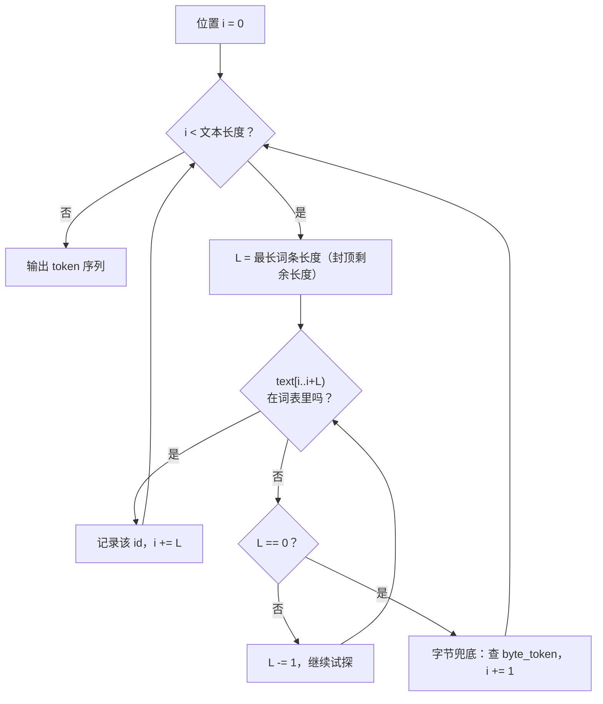

# 01 · Tokenizer：文字怎么变成数字

> 读完这篇你会知道：为什么模型只认数字、token 和词表是什么、最长前缀匹配算法怎么工作、byte fallback 为什么是不可或缺的兜底。
> 对应源码：`src/tokenizer.h` `src/tokenizer.cpp`、`py/make_test_weights.py`（生成测试词表）、`py/reference_model.py` 的 `TokenizerRef`（Python 对应实现）。

## 一、为什么模型不能直接读文字？

计算机里文字就是一串字节，比如 `"The"` 是三个字节 `0x54 0x68 0x65`。技术上模型当然可以吃字节，但效果很差：一个字节只有 256 种可能，几乎不携带任何语义——"t" 和 "h" 单独看毫无意义，"th" 合起来才开始有意义。

所以大模型的做法是：准备一本**词典（词表，vocab）**，把常见的"词块"编号：

```
词表（我们测试模型的 1024 个词条，节选）：
id 6     → "The"
id 10    → "of"
id 89    → "life"
id 112   → "meaning"
id 289   → " "（空格也可以是一个词条！）
id 768   → 字节 0x00   ← 第 768~1023 号是 256 个"字节词条"
id 800   → 字节 0x20（空格）
...
id 0~5   → "<pad>" "<eos>" "<bos>" "<unk>" "<start_of_turn>" "<end_of_turn>"（控制词条）
```

每个词条叫一个 **token**。把文字切成 token 序列的过程叫 **tokenize**，反向过程叫 **detokenize**：

```
"The meaning of life"  →  [6, 289, 112, 289, 10, 289, 89]
```

> 真实大模型的词表大得多：GPT 系列几万到十几万，Gemma 3n 有 26 万个词条。词条也不是"单词"，而是更细的**子词（subword）**：比如 "learning" 可能被切成 "learn" + "ing" 两个 token。子词的好处是生僻词也能拼出来。我们的测试模型同时混用了单词和字节词条，原理相通。

## 二、编码算法：最长前缀匹配（greedy longest-prefix match）

给定文字，怎么查词典切分？一个朴素的想法是"从左到右，每次取词典里最长的能匹配上的前缀"。这就是**贪心最长前缀匹配**。

拿 `"The meaning"` 举例（假设词表里有 "The"、" "、"meaning"、"Th"、"The m" 这些词条）：

```
位置 0："The meaning..." 从最长可能长度开始试探
  试 "The mea" → 不在词表
  试 "The me"  → 不在词表
  试 "The m"   → 在！id 假设为 500
  ✗ 注意：这样 "The m" 会把 "The" 和空格一起匹配掉。
```

整个算法的流程：



所以"最长匹配"有个关键性质：**先到先得，匹配后不再回溯**（贪心）。`"The m"` 更长，就选中它，从位置 5 继续。这是标准做法，好处是算法简单、O(n) 复杂度；坏处是局部最优，未必是全局最优切分——但对大模型来说完全够用。

我们的实现（`src/tokenizer.cpp` 的 `encode`）：

```cpp
std::vector<uint32_t> Tokenizer::encode(const std::string& text) const {
    std::vector<uint32_t> ids;
    size_t i = 0;
    while (i < text.size()) {
        size_t L = max_piece_len < text.size() - i ? max_piece_len : text.size() - i;
        bool matched = false;
        for (; L > 0; L--) {                       // 从最长试探到最短
            auto it = piece_to_id.find(std::string_view(text.data() + i, L));
            if (it != piece_to_id.end()) {         // 命中！
                ids.push_back(it->second);
                i += L;                            // 消耗 L 个字节，继续
                matched = true;
                break;
            }
        }
        if (!matched) {                            // 一个都没匹配上 → 字节兜底
            uint32_t bt = byte_token[(uint8_t)text[i]];
            ids.push_back(bt == UINT32_MAX ? unk_id : bt);
            i += 1;
        }
    }
    return ids;
}
```

其中 `piece_to_id` 是一个哈希表（`unordered_map<string_view, uint32_t>`）：词条文本 → 编号。查找平均 O(1)，所以整个编码是 O(n × 最长词条长度)。

## 三、Byte fallback：为什么词典里要塞 256 个"字节词条"？

试想用户输入了一个词典里没有的字："世界"。词典里没有这个词条，也没有 "世" 或 "界"。如果只靠词条匹配，只能输出 `<unk>`（未知），**信息就丢了**——模型根本不知道用户说了什么。

解法：词典里**永远保证有 256 个特殊词条，分别代表单个字节 0x00~0xFF**。任何文字都是字节序列，所以：

```
"世界" 的 UTF-8 编码是 6 个字节 E4 B8 96 E7 95 8C
每个字节单独查表：E4 → id 996, B8 → id 952, ...
```

**任何输入都能被编码，任何编码都能还原成原文**。这个性质叫"往返无损"（roundtrip），是词表设计的一条铁律。我们的测试就专门验证了它（`tests/unit_tests.cpp` 的 `tokenizer_test`）：

```cpp
// 中文往返测试："hello 世界 test" 编码后再解码，必须逐字节相等
const std::string s2 = "hello \xe4\xb8\x96\xe7\x95\x8c test";
CHECK(tok.decode(tok.encode(s2)) == s2);
// 最极端的测试：256 个原始字节全部走一遍
std::string s3;
for (int i = 0; i < 256; i++) s3 += (char)i;
CHECK(tok.decode(tok.encode(s3)) == s3);
```

真实 Gemma 的词表里这 256 个字节词条写作 `<0x00>` 到 `<0xFF>`，转换脚本（`py/convert_tokenizer.py`）会把它们还原成真实字节。

## 四、解码：数字 → 文字

`decode_id` 按词条类型区别对待（`src/tokenizer.cpp`）：

```cpp
std::string Tokenizer::decode_id(uint32_t id) const {
    if (id >= entries.size()) return "";
    const Entry& e = entries[id];
    if (e.type == fmt::kControl) return "";   // 控制词条不产生文字
    return std::string(e.piece);              // 普通词条/字节词条直接拼接
}
```

三种词条类型（`src/config.h` 的 `fmt::TokenType`）：

| 类型 | 含义 | 解码行为 | 例子 |
|---|---|---|---|
| 0 普通 | 单词/子词 | 拼接其文本 | "The" |
| 1 字节 | 单个原始字节 | 拼接该字节 | 0xE4 |
| 2 控制 | 特殊标记 | **跳过，不输出** | `<eos>` `<start_of_turn>` |

控制词条控制着生成流程但不进入正文：生成循环遇到 `<eos>`（结束符）就停止（这就是 `--terminate_on_eos` 的实现），对话模板里的 `<start_of_turn>` 用来标记"轮到模型说话了"。

## 五、二进制格式：词表文件长什么样

C++ 引擎不想依赖 Python 的 protobuf 库去解析 HuggingFace 的词表文件（sentencepiece 是 protobuf 格式），所以我们定义了自己的格式 **GMT1**（`src/config.h` 的 `fmt::TokenizerHeader`）：

| 偏移 | 大小 | 字段 | 说明 |
|---|---|---|---|
| 0 | 4 | magic = "GMT1" | 识别"这是我的格式" |
| 4 | 4 | version = 1 | 格式版本号 |
| 8 | 4 | vocab_size = 1024 | 词条数 |
| 12 | 4 | bos_id | 句首标记的编号 |
| 16 | 4 | eos_id | 句尾标记的编号 |
| 20 | 4 | unk_id | 未知标记 |
| 24 | 4 | pad_id | 填充标记 |
| 28 | 20 | reserved | 保留，必须全 0 |
| — | — | — | **以上 48 字节是定长头** — |
| 48 | 动态 | vocab_size 条记录 | 每条：u32 len（文本字节长度）+ u32 type（0 普通 / 1 字节 / 2 控制）+ f32 score（词频分数，真实 SentencePiece 有，我们暂不用）+ len 字节 UTF-8 文本 |

**格式设计的第一原则**：读文件不靠猜，靠校验。magic 对不上 → 报错；version 对不上 → 报错；reserved 非零 → 报错。任何"读错文件/文件损坏"都会立刻暴露，而不是悄悄产出垃圾结果。（权重格式把这条原则发挥得更彻底，见《02-二进制格式》。）

## 六、加载词表时的两个细节

看 `Tokenizer::load`（`src/tokenizer.cpp`）：

```cpp
blob.reserve(blob_len);          // 1. 先算好总长，预留空间
for (uint32_t i = 0; i < h.vocab_size; i++) {
    ...
    size_t at = blob.size();
    blob.append(piece.data(), piece.size());
    entries[i].piece = std::string_view(blob.data() + at, len);
    auto [it, inserted] = piece_to_id.emplace(entries[i].piece, i);
    if (!inserted)
        warn("tokenizer has duplicate pieces; longest-match may be ambiguous");
    ...
}
```

- **`string_view` 指向 `blob` 内部**：所有词条文本拼进一个大字符串，哈希表的 key 只是指向它的"窗口"，不复制文本。`reserve(blob_len)` 保证 append 期间不重新分配内存——否则重分配会让之前存的指针全部失效（这是 C++ 里经典的"迭代器失效"问题在指针上的翻版）。
- **重复词条检测**：同样的文本出现两次，编码结果就模棱两可。

## 七、我们踩过的真实 bug：重复词条

这是开发时真实发生的故事，非常有教学价值。第一版测试词表里同时有：

- id 289：词条 `" "`（空格，作为普通单词）
- id 800：词条字节 0x20（空格，作为字节兜底）

两个词条文本相同！于是：

- **C++** 的哈希表用 `emplace`：重复键插入失败，**保留第一个** → `" "` 编码成 289
- **Python 参考**用字典推导式：重复键**后写的覆盖** → `" "` 编码成 800

| | C++ 加载器 | Python 参考 |
|---|---|---|
| 数据结构 | unordered_map + emplace | 字典推导式 |
| 重复键语义 | 插入失败，保留**第一个** | **后写覆盖** |
| 结果 | `" "` → 289 | `" "` → 800 |

结果：C++ 引擎和 Python 参考把同一个 prompt 编码成了不同的 token 序列，两边模型状态从第 2 个 token 起就不一致了。集成测试里表现为 token 序列对不上——**但不是全部对不上**（因为 logits 对比的细节掩盖了问题），排查花了不少时间。

修复（`py/make_test_weights.py`）：生成词表时**剔除所有单字节的单词词条**——每个字节已经有字节词条了，单字节单词词条必然是重复。另外两侧加载器都加上了重复检测（C++ 警告、Python 直接报错）。

**教训**：任何"键"系统（词表、字典、映射表），先问一句"键允许重复吗？重复时谁赢？"两端实现必须给出相同答案。

## 八、总结

1. Tokenizer = 词典 + 查表。编码用贪心最长前缀匹配，O(n)
2. 词典必须含 256 个字节词条 → 任何输入可编码、可无损还原（roundtrip）
3. 控制词条不产生文字，但驱动流程（`<eos>` 停止、`<start_of_turn>` 对话轮次）
4. 自定义二进制格式 = 定长头（magic/version/控制id）+ 变长记录，加载时全字段校验
5. 词表键必须唯一，且 C++/Python 两侧对重复键的处理语义必须一致

## 思考题

1. `max_piece_len` 是词表里最长词条的字节数。如果把它设成 1，编码结果会变成什么样？
2. 为什么 `<start_of_turn>` 这类控制词条要放在词表里，而不是像换行符一样硬编码在 C++ 代码里？（提示：不同模型的控制词条文本可能不同）
3. 编码 `"hello 世界"` 时，中文部分会走字节兜底。如果词典里加一个词条 `"世界"`，编码结果会变短吗？为什么？（提示：最长匹配优先）
