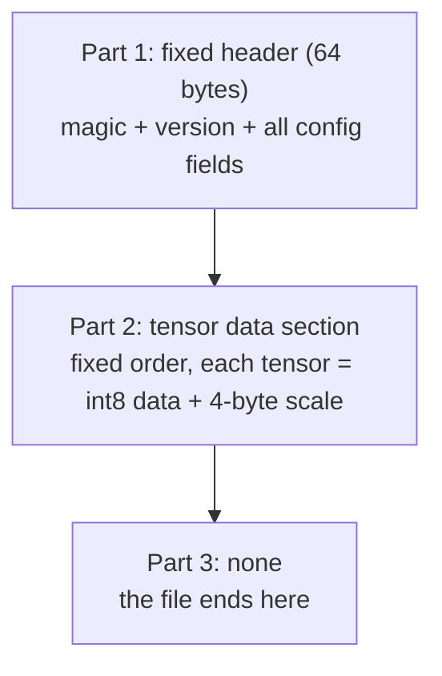
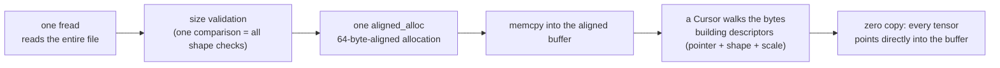

# 02 · Binary Format Design: What a Weights File Looks Like

> By the end of this article you will know: why not use an existing format, what makes a "good" binary format, how a fixed header + fixed order makes validation zero-cost, and how the loader achieves zero copies.
> Corresponding source: `src/weights.h` `src/weights.cpp` (loader), `py/common.py` (writer), `src/config.h` (format constants).

## 1. Why not use an existing format?

On HuggingFace, model weights live in **safetensors** files and the tokenizer lives in a **sentencepiece (protobuf)** file. The engine could absolutely parse them directly. Our reasoning:

1. **Zero dependencies**: parsing safetensors means linking a library; parsing protobuf is worse. Our engine doesn't even link BLAS — pulling in a dependency for a file format isn't worth it
2. **The format is the optimization**: existing formats aren't laid out for our compute pattern. Our format stores data so that "each output row = one contiguous stretch of memory" (Section 5), so computation is efficient the moment loading finishes
3. **Fast loading**: parsing an existing format requires string matching and dictionary lookups; our format stores tensors in a **fixed order**, so loading is pure offset arithmetic

So the division of labor is: **a Python script does the one-time format conversion** (it can read safetensors conveniently), and **the C++ engine only reads its own format**. Conversion runs once; inference runs a million times — put the complexity on the conversion side, keep the hot path simple.

## 2. First, four words

Before reading the format tables you only need four concepts; other terms in the tables are covered by the cheat sheet at the end of this section.

**1. Tensor** = the umbrella term for scalars, vectors, and matrices — the same thing ("an N-dimensional array") named differently at each dimensionality:

| Name | Dimensions | Example |
|---|---|---|
| Scalar | 0-D | a single number: `3.14` |
| Vector | 1-D | a list of numbers: `[1.0, 2.0, 3.0]` |
| Matrix | 2-D | a table (rows × columns) |
| Tensor | 3-D and up | a stack of matrices: `[4][8][256]` |

Engineering convention lumps scalars, vectors, and matrices together as "tensors", because the operations are the same — process a bunch of numbers in bulk; only the row/column/depth arrangement differs. The weights file contains all three: scalars = `rope_base` and each tensor's `scale`; vectors = `gamma_attn`-style [256]; matrices = `q_proj`-style [256][256].

**2. Shape notation `[rows][cols]`**: every tensor in this article is described as `[row count][column count]`, e.g. `q_proj [256][256]` is a 256 × 256 matrix and `gamma_attn [256]` is a 256-element vector. Which index is the row and which is the column matters a lot — Section 5 covers it, because it directly determines how fast the loaded data computes.

**3. Quantization (int8 + scale)**: weights aren't stored as float32 but as **1-byte integers plus one 4-byte scale factor**, with true value ≈ `int8 × scale`. Full details in [09 - INT8 Quantization](09-INT8-Quantization.md); for now you only need: **each tensor in the weights file = `N bytes of int8 data + a 4-byte f32 scale`**.

**4. What a "projection" is**: every tensor with `proj` in its name (`q_proj`, `up_proj`…) is a projection — one matrix multiply `y = W·x` that linearly maps a vector from one space to another; the dimensions are determined by W's shape. It's the most fundamental operation in neural networks; Chapters 03/06/08 each show it in context.

> **Cheat sheet**: this article is a "format spec"; it doesn't explain model internals. embedding / positional encoding → [03](03-Embeddings-and-Positional-Encoding.md); RMSNorm → 04; RoPE → 05; attention Q/K/V, softmax → [06](06-Attention.md); GQA → [07](07-KV-Cache-and-GQA.md); GeGLU / SiLU → [08](08-MLP-and-GeGLU.md). When you hit an unfamiliar word, jump via that table; for now, remembering "what tensor it is and how big" is enough.

## 3. The three-part structure of the GMW1 weights file

Our weights format (`fmt::WeightsHeader` in `src/config.h`, little-endian) has only three parts:



### 3.1 Part 1: the fixed header (exactly 64 bytes)

| Offset | Size | Field | Meaning |
|---|---|---|---|
| 0 | 4 | magic "GMW1" | format identifier |
| 4 | 4 | version = 1 | version number |
| 8 | 4 | n_layers = 2 | number of layers |
| 12 | 4 | dim = 256 | hidden dimension (vector width) |
| 16 | 4 | n_heads = 4 | number of attention heads |
| 20 | 4 | n_kv_heads = 1 | number of KV heads (GQA — Chapter 07) |
| 24 | 4 | mlp_dim = 1024 | MLP intermediate dimension |
| 28 | 4 | vocab_size = 1024 | vocabulary size |
| 32 | 4 | max_seq_len = 256 | number of position-table rows |
| 36 | 4 | head_dim = 64 | width of each attention head = dim/n_heads |
| 40 | 4 | f32 rope_base = 10000 | RoPE frequency base (Chapter 05) |
| 44 | 20 | reserved | must be all 0 |

You **don't need to understand each field right now** (what `n_heads` does → Chapter 06; `rope_base` → Chapter 05). The key property to remember: **the byte size of every tensor in Part 2 is fully determined by these 64 bytes of config fields** — that's what makes Section 4's "zero-cost validation" possible.

### 3.2 Part 2: the tensor data section — fixed order, no names

The order is **hard-coded** (`tensor_order` in `py/common.py`):

| Order | Tensor | Shape |
|---|---|---|
| 1 | embed_tokens | [1024][256] vocab × dim |
| 2 | embed_positions | [256][256] positions × dim |
| Each layer (layer l) | q_proj | [256][256] |
| | k_proj | [64][256] ← GQA: only 1 KV head |
| | v_proj | [64][256] |
| | o_proj | [256][256] |
| | gate_proj | [1024][256] |
| | up_proj | [1024][256] |
| | down_proj | [256][1024] |
| | gamma_attn | [256] vector |
| | gamma_ffn | [256] vector |
| Last | final_norm_gamma | [256] |
| | lm_head | [1024][256] |

**Why no names?** safetensors stores a dictionary (name → tensor): flexible, but loading requires lookups. Our model structure is fixed, so the order itself encodes identity — the loader counts bytes as it walks, and the 5th tensor it reaches must be layer 0's q_proj. All name comparisons are eliminated.

### 3.3 What each tensor is for (cheat sheet — no need to memorize)

Data is stored contiguously by row. Each tensor's role — don't memorize now; come back while reading Chapters 03–08:

**Shared (4 tensors):**

| Tensor | Purpose |
|---|---|
| `embed_tokens` [1024][256] | The token embedding matrix. Row number = token id (0–1023); row contents = that token's 256-dim vector. Turns token ids into vectors on the input side (Chapter 03). |
| `embed_positions` [256][256] | The position embedding table. Row number = position (0–255); row contents = that position's 256-dim vector, added to the token vector. Row count = max_seq_len; positions beyond the table are clamped to the last row with a warning. Note: **real Gemma has no such table** (position comes entirely from RoPE); the conversion script writes all zeros for real weights. This small model additionally learned it, and attention also uses RoPE — two position mechanisms stacked (Chapter 03). |
| `final_norm_gamma` [256] | The γ scale of the final RMSNorm (element-wise, 256 scalars). Not a matrix — a vector (Chapter 04). |
| `lm_head` [1024][256] | The output projection. Multiplying the last token's 256-dim vector by it yields 1024 logits (one score per candidate token); softmax then gives the next-token distribution. Row number = candidate token id. |

**Per layer (n_layers layers, 9 tensors each):**

Attention (4 tensors):

| Tensor | Purpose |
|---|---|
| `q_proj` [256][256] | Projects the 256-dim input into queries. 256 = 4 heads × 64 dims, actually used split into four 64-dim heads. |
| `k_proj` [64][256] | Projects into keys. **Key point: GQA has only 1 KV head** (Chapter 07), so this is 1×64 = 64 dims, not 256 — the 4 query heads share this one KV head, saving 4× the KV cache. |
| `v_proj` [64][256] | Same on the value side. |
| `o_proj` [256][256] | The attention output projection, mapping the concatenated 256 dims of the 4 heads back to 256. |

MLP (3 tensors, a Swish-GLU structure: expand then contract, Chapter 08):

| Tensor | Purpose |
|---|---|
| `gate_proj` [1024][256] | Projects 256 dims to 1024 (the intermediate dim), then through the SiLU activation as the gate. |
| `up_proj` [1024][256] | Also projects to 1024, un-activated, then multiplied element-wise with the gate output (i.e. `silu(x·gate) ⊙ (x·up)`). |
| `down_proj` [256][1024] | Projects 1024 back to 256, completing the GLU contraction. |

Normalization (2 tensors):

| Tensor | Purpose |
|---|---|
| `gamma_attn` [256] | The γ vector of the RMSNorm before the attention sublayer. |
| `gamma_ffn` [256] | The γ vector of the RMSNorm before the FFN sublayer. |

> By the way: `lm_head` and `embed_tokens` have the same shape (both [1024][256]) yet are two independent matrices. Some models use **weight tying** — the output projection reuses the embedding table's transpose, halving parameters. Gemma doesn't tie, so each lives separately in the file.

## 4. The core trick: file size = zero-cost shape validation

First notice a pattern: everywhere [256] appears above it's `dim`; [1024] is `mlp_dim` or `vocab_size`; [64] is `head_dim` (with GQA's single KV head, `k_proj` has head_dim rows rather than dim). **Every tensor's byte size is fully determined by the header config fields** — so `expected_file_size` (`src/weights.cpp`) can compute the total file size without reading any content:

```cpp
size_t Weights::expected_file_size(const ModelConfig& cfg) {
    const size_t kv = (size_t)cfg.n_kv_heads * cfg.head_dim;
    size_t n = sizeof(fmt::WeightsHeader);
    n += (size_t)cfg.vocab_size * cfg.dim + 4;          // embed_tokens
    n += (size_t)cfg.max_seq_len * cfg.dim + 4;         // embed_positions
    for (uint32_t l = 0; l < cfg.n_layers; l++) {
        n += 2 * ((size_t)cfg.dim * cfg.dim + 4);       // q, o
        n += 2 * (kv * cfg.dim + 4);                    // k, v
        n += 2 * ((size_t)cfg.mlp_dim * cfg.dim + 4);   // gate, up
        n += (size_t)cfg.dim * cfg.mlp_dim + 4;         // down
        n += 2 * ((size_t)cfg.dim + 4);                 // gammas
    }
    n += (size_t)cfg.dim + 4;                           // final_norm_gamma
    n += (size_t)cfg.vocab_size * cfg.dim + 4;          // lm_head
    return n;
}
```

**Each tensor's size is fully determined by the header's config fields.** So validation is one line:

```cpp
if (file.size() != expected) {   // just this
    fprintf(stderr, "gemma: weights file size %zu != expected %zu ...\n", ...);
    return false;
}
```

File is 10 bytes too big? Truncated, or the config doesn't match. Too small? Same. **No per-tensor shape checks needed — one size comparison performs the entire shape validation**, because the format leaves no room for "creative freedom".

This philosophy runs through the whole loader:

| Check | How | What it prevents |
|---|---|---|
| Is this my file | magic comparison | picking up the wrong file |
| Version compatible | version comparison | silently misreading an old format |
| Config sane | n_heads % n_kv_heads == 0, head_dim == dim/n_heads, reserved all 0 | self-contradictory config |
| Shapes right | file size == derived size | truncation, tampering, misaligned tensors |

**Design principle**: reject bad data in the first millisecond of loading, not after 10 minutes of inference produces garbage.

## 5. Tensor layout: why store matrices as [output][input]?

### 5.1 First the math: a GEMV reads the matrix row by row

The most frequent operation in inference is **matrix-vector multiplication** (GEMV, `gemv_i8_f32` in the code): an input vector x times a weight matrix W produces an output vector y. A small example — W is 3 × 4 (real weights are [256][256] or bigger):

```
        ┌─────────────────┐   ┌────┐
        │ W00 W01 W02 W03 │   │ x0 │
        │ W10 W11 W12 W13 │ × │ x1 │
        │ W20 W21 W22 W23 │   │ x2 │
        └─────────────────┘   │ x3 │
        W: 3 rows × 4 cols    └────┘
        rows = outputs (3)     x: 4-dim (input)
        cols = inputs (4)      → y: 3-dim (output)

y[0] = W00·x0 + W01·x1 + W02·x2 + W03·x3
y[1] = W10·x0 + W11·x1 + W12·x2 + W13·x3
y[2] = W20·x0 + W21·x1 + W22·x2 + W23·x3
```

W here is 3 rows × 4 columns: 3 outputs, 4 inputs — rows and columns are easy to tell apart. **The row index i is the index of output y; the column index j is the index of input x** — that's where the `[output][input]` notation comes from. Read `q_proj [256][256]` as "256 outputs, each computed as a weighted sum of 256 inputs".

The key observation: **computing y[i] reads only row i of the matrix**. The whole GEMV is "read a row, compute a row". So the matrix's storage layout should serve "make row reads fast".

### 5.2 How it sits in memory: row-major vs column-major

"Stored contiguously by row" is row-major: the elements of row i sit next to each other in memory. Take that 3 × 4 matrix again and look at the byte stream (weights are int8, 1 byte per element; addresses grow left to right):

```
Row-major (our format): 12 elements laid out by row
Addresses: 0  1  2  3 | 4  5  6  7 | 8  9  10 11
Elements:  W00 W01 W02 W03 | W10 W11 W12 W13 | W20 W21 W22 W23
      ←── row 0: 4 contiguous elements ──→

Column-major (the other way): 12 elements laid out by column
Addresses: 0  1  2 | 3  4  5 | 6  7  8 | 9  10 11
Elements:  W00 W10 W20 | W01 W11 W21 | W02 W12 W22 | W03 W13 W23
      row 0's elements W00 W01 W02 W03 sit at addresses 0, 3, 6, 9 — every read skips 2 elements
```

Computing y[0] reads row 0's four elements; here's how the two layouts differ:

- **Row-major**: W00–W03 are **adjacent** in memory, and the CPU reads sequentially — the prefetcher pulls subsequent elements into cache ahead of time, so a whole row is read in one sweep; SIMD loops just load contiguously, `vld1_s8(w + i)` (`src/kernel.cpp` is full of these)
- **Column-major**: W00–W03 are 3 elements apart (the example matrix has 3 rows, so the stride = row count) — **strided jumps**. A real matrix has 256 rows: an int8 stride of 256 bytes (1024 bytes for f32) means each element lands in a **different cache line**; reading one row of 256 elements touches 256 cache lines and uses 1 byte of each

Bandwidth: reading a row contiguously = 256 bytes = 4 cache lines (64 bytes/line), fully utilized; reading a row strided = 256 jumps × 64 bytes pulled each = 16 KB actually read to obtain 256 bytes — a **64× read amplification** (for int8 weights; 16× for f32, consistent with Chapter 10's math).

| | Row-major [output][input] (ours) | Column-major [input][output] |
|---|---|---|
| Row i's elements in memory | contiguous | one every "row count" elements (3-row example → every 3rd) |
| Reading a row (real matrix, 256 elements/row) | sequential 256 bytes = 4 cache lines, fully used | 256 jumps, one cache line per element |
| Cache line utilization | 100% | ~1.6% (~6% for f32) |
| Cost | — | actual reads ×64 (×16 for f32) |

Conclusion: **the storage layout serves the compute pattern** — a GEMV computes by row, so store weights by row.

> Side note: HuggingFace's weights happen to be [output][input] row-major too, so the conversion script almost never needs to transpose — it's the de facto industry standard.

## 6. The loader: one allocation, one read, zero copies

The flow of `Weights::load` (`src/weights.cpp`):

```cpp
// 1. read the whole file into memory in one go
read_whole_file(path, file);        // first into a temporary vector
// 2. validate (all the checks above)
// 3. copy into a 64-byte-aligned big buffer
buf.alloc(file.size());
memcpy(buf.ptr, file.data(), file.size());
// 4. walk the bytes with a "cursor", building the descriptor table —
//    note: no data is copied!
Cursor cur{(const int8_t*)buf.ptr};
embed_tokens = cur.next(cfg.vocab_size, cfg.dim);
embed_positions = cur.next(cfg.max_seq_len, cfg.dim);
...
```

Each call to `Cursor::next` advances `off` by `rows*cols + 4` bytes and returns a **descriptor** (pointer + shape + scale):

```cpp
struct Cursor {
    const int8_t* p;
    size_t off = sizeof(fmt::WeightsHeader);
    QTensor next(size_t rows, size_t cols) {
        QTensor t;
        t.data = p + off;              // points directly into the big buffer!
        t.rows = rows; t.cols = cols;
        off += rows * cols;
        memcpy(&t.scale, p + off, 4);  // the 4 bytes right after the data are the scale
        off += 4;
        return t;
    }
};
```

Three keywords:

- **One allocation**: a 900 MB weights file corresponds to a single `aligned_alloc`, not thousands of `new` calls (each `new` has overhead; thousands of them measurably slow things down)
- **One read**: a single `fread` reads the whole file. The OS is best at sequential bulk reads; one 900 MB read beats 9000 × 100 KB reads by far
- **Zero copies**: descriptors store only pointers; no tensor data is copied. Copying is the enemy of high-performance code

The whole loading chain:



The 64-byte alignment is to match the CPU's **cache line** (usually 64 bytes): data aligned to cache-line boundaries loads most efficiently. `AlignedBuffer` in `src/tensor.h` encapsulates this (note: macOS's `aligned_alloc` requires the size to be a multiple of 64, so we round up).

## 7. --dump: verifying both sides agree

`./build/gemma --weights_path weights/tiny_weights.bin --dump` prints the config and every tensor as the loader sees them:

```
model config:
  n_layers    = 2
  dim         = 256
  ...
  file size   = 2688448 bytes
tensors:
  embed_tokens             [1024x256] scale=0.0377405
  ...
```

During development it verified that what Python wrote and what C++ read were exactly the same. If you ever extend the format, **the first step is always to make the writer and reader print the same things**.

## 8. Summary

1. Why a custom format: zero dependencies, layout optimized for the compute pattern, fast loading; conversion complexity stays in the one-time script
2. Format = fixed header (magic + version + config) + fixed-order tensor section (each tensor = int8 data + f32 scale)
3. The file size is uniquely determined by the header fields → one size comparison = the entire shape validation
4. Matrices stored row-major as [output][input] → each output row is contiguous memory → cache-friendly
5. Loading = one allocation + one read + a cursor building descriptors, zero copies
6. Every failed check errors out immediately — a bad file never survives into inference

## Exercises

1. Why must the `reserved` field be "all 0"? Suppose format 2.0 wants to add a `tie_embeddings` flag — what does an all-zero reserved field in an old file mean?
2. If vocab_size changes from 1024 to 4096, by how many bytes does the file grow? Show the arithmetic. (Hint: both embed_tokens and lm_head contain vocab)
3. Why does gamma (only 256 elements) get its own scale instead of reusing a neighboring tensor's? Hint: think about what quantization means (Chapter 09 reveals the answer; guess first).
