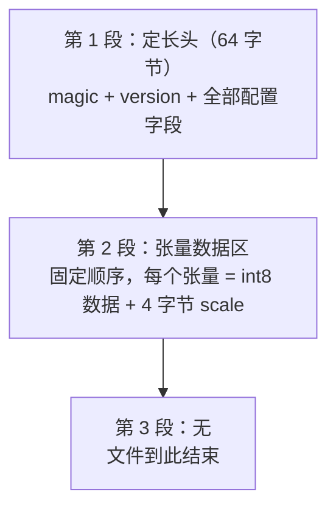
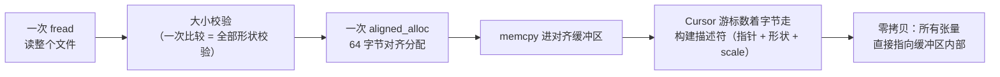

# 02 · 二进制格式设计：权重文件长什么样

> 读完这篇你会知道：为什么不用现成格式、一个"好"的二进制格式由哪几部分组成、定长头 + 固定顺序如何让校验零成本、加载器如何做到零拷贝。
> 对应源码：`src/weights.h` `src/weights.cpp`（加载器）、`py/common.py`（写出）、`src/config.h`（格式常量）。

## 一、为什么不用现成格式？

HuggingFace 上模型的权重存在 **safetensors** 文件里，tokenizer 存在 **sentencepiece（protobuf）** 文件里。引擎完全可以直接解析它们。但我们的思路是：

1. **零依赖**：解析 safetensors 需要链接相应库，解析 protobuf 更麻烦。我们的引擎连 BLAS 都不链，为一个文件格式引入依赖不划算
2. **格式即优化**：现成格式的数据布局未必符合我们的计算模式。我们的格式直接以"每一行输出 = 一段连续内存"的方式存放（第五节细讲），加载完就能高效计算
3. **加载快**：解析现成格式要做字符串匹配、字典查找；我们的格式按**固定顺序**存放，加载就是纯偏移运算

所以分工是：**Python 脚本做一次性的格式转换**（它能方便地读 safetensors），**C++ 引擎只读自己的格式**。转换只跑一次，推理跑无数次——把复杂度放在转换侧，把简单留给热路径。

## 二、先认识四个词

读后面的格式表之前，只需要四个概念；表格里碰到的其他名词，看文末的速查表。

**1. 张量** = 标量、向量、矩阵的统称——同一件事（"N 维数组"）在不同维数下的名字：

| 名称 | 维数 | 例子 |
|---|---|---|
| 标量 | 0 维 | 一个数：`3.14` |
| 向量 | 1 维 | 一串数：`[1.0, 2.0, 3.0]` |
| 矩阵 | 2 维 | 一张表（行×列） |
| 张量 | 3 维及以上 | 一堆矩阵叠起来：`[4][8][256]` |

工程上习惯把标量、向量、矩阵统称张量，因为操作都一样——批量处理一堆数，只是排几行几列、叠几层的区别。权重文件里三类都有：标量 = `rope_base`、每个张量的 `scale`；向量 = `gamma_attn` 这类 [256]；矩阵 = `q_proj` 这类 [256][256]。

**2. 形状记号 `[行][列]`**：本文件里每个张量用 `[行数][列数]` 描述，例如 `q_proj [256][256]` 是 256 行 × 256 列的矩阵，`gamma_attn [256]` 是 256 个数的向量。行和列谁是谁，第五节会讲——它直接决定加载后算得快不快。

**3. 量化（int8 + scale）**：权重不存 float32，而存 **1 字节整数 + 一个 4 字节的缩放系数 scale**，真实值 ≈ `int8 × scale`。完整原理见《09-INT8量化》，现在只需知道：**权重文件里每个张量 = `N 字节的 int8 数据 + 4 字节的 f32 scale`**。

**4. "投影"是什么**：名字里带 `proj` 的张量（`q_proj`、`up_proj`……）都是投影——一次矩阵乘法 `y = W·x`，把向量从一个空间线性映射到另一个空间，从几维到几维由 W 的形状决定。它是神经网络里最基础的操作，03/06/08 篇各有场景。

> **名词速查**：本文件是"格式说明书"，不负责解释模型原理。embedding / 位置编码 → 《03-嵌入与位置编码》；RMSNorm → 04；RoPE → 05；注意力 Q/K/V、softmax → 06；GQA → 07；GeGLU / SiLU → 08。看到不懂的词按这个表跳过去，先记住"它是什么张量、形状多大"就够。

## 三、权重文件 GMW1 的三段式结构

我们的权重格式（`src/config.h` 的 `fmt::WeightsHeader`，小端字节序）只有三段：



### 3.1 第 1 段：定长头（恰好 64 字节）

| 偏移 | 大小 | 字段 | 说明 |
|---|---|---|---|
| 0 | 4 | magic "GMW1" | 格式识别符 |
| 4 | 4 | version = 1 | 版本号 |
| 8 | 4 | n_layers = 2 | 层数 |
| 12 | 4 | dim = 256 | 隐藏维度（向量宽度） |
| 16 | 4 | n_heads = 4 | 注意力头数 |
| 20 | 4 | n_kv_heads = 1 | KV 头数（GQA，07篇会讲） |
| 24 | 4 | mlp_dim = 1024 | MLP 中间维度 |
| 28 | 4 | vocab_size = 1024 | 词表大小 |
| 32 | 4 | max_seq_len = 256 | 位置表行数 |
| 36 | 4 | head_dim = 64 | 每个注意力头的宽度 = dim/n_heads |
| 40 | 4 | f32 rope_base = 10000 | RoPE 频率基数（05篇） |
| 44 | 20 | reserved | 必须全 0 |

这些字段**现在不用逐个弄懂**（`n_heads` 干什么见 06 篇、`rope_base` 见 05 篇）。关键是记住一个性质：**第 2 段每个张量的字节数，全部由这 64 字节里的配置字段决定**——第四节"零成本校验"就靠这一点。

### 3.2 第 2 段：张量数据区——固定顺序，没有名字

顺序是**硬编码**的（`py/common.py` 的 `tensor_order`）：

| 顺序 | 张量 | 形状 |
|---|---|---|
| 1 | embed_tokens | [1024][256] 词表 × 维度 |
| 2 | embed_positions | [256][256] 位置 × 维度 |
| 每层（第 l 层） | q_proj | [256][256] |
| | k_proj | [64][256] ← GQA：只有 1 个 KV 头 |
| | v_proj | [64][256] |
| | o_proj | [256][256] |
| | gate_proj | [1024][256] |
| | up_proj | [1024][256] |
| | down_proj | [256][1024] |
| | gamma_attn | [256] 向量 |
| | gamma_ffn | [256] 向量 |
| 最后 | final_norm_gamma | [256] |
| | lm_head | [1024][256] |

**为什么不要名字？** safetensors 用字典（名字→张量）存放，灵活但加载要查表。我们的模型结构是固定的，顺序就隐含了身份——加载器数着字节走，走到第 5 个张量就必然是第 0 层的 q_proj。省掉所有名字比较。

### 3.3 每个张量是干什么的（速查，不用背）

数据按行连续存放。逐个张量的职责——现在不用背，读 03~08 篇时回来看：

**共享层（4 个）：**

| 张量 | 作用 |
|---|---|
| `embed_tokens` [1024][256] | 词嵌入矩阵。行号 = token id（0–1023），行内容 = 该 token 的 256 维向量。输入侧把 token id 变成向量（03篇）。 |
| `embed_positions` [256][256] | 位置嵌入表。行号 = 位置（0–255），行内容 = 该位置的 256 维向量，加到 token 向量上。行数 = max_seq_len，位置超出表尾会被钳制到最后一行并警告。注意：**真实 Gemma 没有这张表**（位置全靠 RoPE），转换脚本对真实权重写全 0；这个小模型额外学了它，且注意力里同时用 RoPE——两种位置机制叠加（03篇）。 |
| `final_norm_gamma` [256] | 最后一个 RMSNorm 的缩放系数 γ（逐元素，256 个标量）。不是矩阵，是向量（04篇）。 |
| `lm_head` [1024][256] | 输出投影。把最后一个 token 的 256 维向量乘上它，得到 1024 维 logits（每个候选 token 一个分数），softmax 后即下一个 token 的概率分布。行号 = 候选 token id。 |

**每层（共 n_layers 层，每层 9 个张量）：**

注意力部分（4 个）：

| 张量 | 作用 |
|---|---|
| `q_proj` [256][256] | 把 256 维输入投影成 query。256 = 4 头 × 64 维，实际按 4 个 64 维的头切分使用。 |
| `k_proj` [64][256] | 投影成 key。**关键点：GQA 只有 1 个 KV 头**（07篇），所以只有 1×64 = 64 维，而不是 256 维——4 个 query 头共享这一个 KV 头，省掉 4 倍 KV 缓存。 |
| `v_proj` [64][256] | 同上，value 侧。 |
| `o_proj` [256][256] | 注意力输出投影，把 4 个头拼接后的 256 维投回 256 维。 |

MLP 部分（3 个，Swish-GLU 结构，先放大再缩小，08篇）：

| 张量 | 作用 |
|---|---|
| `gate_proj` [1024][256] | 把 256 维投到 1024 维（中间维度），之后过 SiLU 激活，作为门控。 |
| `up_proj` [1024][256] | 同样投到 1024 维，不激活，与门控输出逐元素相乘（即 `silu(x·gate) ⊙ (x·up)`）。 |
| `down_proj` [256][1024] | 把 1024 维投回 256 维，完成 GLU 的收缩。 |

归一化（2 个）：

| 张量 | 作用 |
|---|---|
| `gamma_attn` [256] | 注意力子层前 RMSNorm 的 γ 向量。 |
| `gamma_ffn` [256] | FFN 子层前 RMSNorm 的 γ 向量。 |

> 顺带一提：`lm_head` 和 `embed_tokens` 形状相同（都是 [1024][256]）却是两个独立矩阵。有些模型用**权重绑定**（weight tying）——输出投影直接复用嵌入表的转置，省一半参数量；Gemma 不绑定，各存各的，所以文件里它们各占一份。

## 四、核心技巧：文件大小 = 零成本的形状校验

先看一个规律：上面所有 [256] 维出现的地方都是 `dim`，[1024] 是 `mlp_dim` 或 `vocab_size`，[64] 是 `head_dim`（GQA 只有一个 KV 头时 `k_proj` 行数 = head_dim 而非 dim）。**每个张量的字节数全部由头部配置字段决定**——所以 `expected_file_size`（`src/weights.cpp`）能不用读内容就算出文件总大小：

```cpp
size_t Weights::expected_file_size(const ModelConfig& cfg) {
    const size_t kv = (size_t)cfg.n_kv_heads * cfg.head_dim;
    size_t n = sizeof(fmt::WeightsHeader);
    n += (size_t)cfg.vocab_size * cfg.dim + 4;          // embed_tokens
    n += (size_t)cfg.max_seq_len * cfg.dim + 4;         // embed_positions
    for (uint32_t l = 0; l < cfg.n_layers; l++) {
        n += 2 * ((size_t)cfg.dim * cfg.dim + 4);       // q, o
        n += 2 * (kv * cfg.dim + 4);                    // k, v
        n += 2 * ((size_t)cfg.mlp_dim * cfg.dim + 4);   // gate, up
        n += (size_t)cfg.dim * cfg.mlp_dim + 4;         // down
        n += 2 * ((size_t)cfg.dim + 4);                 // gammas
    }
    n += (size_t)cfg.dim + 4;                           // final_norm_gamma
    n += (size_t)cfg.vocab_size * cfg.dim + 4;          // lm_head
    return n;
}
```

**每个张量的大小都由头里的配置字段完全决定。** 于是校验就一行：

```cpp
if (file.size() != expected) {   // 就这一行
    fprintf(stderr, "gemma: weights file size %zu != expected %zu ...\n", ...);
    return false;
}
```

文件大了 10 字节？说明被截断或者配置不符。文件小了？同样。**不用逐张量检查形状，一次大小比较就完成了全部形状校验**——因为格式没有"自由发挥"的空间。

这套哲学贯穿整个加载器：

| 校验 | 怎么做的 | 防止什么 |
|---|---|---|
| 这是不是我的文件 | magic 比对 | 拿错文件 |
| 版本兼容吗 | version 比对 | 旧格式静默读错 |
| 配置合法吗 | n_heads % n_kv_heads == 0、head_dim == dim/n_heads、reserved 全 0 | 自相矛盾的配置 |
| 形状对吗 | 文件大小 == 推导大小 | 截断、篡改、张量错位 |

**设计原则**：坏数据要在加载的第一毫秒被拒绝，而不是在推理 10 分钟后输出垃圾。

## 五、张量布局：为什么矩阵要按 [输出][输入] 存？

### 5.1 先看数学：GEMV 是"逐行"读矩阵的

推理时最频繁的操作是**矩阵乘向量**（GEMV，代码里是 `gemv_i8_f32`）：输入向量 x 乘上权重矩阵 W，得到输出向量 y。先看一个小例子——W 取 3 行 × 4 列（真实权重是 [256][256] 甚至更大）：

```
        ┌─────────────────┐   ┌────┐
        │ W00 W01 W02 W03 │   │ x0 │
        │ W10 W11 W12 W13 │ × │ x1 │
        │ W20 W21 W22 W23 │   │ x2 │
        └─────────────────┘   │ x3 │
        W：3 行 × 4 列         └────┘
        行数 = 输出数（3）       x：4 维（输入）
        列数 = 输入数（4）       → y：3 维（输出）

y[0] = W00·x0 + W01·x1 + W02·x2 + W03·x3
y[1] = W10·x0 + W11·x1 + W12·x2 + W13·x3
y[2] = W20·x0 + W21·x1 + W22·x2 + W23·x3
```

上面 W 是 3 行 × 4 列：3 个输出、4 个输入，行和列一眼分得清。**行号 i 是输出 y 的下标，列号 j 是输入 x 的下标**——这就是 `[输出][输入]` 记号的来历。`q_proj [256][256]` 读作"256 个输出，每个输出由 256 个输入加权求和得到"。

关键观察：**计算 y[i] 只读矩阵的第 i 行**。整个 GEMV 就是"一行一行地读、一行一行地算"。所以矩阵怎么存，要服务"按行读得快"这个需求。

### 5.2 内存里怎么摆：行主序 vs 列主序

"按行连续存放"就是行主序（row-major）：第 i 行的元素在内存里一个挨一个。拿刚才那个 3 行 × 4 列的小矩阵看字节流（权重是 int8，每元素 1 字节，地址从左到右增大）：

```
行主序（我们的格式）：12 个元素按行连排
地址：0  1  2  3 | 4  5  6  7 | 8  9  10 11
元素：W00 W01 W02 W03 | W10 W11 W12 W13 | W20 W21 W22 W23
      ←── 第 0 行：4 个元素连续 ──→

列主序（反着存）：12 个元素按列连排
地址：0  1  2 | 3  4  5 | 6  7  8 | 9  10 11
元素：W00 W10 W20 | W01 W11 W21 | W02 W12 W22 | W03 W13 W23
      第 0 行的元素 W00 W01 W02 W03 分别在地址 0、3、6、9 —— 每读一个要跳过 2 个元素
```

计算 y[0] 时要读第 0 行的 4 个元素，两种布局的差别：

- **行主序**：W00~W03 在内存里**挨着**，CPU 顺序读——预取器（prefetch）会把后面的元素也提前拉进缓存，一次读完一整行；SIMD 循环就是连续加载 `vld1_s8(w + i)`（`src/kernel.cpp` 里全是这种）
- **列主序**：W00~W03 隔 3 个元素一个（例子里矩阵 3 行，步长 = 行数）——**跨步跳跃**。真实矩阵有 256 行：int8 步长 256 字节（f32 时 1024 字节），每个元素落在**不同的缓存行**里，读一行 256 个元素要碰 256 个缓存行，每个只用 1 个字节

带宽：连续读一行 = 256 字节 = 4 个缓存行（64 字节/行），全部用满；跨步读一行 = 256 次跳跃 × 每次拉 64 字节 = 实际读取 16KB 才拿到 256 字节——**读取量放大 64 倍**（int8 权重；f32 时放大 16 倍，与《10-SIMD与矩阵乘法》的算法一致）。

| | 行主序 [输出][输入]（我们） | 列主序 [输入][输出] |
|---|---|---|
| 第 i 行的元素在内存 | 连续 | 每"行数"个元素出现一个（3 行的例子 → 隔 3 个） |
| 读一行（真实矩阵，一行 256 个元素） | 顺序读 256 字节 = 4 个缓存行，全用满 | 256 次跳跃，每个元素一个缓存行 |
| 缓存行利用率 | 100% | ~1.6%（f32 时 ~6%） |
| 代价 | — | 实际读取量 ×64（f32 时 ×16） |

结论：**存储布局要为计算模式服务**——GEMV 按行算，权重就按行存。

> 补充：HuggingFace 的权重恰好也是 [输出][输入] 行主序，所以转换脚本几乎不用转置——这是业界事实标准。

## 六、加载器：一次分配、一次读取、零拷贝

看 `Weights::load` 的流程（`src/weights.cpp`）：

```cpp
// 1. 一次性把整个文件读进内存
read_whole_file(path, file);        // 先读进临时 vector
// 2. 校验（上文的全部检查）
// 3. 拷贝到 64 字节对齐的大缓冲区
buf.alloc(file.size());
memcpy(buf.ptr, file.data(), file.size());
// 4. 用"游标"数着字节走，构建描述符表——注意：没有任何数据被复制！
Cursor cur{(const int8_t*)buf.ptr};
embed_tokens = cur.next(cfg.vocab_size, cfg.dim);
embed_positions = cur.next(cfg.max_seq_len, cfg.dim);
...
```

`Cursor::next` 每被调用一次，就把 `off` 前进 `rows*cols + 4` 字节，返回一个**描述符**（指针 + 形状 + scale）：

```cpp
struct Cursor {
    const int8_t* p;
    size_t off = sizeof(fmt::WeightsHeader);
    QTensor next(size_t rows, size_t cols) {
        QTensor t;
        t.data = p + off;              // 直接指向大缓冲区内部！
        t.rows = rows; t.cols = cols;
        off += rows * cols;
        memcpy(&t.scale, p + off, 4);  // 紧随数据的 4 字节是 scale
        off += 4;
        return t;
    }
};
```

三个关键词：

- **一次分配**：900MB 的权重文件对应一次 `aligned_alloc`，而不是几千次 `new`（每次 new 都有开销，几千次会明显变慢）
- **一次读取**：一次 `fread` 把整个文件读进来。操作系统最擅长顺序大块读取；一次 900MB 的读比 9000 次 100KB 的读快得多
- **零拷贝**：描述符只存指针，不复制张量数据。"复制"是高性能代码的敌人

整条加载链：



64 字节对齐是为了配合 CPU 的**缓存行**（cache line，通常是 64 字节）：数据对齐到缓存行边界时，加载效率最高。`src/tensor.h` 的 `AlignedBuffer` 封装了这个细节（注意 macOS 的 `aligned_alloc` 要求大小是 64 的倍数，所以做了向上取整）。

## 七、--dump：验证两侧一致

`./build/gemma --weights_path weights/tiny_weights.bin --dump` 会把加载器看到的配置和每个张量打印出来：

```
model config:
  n_layers    = 2
  dim         = 256
  ...
  file size   = 2688448 bytes
tensors:
  embed_tokens             [1024x256] scale=0.0377405
  ...
```

开发时它帮我们验证了 Python 写出的文件和 C++ 读到的完全一致。如果你以后扩展格式，**第一步永远是先让写出侧和读取侧打印同样的东西**。

## 八、总结

1. 自定义格式的理由：零依赖、布局为计算优化、加载快；转换的复杂度留给一次性脚本
2. 格式 = 定长头（magic + version + 配置） + 固定顺序张量区（每个 = int8 数据 + f32 scale）
3. 文件大小由头字段唯一决定 → 一次大小比较 = 全部形状校验
4. 矩阵按 [输出][输入] 行主序存放 → 每行输出是连续内存 → 缓存友好
5. 加载 = 一次分配 + 一次读取 + 游标建描述符，零拷贝
6. 所有校验失败立刻报错——坏文件不允许活着进入推理

## 思考题

1. `reserved` 字段为什么要"必须全 0"？设想 2.0 版格式想加一个 `tie_embeddings` 标志，旧文件 reserved 全 0 意味着什么？
2. 如果 vocab_size 从 1024 改成 4096，文件会变大多少字节？写出计算过程。（提示：embed_tokens 和 lm_head 都含 vocab）
3. 为什么 gamma（只有 256 个元素）也要占用单独的 scale，而不是复用相邻张量的？提示：想想量化的定义（09篇会揭晓答案，先猜）。
