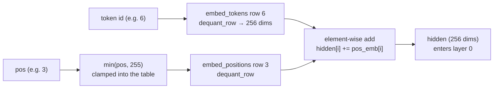

# 03 · Embeddings and Positional Encoding: Numbers Become Vectors

> By the end of this article you will know: how a token becomes a vector, why position information is indispensable, how our engine's "lookup + addition" combination works, and how to look up rows efficiently after quantization.
> Corresponding source: the start of `forward_token` in `src/model.cpp`, `dequant_row` in `src/kernel.cpp`.

## 1. From "a number" to "a vector"

[01 - Tokenizer](01-Tokenizer.md) turned text into ids — "The" → 6. But an id has no semantics: 6 being next to 7 does not mean "The" is similar to "a" — an id is just a door number.

The real representation is a **vector**: each token in the vocabulary gets a 256-dimensional floating-point vector (our engine has dim=256), e.g.:

```
token 6   "The"   →  [ 0.13, -0.52,  0.78, ... ]   (256 numbers)
token 89  "life"  →  [-0.31,  0.05, -0.11, ... ]
```

Where do these vectors come from? **They are learned during training.** Initialized randomly at the start of training, then adjusted over vast amounts of text so that semantically similar words end up with similar vectors. At inference time, the vectors are part of the "weights" — stored in the weights file.

Vocab 1024 × 256 dims per word = 1024×256 = 262144 numbers, exactly the shape of the first tensor in the weights file, `embed_tokens` `[1024][256]`.

## 2. The lookup: the essence of the embedding layer

Given token id 6, how do we get its vector? **Table lookup**: row 6 is its vector.

```
embed_tokens (a matrix, 1024 rows × 256 cols)
row 0:    <pad>'s vector
row 1:    <eos>'s vector
...
row 6:    "The"'s vector   ← take this row
...
row 1023: byte 0xFF's vector
```

Note: there is **no computation** here — it's just copying one row of memory. This is nearly the cheapest layer in any neural network, but it is the bridge from "discrete symbols" to "continuous vectors"; without it, none of the subsequent matrix math makes sense.

## 3. Position: why "The cat chased the dog" ≠ "The dog chased the cat"

Look back at our attention computation (Chapter 06 covers it in detail): it lets each word "look at" the other words. But a pure lookup vector contains **only word meaning, no position** — whether "cat" appears at position 2 or position 5, its vector is identical.

That clearly won't do: "cat chases dog" and "dog chases cat" use the same words in different order with opposite meanings. The model must know where each word **is**.

Three generations of mainstream solutions:

1. **Learnable position vectors** (our engine's approach): like word vectors, each possible position also gets a learnable vector, added directly
2. Fixed sinusoidal encoding (the original Transformer paper): generated per position by sin/cos formulas, not learned
3. **RoPE rotary position embedding** (modern mainstream; our engine also uses it inside attention — Chapter 05): "rotates" position information into the vector

| | Learnable position vectors | Fixed sinusoidal | RoPE |
|---|---|---|---|
| Learned? | yes (adjusted in training) | no (sin/cos formula fixed) | no (rotation-angle formula) |
| Needs a table? | yes (max_seq_len × dim) | no | no (cos/sin generated on demand) |
| Beyond table length | clamped to the last row | can extrapolate | can extrapolate |
| Encodes what | absolute position | absolute position | relative distance (Chapter 05) |
| Our usage | added in the embedding layer | — | attention q/k |

Our engine is actually a **combination of 1 and 3**: the embedding layer adds a learnable position bias (this article), and attention applies RoPE (Chapter 05).

## 4. Our implementation: two lookups + one addition

The start of `forward_token` in `src/model.cpp`:

```cpp
// Embedding: token row + position row (clamped to the table), added element-wise
uint32_t p = std::min(pos, w.embed_positions.rows - 1);
dequant_row(w.embed_tokens.data + (size_t)token * cfg.dim, w.embed_tokens.scale,
            hidden.data(), cfg.dim);                 // token row lookup
dequant_row(w.embed_positions.data + (size_t)p * cfg.dim, w.embed_positions.scale,
            pos_emb.data(), cfg.dim);                // position row lookup
for (uint32_t i = 0; i < cfg.dim; i++)
    hidden[i] += pos_emb[i];                         // add = this word's representation at this position
```

The data flow:



This corresponds to the `embed_positions` tensor `[max_seq_len=256][dim=256]` in the weights file: 256 positions, each with a 256-dim vector. Positions 0–255 all have their own vector — **what about positions beyond 255?** We clamp (cap at 255) and warn once — in real Gemma the position table usually has 1024 rows, and RoPE handles long-range position discrimination, so the clamp is an architecturally sound fallback.

> The 270m preset is configured to big-model specs with a 128K context; the test model is the tiny tier with only 256 positions. In fact, context length and position count are the same thing — both are determined by the single `max_seq_len` field (positions run 0 to max_seq_len−1). So why doesn't the test model also get 128K positions? **Memory**: a 128K-row position table would cost 128K positions × 1536 dims × 1 byte (int8) ≈ 197 MB — not worth it for one table. Long contexts are extended by RoPE (the formula is computed on the fly per position, occupying no storage); the position table only serves short distances, and hard-storing 128K rows is pure waste. So engineering-wise, allocate as needed: the table gets as many rows as it needs; `--max_cache_len` is the same idea (Chapter 07).

## 5. Lookup after quantization: dequant_row

Weights are stored as int8 (Chapter 09 explains). A lookup must "restore" a row of int8 to float32. That operation is **dequantization**, in `src/kernel.cpp`:

```cpp
void dequant_row(const int8_t* w, float scale, float* out, size_t n) {
    // NEON path (this machine)
    float32x4_t sv = vdupq_n_f32(scale);   // broadcast the scale to 4 lanes
    size_t i = 0;
    for (; i + 8 <= n; i += 8) {
        int8x8_t w8 = vld1_s8(w + i);      // load 8 int8 at once
        int16x8_t w16 = vmovl_s8(w8);      // sign-extend to int16
        // widen to int32, convert to float32, multiply by scale
        vst1q_f32(out + i,
                  vmulq_f32(vcvtq_f32_s32(vmovl_s16(vget_low_s16(w16))), sv));
        vst1q_f32(out + i + 4, ...);       // same for the high 4
    }
    for (; i < n; i++) out[i] = (float)w[i] * scale;   // tail (fewer than 8)
}
```

Remember the mathematical essence first (SIMD details in Chapter 10): `out[i] = w[i] × scale`. int8 first becomes an integer (sign-extended, because int8 has negatives), then a float, then multiplied by scale.

**Why dequantize?** int8 is a **storage format**, not a compute format: weights are stored as int8 to save memory (a 270M model drops from 1.08 GB to 270 MB — Chapter 09), but computation must happen in floating point. Three reasons: first, the CPU's SIMD instructions (`vld1q_f32`, `vmulq_f32`) operate on float32 lanes; int8 integers can't participate directly. Second, everything downstream is floating point — `hidden[i] += pos_emb[i]`, RMSNorm, softmax, the float accumulators of matrix multiplies; int8 can't enter that chain. Third, int8 is a "compressed package", not the true value — quantization did `round(float / scale)`, discarding precision, and dequantization `× scale` recovers an approximate float.

Note that matrix multiplication (`dot_i8_f32`, Chapter 10) does **not** dequantize first and then compute: `Σ (int8ᵢ × scale) × xᵢ = scale × Σ (int8ᵢ × xᵢ)` — the scale is folded to one multiplication at the end; mathematically equivalent, and it saves the intermediate float storage. The lookup path, on the other hand, adds its row into hidden and repeatedly feeds downstream computation, so dequantizing directly is more natural. Both roads reach the same destination: **int8 saves memory, floats compute accurately, and only one scale multiply separates them**.

Two design points:

1. **Dequantize by row, never the whole vocabulary**. The vocab has 1024 rows and each pass uses one. Dequantizing all of it would cost real Gemma 262K × 1536 × 4 bytes ≈ 1.5 GB of resident memory — pure waste
2. `pos_emb` and `hidden` are **pre-allocated buffers** (allocated once in the `Model` constructor) — zero allocations inside the decode loop. This is an engine-wide convention (see the hot-path discussion in [12 - Testing Strategy](12-Testing-Strategy.md))

## 6. A tiny hand-computed example

Assume a vocabulary of 4 words and 2 dimensions (real is 1024×256; the principle is identical):

```
embed_tokens = [[1.0, 2.0],     # token 0
                [3.0, 4.0],     # token 1
                [5.0, 6.0],     # token 2
                [7.0, 8.0]]     # token 3
embed_positions = [[0.1, 0.2],  # position 0
                   [0.3, 0.4],  # position 1
                   [0.5, 0.6]]  # position 2

Input: token 2 at position 1
hidden = embed_tokens[2] + embed_positions[1]
       = [5.0, 6.0] + [0.3, 0.4]
       = [5.3, 6.4]
```

The same token 2 at position 0 gives `[5.1, 6.2]` — **same word, different position, different vector**. That is exactly what "positional encoding" is for.

## 7. Differences from real Gemma

Real Gemma 3n has **no** `embed_positions` — it relies entirely on RoPE for position. The simplified teaching architecture includes it, so we implemented it as described. When converting real weights, `py/convert.py` fills the missing `embed_positions` with zeros (the additive identity, which doesn't affect correctness) and RoPE works as usual. This is also a benefit of "config-driven data": architectural differences are isolated inside the conversion script.

## 8. Summary

1. Token ids have no semantics; a lookup produces the vector that actually "represents the word"
2. Position information must be added explicitly: we = learnable position vectors + addition
3. A lookup = reading one row of memory — the cheapest layer in the network
4. Post-quantization lookups dequantize per row, never the whole vocabulary
5. Out-of-range positions need a fallback (clamp + warning), and memory must be allocated on demand

## Exercises

1. Why is `embed_positions` shaped `[max_seq_len][dim]` rather than `[dim][max_seq_len]`? (Hint: a lookup takes one row)
2. If a token id ≥ vocab_size (say 5000 ≥ 1024), what does `forward_token` do? Find the code.
3. Why are position vectors *added* to word vectors rather than *concatenated* (doubling the vector length)? (Hint: addition preserves dimension, concatenation changes it — think about the downstream matrices' shapes)
