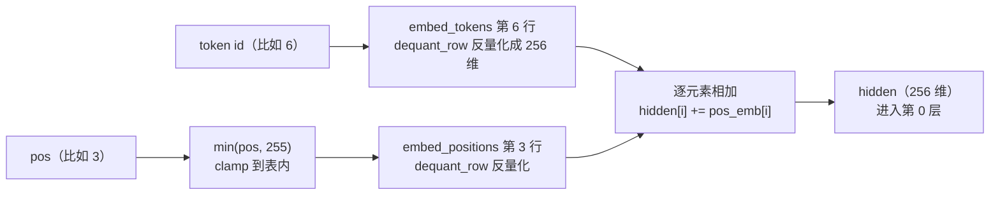

# 03 · 嵌入与位置编码：数字变成向量

> 读完这篇你会知道：token 怎么变成向量、为什么位置信息必不可少、我们引擎的"查表 + 加法"组合怎么实现、量化后怎么高效查表。
> 对应源码：`src/model.cpp` 的 `forward_token` 开头、`src/kernel.cpp` 的 `dequant_row`。

## 一、从"数字编号"到"向量"

《01-Tokenizer》把文字变成了编号，比如 "The" → 6。但编号本身没有语义：6 和 7 挨着，不代表 "The" 和 "a" 意思相近——编号只是门牌号。

真正的表示是一个**向量**：给词表里每个 token 分配一个 256 维的浮点向量（我们引擎的 dim=256），例如：

```
token 6   "The"   →  [ 0.13, -0.52,  0.78, ... ]   （256 个数）
token 89  "life"  →  [-0.31,  0.05, -0.11, ... ]
```

这些向量从哪来？**训练时学出来的**。训练初期随机初始化，然后通过海量文本学习调整，使得语义相近的词向量也相近。推理时，向量就是"权重"的一部分——存在权重文件里。

词表 1024 × 每词 256 维 = 1024×256 = 262144 个数，正好对应权重文件里第一个张量 `embed_tokens` 的形状 `[1024][256]`。

## 二、查表：embedding 层的本质

给定 token 编号 6，怎么拿到它的向量？**查表**：第 6 行就是它的向量。

```
embed_tokens（矩阵，1024 行 256 列）
行 0:  <pad> 的向量
行 1:  <eos> 的向量
...
行 6:  "The" 的向量   ← 取这一行
...
行 1023: 字节 0xFF 的向量
```

注意：这里**没有计算**，就是内存拷贝一行。这在所有神经网络里几乎是最便宜的一层，但它是"离散符号"到"连续向量"的桥梁，没有它后面的矩阵运算无从谈起。

## 三、位置信息：为什么 "The cat chased the dog" ≠ "The dog chased the cat"

再回头看看我们的注意力计算（06篇细讲）：它让每个词"看"其他词。但纯查表得到的向量里**只有词义，没有位置**——"猫"出现在第 2 个位置还是第 5 个位置，它的向量一模一样。

这显然不行："猫追狗"和"狗追猫"词完全相同，顺序不同意思完全相反。模型必须知道每个词在**哪里**。

主流方案有三代：

1. **可学习位置向量**（我们引擎的方案）：像词向量一样，给每个可能的位置也分配一个可学习向量，直接相加
2. 固定正弦编码（Transformer 原版论文）：用 sin/cos 函数按位置生成，不学习
3. **RoPE 旋转位置编码**（现代主流，我们引擎同时在注意力里用了它，05篇讲）：把位置信息"旋转"进向量

| | 可学习位置向量 | 固定正弦编码 | RoPE |
|---|---|---|---|
| 是否学习 | 是（训练时调整） | 否（sin/cos 公式固定） | 否（旋转角度公式） |
| 要存表吗 | 要（max_seq_len × dim） | 不要 | 不要（cos/sin 按需生成） |
| 超出表长 | clamp 到表尾 | 可外推 | 可外推 |
| 编码什么 | 绝对位置 | 绝对位置 | 相对距离（05篇） |
| 我们的用法 | 嵌入层相加 | — | 注意力 q/k |

我们引擎其实是 **1 和 3 的组合**：嵌入层加可学习位置偏置（本文），注意力里再做 RoPE（05篇）。

## 四、我们的实现：两行查表 + 一次加法

`src/model.cpp` 的 `forward_token` 开头：

```cpp
// Embedding: token 行 + 位置行（clamp 到表格范围），逐元素相加
uint32_t p = std::min(pos, w.embed_positions.rows - 1);
dequant_row(w.embed_tokens.data + (size_t)token * cfg.dim, w.embed_tokens.scale,
            hidden.data(), cfg.dim);                 // 查 token 行
dequant_row(w.embed_positions.data + (size_t)p * cfg.dim, w.embed_positions.scale,
            pos_emb.data(), cfg.dim);                // 查位置行
for (uint32_t i = 0; i < cfg.dim; i++)
    hidden[i] += pos_emb[i];                         // 相加 = 这个词在此位置的表示
```

数据流长这样：



对应权重文件里的 `embed_positions` 张量 `[max_seq_len=256][dim=256]`：256 个位置，每个位置一个 256 维向量。位置 0 到 255 都有专属向量，**超过 255 的位置怎么办？** 我们的处理是 clamp（截断到 255）并警告一次——真实 Gemma 里位置表通常是 1024 行，而 RoPE 负责长距离的位置区分，所以这个 clamp 在架构上是合理的兜底。

> 270m 预设按大模型规格配，上下文设的是 128K；测试模型是 tiny 档，位置只设了 256 个。其实上下文长度和位置个数是一回事，都由 `max_seq_len` 一个字段决定（位置从 0 数到 max_seq_len−1）。那为什么测试模型不也配 128K 个位置？**内存占用**：如果给位置表配 128K 行，128K 个位置 × 1536 维 × 1 字节（int8）≈ 197MB——就为了一张位置表，不值得。长上下文靠 RoPE 延展（公式随位置即时算，不占存储），位置表只服务短距离，硬存 128K 行纯浪费。所以工程上按需分配：表需要多长就配多少行；`--max_cache_len` 同理（07篇）。

## 五、量化后怎么查表：dequant_row

权重是 int8 存的（09篇细讲）。查表时要把一行 int8 "还原"成 float32。这个操作叫**反量化**，`src/kernel.cpp`：

```cpp
void dequant_row(const int8_t* w, float scale, float* out, size_t n) {
    // NEON 路径（本机）
    float32x4_t sv = vdupq_n_f32(scale);   // 把 scale 广播到 4 个通道
    size_t i = 0;
    for (; i + 8 <= n; i += 8) {
        int8x8_t w8 = vld1_s8(w + i);      // 一次加载 8 个 int8
        int16x8_t w16 = vmovl_s8(w8);      // 符号扩展到 int16
        // 再扩展到 int32，转成 float32，统一乘 scale
        vst1q_f32(out + i,
                  vmulq_f32(vcvtq_f32_s32(vmovl_s16(vget_low_s16(w16))), sv));
        vst1q_f32(out + i + 4, ...);       // 高 4 个同样处理
    }
    for (; i < n; i++) out[i] = (float)w[i] * scale;   // 尾巴（不足 8 个）
}
```

先记住数学本质（SIMD 细节见 10篇）：`out[i] = w[i] × scale`。int8 先变成整数（符号扩展，因为 int8 有负数），再变成浮点，最后乘 scale。

**为什么要反量化？** int8 是**存储格式**，不是计算格式：权重按 int8 存是为了省内存（270M 模型从 1.08GB 降到 270MB，09篇细讲），但计算必须在浮点里做。三个理由：一是 CPU 的 SIMD 指令（`vld1q_f32`、`vmulq_f32`）处理的通道是 float32，int8 整数没法直接参与；二是下游全是浮点运算——`hidden[i] += pos_emb[i]`、RMSNorm、softmax、矩阵乘的浮点累加器，int8 进不了这条链；三是 int8 只是"压缩包"不是真值——量化时 `round(float / scale)` 取整丢弃了精度，反量化 `× scale` 恢复近似浮点值。

注意矩阵乘（`dot_i8_f32`，10篇）**不先反量化再算**：`Σ (int8ᵢ × scale) × xᵢ = scale × Σ (int8ᵢ × xᵢ)`——scale 折叠到最后乘一次，数学等价，还省掉中间浮点存储；查表路径则因为行要加进 hidden、反复参与下游计算，直接反量化更自然。两条路殊途同归：**省内存靠 int8，算得准靠浮点，中间只隔一次乘 scale**。

两个设计点：

1. **按行反量化，而不是把整个词表反量化**。词表 1024 行，每次只用 1 行。如果全部反量化，真实 Gemma 26 万 × 1536 × 4 字节 ≈ 1.5GB 常驻内存——纯浪费
2. `pos_emb` 和 `hidden` 是**预分配的缓冲区**（`Model` 构造时一次性分配好），解码循环里零内存分配——这也是全引擎的约定（见《12-测试策略》里关于热路径的讨论）

## 六、手算一个小例子

假设词表只有 4 个词、维度只有 2（真实是 1024×256，原理一样）：

```
embed_tokens = [[1.0, 2.0],     # token 0
                [3.0, 4.0],     # token 1
                [5.0, 6.0],     # token 2
                [7.0, 8.0]]     # token 3
embed_positions = [[0.1, 0.2],  # 位置 0
                   [0.3, 0.4],  # 位置 1
                   [0.5, 0.6]]  # 位置 2

输入：token 2 出现在位置 1
hidden = embed_tokens[2] + embed_positions[1]
       = [5.0, 6.0] + [0.3, 0.4]
       = [5.3, 6.4]
```

同一个 token 2 出现在位置 0 时是 `[5.1, 6.2]`——**同一个词，不同位置，不同向量**。这正是"位置编码"想要的效果。

## 七、和真实 Gemma 的差异

真实 Gemma 3n **没有** `embed_positions`——它完全靠 RoPE 提供位置信息。教学用简化架构里有，我们照它实现。`py/convert.py` 转换真实权重时会把缺失的 `embed_positions` 填成全零（加法恒等元，不影响正确性），RoPE 照常工作。这也是"配置数据驱动"的好处：架构差异被隔离在转换脚本里。

## 八、总结

1. token 编号没有语义，查表得到向量才是"词的表示"
2. 位置信息必须显式加入：我们 = 可学习位置向量 + 相加
3. 查表 = 读内存一行，是网络里最便宜的一层
4. 量化后查表要反量化：按行做，绝不全词表反量化
5. 位置越界要兜底（clamp + 警告），内存要按需分配

## 思考题

1. `embed_positions` 的形状为什么是 `[max_seq_len][dim]` 而不是 `[dim][max_seq_len]`？（提示：查表是取一行）
2. 如果 token 编号 ≥ vocab_size（比如 5000 ≥ 1024），`forward_token` 会怎么做？找出对应代码。
3. 位置向量加到词向量上，为什么是"加法"而不是"拼接"（把向量拼长一倍）？（提示：加法的维度不变，拼接改变维度——想想下游矩阵的形状）
