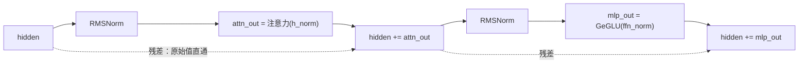

# 04 · RMSNorm：让数值不爆炸

> 读完这篇你会知道：为什么神经网络需要归一化、LayerNorm 和 RMSNorm 的区别、公式每一项的含义、一个 eps 能防止哪类数值错误。
> 对应源码：`src/ops.cpp` 的 `rmsnorm`、`src/weights.cpp`（gamma 的加载与缓存）。

## 一、问题：数值会失控

想象一个 26 层的网络，每层做"向量 × 矩阵"。如果权重矩阵的数值偏大（比如平均 2.0），每过一层向量的数值就大约翻倍：

```
第 1 层输出：~2
第 2 层输出：~4
...
第 26 层输出：~2^26 ≈ 6700 万
```

数值爆炸（或反向地，权重偏小时数值消失成 0）会让整个网络失效：激活值超出 float32 的表示范围、梯度消失/爆炸让训练失败、softmax 变成一团 NaN。**归一化**就是每层之间"拉回正轨"的手段。

## 二、LayerNorm 回顾（RMSNorm 的前身）

经典的层归一化（Layer Normalization）对每个向量做两件事：

1. **减均值**：把向量平移，使其中心为 0
2. **除标准差**：把向量缩放，使其离散程度为 1

公式（对向量 x 的每个元素）：

```
x'[i] = (x[i] - mean(x)) / std(x) * γ[i] + β[i]
```

其中 γ（缩放）和 β（平移）是可学习参数，让网络能自己决定"归一化后想变成什么样"。

RMSNorm 就是在 LayerNorm 上砍掉"减均值"这一步：

| | LayerNorm | RMSNorm |
|---|---|---|
| 减均值 | 有 | **无** |
| 归一化分母 | 标准差 std(x) | 均方根 sqrt(mean(x²) + eps) |
| 可学习参数 | γ 和 β | 只有 γ |
| 实现遍历次数 | 均值 + 方差 + 缩放（3 遍） | 均方和 + 缩放（2 遍） |
| 现代大模型 | 早期 Transformer | Gemma / LLaMA |

2019 年有研究者提出疑问：**减均值真的有用吗？** 实验结论是——去掉均值平移，效果几乎不变，还省了一次全向量求和的遍历。于是有了 RMSNorm：

## 三、RMSNorm 公式逐项拆解

```
x'[i] = x[i] / sqrt( mean(x²) + eps ) * γ[i]
        ───────   ─────────────────────   ─────
        原值       均方根（RMS）的倒数      可学习缩放
```

逐项理解：

- **x² 再求均值**：均方值（mean square）。注意先平方再平均——平方让负数也变成正贡献
- **sqrt(...)**：开根号得到"均方根"（Root Mean Square，RMS）——一个描述"这个向量整体有多大"的量。比如向量 [3, 4]，RMS = sqrt((9+16)/2) = sqrt(12.5) ≈ 3.54
- **除以 RMS**：向量整体被缩放到"RMS = 1"的尺度。无论进来多大/多小，出去都差不多大——数值失控被止住
- **+ eps**：`eps = 1e-6` 是"防零保护"。如果向量恰好全 0，mean(x²)=0，除 0 得到无穷大/NaN。加一个极小的正数，分母永远 > 0。代价是归一化结果有 1e-6 量级的微小偏差，可以忽略
- **× γ**：光归一化还不够——网络可能需要"这一层整体放大 1.5 倍"。γ 是每个维度一个的可学习参数（长度 = dim 的向量），存在权重文件里（每层两个：gamma_attn 和 gamma_ffn）

注意 RMSNorm **没有减均值**：结果的中心不一定是 0，但实验证明这不影响效果，Gemma、LLaMA 等现代模型全用 RMSNorm。

## 四、手算例子

取向量 x = [3, 4]，γ = [1, 1]，eps 忽略：

```
mean(x²) = (9 + 16) / 2 = 12.5
rstd = 1 / sqrt(12.5) = 0.2828
x' = [3 × 0.2828, 4 × 0.2828] = [0.8485, 1.1314]
验证：mean(x'²) = (0.72 + 1.28) / 2 = 1.0  ✓ 归一化到 RMS=1
```

如果 γ = [2, 0.5]（网络学到的缩放），结果再逐元素乘上：x'' = [1.697, 0.566]。

## 五、我们的实现

`src/ops.cpp`：

```cpp
void rmsnorm(const float* x, const float* gamma, size_t n, float eps, float* out) {
    float ss = 0.0f;
    for (size_t i = 0; i < n; i++) ss += x[i] * x[i];      // 第一步：均方和
    float rstd = 1.0f / std::sqrt(ss / (float)n + eps);    // 第二步：RMS 的倒数
    for (size_t i = 0; i < n; i++) out[i] = x[i] * rstd * gamma[i];  // 第三步
}
```

不到 10 行。两个实现细节：

1. **两遍遍历**：先求和再缩放。第一遍算 ss 必须完整（不能用一半的 ss 去缩放前一半元素）。代码简单、无中间分配
2. **写 out 而不是原地**：调用方传入 `h_norm` 缓冲区，`x`（hidden）不动。为什么？残差连接需要原始值——原因见下一节

### gamma 的加载细节（src/weights.cpp）

gamma 在权重文件里也是 int8 + scale（和所有张量统一）。但 gamma 每次前向都要用，所以加载时**预先反量化一次**，缓存成 float32 向量：

```cpp
gamma_attn_f32[l][i] = (float)L.gamma_attn.data[i] * L.gamma_attn.scale;
```

内存代价：2 × 26 层 × 1536 × 4 字节 ≈ 320KB——微不足道。收益：热路径少一次反量化。**"加载时算一次，推理时用无数次"**是引擎里反复出现的思想（RoPE 的 cos/sin 表、gamma 缓存都是）。

## 六、它在模型里的位置：残差连接的好搭档

看 `forward_token` 的结构（00篇见过）：

```cpp
rmsnorm(hidden, gamma_attn[l], h_norm);      // 归一化
attention_block(..., h_norm, ...);           // 注意力读的是归一化后的值
hidden += attn_out;                          // 残差：把结果"加回去"
```



这个模式叫 **pre-norm + 残差连接**（先归一化再进子层，子层输出加回原值）：

- **pre-norm**：归一化在注意力/MLP **之前**，保证子层输入始终在健康范围
- **残差（residual）**：`hidden += attn_out` 让网络学习的是"增量"而不是"全部重来"。原始信息有一条**高速通道**直达深层，梯度也能直通回传。没有残差，深网络根本训练不起来

所以归一化才需要输出到独立缓冲区：`hidden` 的原始值还要留着做加法。

## 七、归一化 vs 我们实现的顺序（一个容易混淆的点）

有人会问：真实 Gemma 是 `h = h + attn(rmsnorm(h))`，我们的代码里也是先 rmsnorm 再 attention_block，最后加回——顺序一致 ✓。注意区分"归一化的输出 h_norm"和"残差加回后的 hidden"是两个不同的向量，代码里分别叫 `h_norm` 和 `hidden`，读代码时别混。

## 八、总结

1. 归一化阻止数值随层数爆炸/消失
2. RMSNorm = LayerNorm 去掉减均值：`x / sqrt(mean(x²) + eps) × γ`
3. eps 是防除零保护（1e-6），γ 是可学习缩放（每层两个，加载时预先反量化）
4. 两遍遍历实现：先求均方和，再缩放
5. pre-norm + 残差连接是现代 Transformer 的标准结构，归一化输出到独立缓冲区正是为了保住残差的原始值

## 思考题

1. 如果去掉 `+ eps`，构造一个让 `rmsnorm` 输出 NaN 的输入。
2. 为什么 gamma 加载时预反量化，而 embed_tokens 查表时才反量化？两者使用模式的差别是什么？（提示：每层 gamma 每次前向必用；embed 每次只用 1 行）
3. 把 eps 从 1e-6 改成 1.0，对输出有什么影响？在 tiny 模型上试试（改 `config.h` 的 `kRmsEps`），测试会不会红？为什么？
