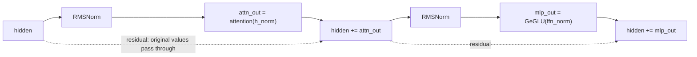

# 04 · RMSNorm: Keeping the Numbers from Exploding

> By the end of this article you will know: why neural networks need normalization, how LayerNorm and RMSNorm differ, what every term of the formula means, and which class of numerical errors an eps prevents.
> Corresponding source: `rmsnorm` in `src/ops.cpp`, `src/weights.cpp` (gamma loading and caching).

## 1. The problem: numbers go out of control

Imagine a 26-layer network where each layer does "vector × matrix". If the weight matrices are on the large side (say, averaging 2.0), the vector's magnitude roughly doubles per layer:

```
Layer 1 output: ~2
Layer 2 output: ~4
...
Layer 26 output: ~2^26 ≈ 67 million
```

Explosion (or, in reverse, vanishing to 0 when weights are small) breaks the whole network: activations leave float32's representable range, gradients vanish/explode and training fails, softmax turns into NaN soup. **Normalization** is the mechanism that pulls things back on track between layers.

## 2. LayerNorm recap (RMSNorm's predecessor)

Classic Layer Normalization does two things to each vector:

1. **Subtract the mean**: shift the vector so it's centered at 0
2. **Divide by the standard deviation**: scale it so its dispersion is 1

Formula (for each element of vector x):

```
x'[i] = (x[i] - mean(x)) / std(x) * γ[i] + β[i]
```

where γ (scale) and β (shift) are learnable parameters, letting the network decide for itself "what shape do I want after normalization".

RMSNorm is LayerNorm with the "subtract the mean" step removed:

| | LayerNorm | RMSNorm |
|---|---|---|
| Mean subtraction | yes | **no** |
| Normalization denominator | standard deviation std(x) | root mean square sqrt(mean(x²) + eps) |
| Learnable parameters | γ and β | γ only |
| Passes over the data | mean + variance + scale (3) | mean-square + scale (2) |
| Modern LLMs | early Transformers | Gemma / LLaMA |

In 2019 researchers asked: **is mean subtraction actually useful?** The experimental conclusion — removing the mean shift barely changes results, and it saves a full pass of summing the vector. Hence RMSNorm:

## 3. The RMSNorm formula, term by term

```
x'[i] = x[i] / sqrt( mean(x²) + eps ) * γ[i]
        ─────   ─────────────────────   ─────
        value    1/RMS (root mean square)   learnable scale
```

Understanding each term:

- **x² then mean**: the mean square. Square first, then average — squaring makes negatives contribute positively
- **sqrt(...)**: the square root gives the "root mean square" (RMS) — a measure of "how big is this vector overall". For [3, 4], RMS = sqrt((9+16)/2) = sqrt(12.5) ≈ 3.54
- **Divide by RMS**: the vector is rescaled so its "RMS = 1". Whatever magnitude comes in, roughly the same goes out — runaway values are stopped
- **+ eps**: `eps = 1e-6` is divide-by-zero protection. If the vector is exactly all zeros, mean(x²)=0 and dividing gives infinity/NaN. A tiny positive number keeps the denominator > 0. The cost is a 1e-6-magnitude bias in the result — negligible
- **× γ**: normalization alone isn't enough — the network may want "this layer amplified 1.5× overall". γ is a learnable per-dimension parameter (a vector of length = dim), stored in the weights file (two per layer: gamma_attn and gamma_ffn)

Note that RMSNorm **does not subtract the mean**: the result isn't necessarily centered at 0, but experiments show this doesn't hurt; Gemma, LLaMA, and other modern models all use RMSNorm.

## 4. A hand-computed example

Take x = [3, 4], γ = [1, 1], ignore eps:

```
mean(x²) = (9 + 16) / 2 = 12.5
rstd = 1 / sqrt(12.5) = 0.2828
x' = [3 × 0.2828, 4 × 0.2828] = [0.8485, 1.1314]
Check: mean(x'²) = (0.72 + 1.28) / 2 = 1.0  ✓ normalized to RMS=1
```

If γ = [2, 0.5] (scales the network learned), multiply element-wise: x'' = [1.697, 0.566].

## 5. Our implementation

`src/ops.cpp`:

```cpp
void rmsnorm(const float* x, const float* gamma, size_t n, float eps, float* out) {
    float ss = 0.0f;
    for (size_t i = 0; i < n; i++) ss += x[i] * x[i];      // step 1: sum of squares
    float rstd = 1.0f / std::sqrt(ss / (float)n + eps);    // step 2: 1/RMS
    for (size_t i = 0; i < n; i++) out[i] = x[i] * rstd * gamma[i];  // step 3
}
```

Under 10 lines. Two implementation details:

1. **Two passes**: sum first, then scale. The first pass must finish completely (you can't scale the first half of the elements with half a sum). Simple code, no intermediate allocations
2. **Write to `out`, not in place**: the caller passes the `h_norm` buffer and `x` (hidden) stays untouched. Why? The residual connection needs the original values — see the next section

### How gamma is loaded (src/weights.cpp)

Gamma is also int8 + scale in the weights file (uniform with all other tensors). But gamma is needed on every forward pass, so at load time we **dequantize once up front** and cache it as a float32 vector:

```cpp
gamma_attn_f32[l][i] = (float)L.gamma_attn.data[i] * L.gamma_attn.scale;
```

Memory cost: 2 × 26 layers × 1536 × 4 bytes ≈ 320 KB — negligible. Benefit: one fewer dequantization on the hot path. **"Compute once at load, use a million times at inference"** is a recurring theme in this engine (the RoPE cos/sin tables and the gamma cache are both examples).

## 6. Where it sits in the model: the residual connection's best friend

The structure of `forward_token` (seen in Chapter 00):

```cpp
rmsnorm(hidden, gamma_attn[l], h_norm);      // normalize
attention_block(..., h_norm, ...);           // attention reads the normalized values
hidden += attn_out;                          // residual: "add the result back"
```



This pattern is **pre-norm + residual connection** (normalize before the sublayer; add the sublayer's output back to the original):

- **Pre-norm**: normalization happens **before** attention/MLP, guaranteeing the sublayer's input is always in a healthy range
- **Residual**: `hidden += attn_out` means the network learns an "increment" rather than redoing everything from scratch. The original information has an **express lane** straight to the deep layers, and gradients flow straight back. Without residuals, deep networks simply won't train

That's also why normalization writes to a separate buffer: `hidden`'s original value must survive for the addition.

## 7. Normalization vs. our implementation's order (a common confusion)

One might ask: real Gemma is `h = h + attn(rmsnorm(h))`, and our code also does rmsnorm first, then attention_block, then adds back — same order ✓. Just don't confuse "the normalized output h_norm" with "hidden after the residual add": they are two different vectors, named `h_norm` and `hidden` in the code. Keep them straight when reading.

## 8. Summary

1. Normalization stops values from exploding/vanishing with depth
2. RMSNorm = LayerNorm minus mean subtraction: `x / sqrt(mean(x²) + eps) × γ`
3. eps is divide-by-zero protection (1e-6); γ is a learnable scale (two per layer, pre-dequantized at load)
4. Two-pass implementation: sum of squares first, then scale
5. Pre-norm + residual is the standard structure of modern Transformers; normalizing into a separate buffer exists precisely to preserve the residual's original values

## Exercises

1. Without `+ eps`, construct an input that makes `rmsnorm` output NaN.
2. Why is gamma pre-dequantized at load while embed_tokens is dequantized at lookup time? What's the difference in usage pattern? (Hint: each layer's gamma is used on every forward; embedding uses 1 row at a time)
3. Change eps from 1e-6 to 1.0 — what happens to the output? Try it on the tiny model (edit `kRmsEps` in `config.h`). Do the tests go red? Why?
