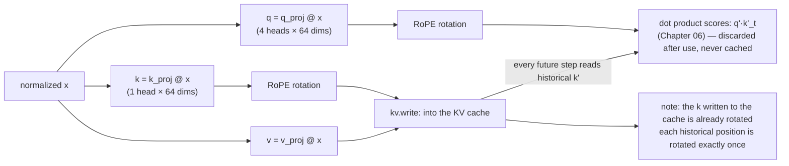

# 05 · RoPE: Rotary Position Embedding

> By the end of this article you will know: the three generations of positional encoding, why "rotation" carries position information, why a fixed formula works without ever being trained, what GPT-NeoX interleaved pairing is, why the cos/sin tables are generated lazily — and a classic in-place aliasing bug that cost us half a day of debugging.
> Corresponding source: `RopeCache` in `src/ops.cpp`, `rope_apply` in `py/reference_model.py`.

## 1. The evolution of positional encoding (three generations)

[03 - Embeddings and Positional Encoding](03-Embeddings-and-Positional-Encoding.md) covered generation one: give every absolute position a learnable vector and add it to the word vector. Its problems: the position table has a length cap (ours is 256 rows) and cannot represent anything beyond it; and the relative relationship between position 100 and 101 has to be learned from data by the model itself.

Generation two (the original Transformer paper): fixed sinusoidal functions `sin(pos / 10000^(i/d))` generate the position vectors — nothing is learned. No table to store, and it extrapolates. But it's still absolute encoding; the **relative distance** between words still has to be inferred by the model.

Generation three (proposed in 2021, modern mainstream): **RoPE (Rotary Position Embedding)**. The core insight —

> Rather than handing each position a "name tag", hide the position inside the vectors themselves: **the dot product of two vectors is modulated directly by their relative position difference Δ**.

First, the vocabulary: a **dot product** (inner product) measures the similarity of two vectors — the more related two words, the larger the dot product of their vectors. **Δ (delta)** is the position difference: for a word at position 5 and one at position 2, Δ = 3. In attention (formally covered in [06 - Attention](06-Attention.md)), the vectors whose dot product is taken are exactly **q and k** — query and key; the model uses them to compare how related any two words are.

So RoPE's practical effect: **when q and k take their dot product, how far apart the two words are (Δ) is written directly into the result**. This means any two words with position difference 3, whether at the start of a sentence or the end, get their inner product modulated identically. That is exactly the ideal property of relative position encoding.

The three generations side by side:

| | Gen 1: learnable position vectors | Gen 2: fixed sinusoidal | Gen 3: RoPE |
|---|---|---|---|
| How position is represented | one learnable vector per position | vectors from sin/cos formulas | rotate the q/k vectors |
| Needs a table? | yes (with a length cap) | no | no (cos/sin generated lazily) |
| Can extrapolate? | no | yes | yes |
| Relative distance (p−q) | not encoded directly; must be learned | not encoded directly; must be learned | **goes directly into the q·k inner product** |
| Modern models | — | rare | Gemma / LLaMA |

### How can a fixed formula "work" if it was never trained?

A frequent question: a learnable position table at least "grew" out of training data, while RoPE's rotation angles are a hard-coded formula — no learning process, so didn't it learn nothing from the data?

To answer, first separate **who provides the information** from **who learns to interpret it**:

- **Positional encoding (learned or formulaic) only "provides position information"** — it tells the model "this token is at position #". Without it, attention is insensitive to word order: the input contains no position signal, so there is nothing to learn
- **The entire downstream network "learns to use the position information"** — q_proj, k_proj, the attention weights, the MLP are all trained from data. What the data teaches them is "a rotation-angle difference of 3 means the two words are close and related", not "what is the vector of position 5"

So "RoPE itself was never trained" is true — but it only provides information; the entire downstream network learns from data just the same. Nothing is lost.

**Hard-coded ≠ not learned.** In convolutional networks, the translation structure of "neighboring pixels share weights" is hard-coded; an RNN's recurrence is hard-coded; nobody says a CNN learned nothing from data. Architecture = priors fixed in advance (words have order; near neighbors are more relevant than distant ones); weights = parameters learned from data. RoPE is architecture-level structure, on the same tier as convolution's translation structure.

**A learned position table "memorizes entries"; it doesn't "learn a concept".** It memorizes one unrelated vector for each of 256 positions, with no enforced relationship between position 5 and 6 — so position 257 has no entry and can only be clamped. A formula "derives": any position is computable on the fly, adjacent positions' signals are structurally linked, and it comes with the "relative distance enters the inner product" property for free. **Memorizing entries can never extrapolate; learning a concept can.**

**Proof by contradiction**: if the fixed formula were useless or harmful, training would automatically cancel it out — rotation acts on q and k, while q_proj and k_proj are learned, so the network could project into a subspace where rotation barely matters. It doesn't; all modern LLMs depend on RoPE, which shows the training data validated this prior as worth exploiting.

| | Learnable table (embed_positions) | Fixed formula (RoPE) |
|---|---|---|
| Form of information | entry-by-entry memorization (a dictionary) | structural computation (a formula) |
| Who learns from data | the table itself (memorizing each position's vector) | the downstream network (learning to interpret rotation angles) |
| Relations between positions | none enforced; grown from data | adjacent positions' signals are structurally linked |
| Beyond trained length | no entry; clamp or fail | any position computable; extrapolates |

## 2. Intuition: rotation in 2-D

Start with the simplest case. For a plane vector (x, y), **rotate it counterclockwise about the origin by angle θ**; the new coordinates are (high-school analytic geometry):

```
x' = x·cos(θ) − y·sin(θ)
y' = x·sin(θ) + y·cos(θ)
```

Key property: **rotation doesn't change a vector's length** (only its direction), so it doesn't destabilize the numbers. And rotation is invertible and smooth — exactly the right way to inject position into a vector.

Now make **the rotation angle proportional to position**: the word at position m is rotated by `m × ω` (ω is some "angular velocity").

For two words at positions m and n, after rotation their dot product can be shown mathematically to equal: the original dot product × cos((m−n)ω) + a related term. **The relative distance (m−n) appears directly in the inner-product formula** — the model can sense how far apart two words are from "how big their dot product is", with no explicit table lookup. That is the core of RoPE.

> Math detail (skippable): the rotation matrix `R(θ)` satisfies `R(mω)·R(nω)ᵀ = R((m−n)ω)` — the product of rotation matrices depends only on the angle difference. The inner product of q·Rᵀ and k·Rᵀ = q·R((m−n)ω)·kᵀ: relative position enters the inner product.

## 3. Generalizing to high dimensions: many independent rotations + decreasing frequencies

A 256-dim vector can't "rotate about one axis" as a whole (that intuition only exists in 3-D). RoPE's approach is **pairing**: split 256 dims into 128 pairs ((x0,x1), (x2,x3), (x4,x5), ...), each pair rotated independently in 2-D:

```
Pair j: angle = pos × freq[j]
freq[j] = rope_base ^ (−2j / head_dim) = 10000^(−2j/64)
```

**freq (frequency) decreases as j grows**:

| j | freq = 10000^(−2j/64) | Role |
|---|---|---|
| 0 | 1.0000 | rotates fastest: 1 radian per +1 position (fine-grained local information) |
| 1 | ≈ 0.750 | gradually slower |
| 2 | ≈ 0.562 | |
| … | … | |
| 31 | ≈ 0.00014 | barely rotates (coarse long-range information) |

Why decreasing frequencies? Analogy to numbers: the low digits change fast (the ones place), the high digits change slowly (the tens place). **Low-dim pairs (low j) carry "fine" local position information; high-dim pairs (high j) carry "coarse" long-range information**. The combination of frequencies lets one vector distinguish both "adjacent positions" and "distant positions".

## 4. GPT-NeoX interleaved pairing

Two common ways to pair:

- **Adjacent pairing** (original RoPE): the first half of the vector pairs with the second half — (x0, x32), (x1, x33), ...
- **Interleaved pairing** (GPT-NeoX style, **what we use**): immediate neighbors pair — (x0, x1), (x2, x3), (x4, x5), ...

| | Adjacent (original RoPE) | Interleaved (GPT-NeoX, ours) |
|---|---|---|
| Pairing | (x0, x32), (x1, x33), … | (x0, x1), (x2, x3), … |
| Read pattern | reads across halves | reads two contiguous elements |
| Code complexity | slightly higher | lower |
| Used by | the original paper | LLaMA / Gemma |

Interleaved pairing is simpler to code (just read two contiguous elements), and both LLaMA and Gemma use it. Our implementation (`src/ops.cpp`):

```cpp
void RopeCache::apply(float* x, uint32_t pos) const {
    const float* c = cos_t.data() + (size_t)pos * nhalf;
    const float* s = sin_t.data() + (size_t)pos * nhalf;
    for (uint32_t j = 0; j < nhalf; j++) {
        float x0 = x[2 * j], x1 = x[2 * j + 1];
        x[2 * j]     = x0 * c[j] - x1 * s[j];    // rotation formula
        x[2 * j + 1] = x0 * s[j] + x1 * c[j];
    }
}
```

**Note that `x0` and `x1` are local copies** — that seemingly redundant line is a deep lesson (see Section 7).

## 5. The cos/sin tables: why "lazy generation"?

Each pair's rotation needs cos and sin. A naive implementation precomputes at startup: `128K positions × 192 pairs × 2 × 4 bytes ≈ 393 MB` — the engine would occupy nearly 400 MB before inference even starts, while our entire quantized model is only 900 MB.

Observation: **inference only ever touches positions it has actually reached**. Generating the 70th token only needs the table for positions 0–70. So `ensure(pos)` extends lazily:

```cpp
void RopeCache::ensure(uint32_t pos) {
    if (pos < max_pos) return;                    // already generated
    const uint32_t new_rows = pos + 1;
    cos_t.resize((size_t)new_rows * nhalf);       // grow
    sin_t.resize((size_t)new_rows * nhalf);
    // compute only the small new range [max_pos, new_rows)
    for (uint32_t p = max_pos; p < new_rows; p++) { ... }
    max_pos = new_rows;
}
```

The frequencies `freq[j]` are only 32 numbers, precomputed once. cos/sin are 32 pairs per row, generated only when needed. **Memory scales with the length actually generated, not with the theoretical cap** — the same philosophy appears in the KV cache (Chapter 07) and embed_positions.

## 6. Where RoPE is applied: attention's q and k

RoPE is applied only to attention's **q and k**, never to v (Chapter 06 explains what each is). Intuition: q and k take the dot product that decides "who looks at whom", so position must influence that dot product; v is the content attention retrieves, and content itself doesn't need position modulation.

Note this is a completely different mechanism from the position table (Chapter 03): `embed_positions` is **addition** — at the input, a position vector is added to the token vector (`hidden = embed_tokens[tok] + embed_positions[pos]`); the shift is a fixed table lookup, independent of the token. RoPE is **rotation** — the input vectors are never touched; what gets rotated are the projected q/k, the position hides in the rotation angle, and any position is computable. In one sentence: the position table is "one shift per position"; RoPE is "one rotation angle per position".

The two mechanisms side by side:

```
Position table (addition): position info lives in the vector values, travels with the vector
  token → lookup → add position vector → hidden (already positioned) → layer 1 → layer 2 → ……
  every layer sees the shifted vector

RoPE (rotation): position info is not in the vector; it's in the "dot product" operation
  hidden → q_proj → rotate → q' ─┐
                                 ├→ dot product: score_t = q'·k'_t ← position only shows up here
  hidden → k_proj → rotate → k' ─┘   k' is written to the cache; every future step's dot product reads it
  → softmax → weighted sum Σ p·v → attention output (positioned) → o_proj → next layer
```

`attention_block` in `src/model.cpp`:

```cpp
gemv_i8_f32(L.q, x, q_buf);   // compute q
gemv_i8_f32(L.k, x, k_buf);   // compute k
...
for (uint32_t h = 0; h < nh; h++) rope.apply(q_buf + h*hd, pos);  // rotate q
for (uint32_t h = 0; h < nkv; h++) rope.apply(k_buf + h*hd, pos); // rotate k
kv.write(pos, k_buf, v_buf);  // the rotated k goes into the cache (the key convention of Chapter 07)
```



The rotated q and k **enter no further layers**: q' immediately takes dot products with every historical position's k' to score them; once all the dot products are done, q' is discarded — **the scores themselves are not thrown away**, they immediately go into softmax to become probabilities and weight-sum v into the attention output (see [06 - Attention](06-Attention.md)); k' is written to the cache for every future step's dot product to read directly.

The journey of a score (example: position 2, with history positions 0, 1, 2):

```
① Scores    score₀ = q'·k'₀   score₁ = q'·k'₁   score₂ = q'·k'₂
② Softmax   p₀ p₁ p₂ (sum to 1) — scores become probabilities here
③ Weighted  attn_out = p₀·v₀ + p₁·v₁ + p₂·v₂  ← the scores are truly used in this expression
④ Onward    attn_out → o_proj → hidden += attn_out → next layer
```

So who is discarded and who is kept:

| What | Fate |
|---|---|
| q' | **Discarded**: used once; a future position's attention reads its own qₘ (m > n), never historical q |
| k' | **Kept**: every future step dot-products against it, so it goes into the KV cache |
| Raw scores | Overwritten: once softmax computes probabilities in place, they're spent (Exercise 2 of Chapter 06) |
| Probabilities p | Absorbed: gone once the weighted sum is computed |
| Attention output | **Continues onward**: the only thing that enters the next layer |

What actually carries position information into the deeper layers is the **attention output** — it is assembled by weight-summing v with these "positioned scores". Contrast with the position table: there, position lives in the vector values and travels with them into every layer; in RoPE, position lives in the dot-product operation — take q' or k' alone and position shows up only as direction; multiply, and the relative distance appears.

**The convention: the k written to the KV cache is already rotated.** That way, decoding never re-rotates historical k (each historical position is rotated exactly once). The NumPy reference must follow the same convention or every test goes red — one of our unit tests verifies exactly this (the `attention_scores_kv` test).

## 7. A real bug we hit: in-place aliasing

The first version of the Python reference looked like this (`rope_apply` in `py/reference_model.py`):

```python
x0, x1 = x[..., 0::2], x[..., 1::2]   # ← note: these are "views", not copies!
x[..., 0::2] = x0 * c - x1 * s
x[..., 1::2] = x0 * s + x1 * c       # ← by now x0 points at the already-modified even slots!
```

`x0` is a **view** of x, not a copy. The first line writes the rotated values into the even slots; the second line reads `x0` (the even slots) and gets the **new** values, then uses them to compute the odd slots — the formula is wrong. This bug turned every attention-related golden test red, and the error had a "pattern" (deviation decreasing with dimension, because high-dim pairs have small angles and little contamination) — which is what eventually revealed the classic in-place dependency problem.

The fix is adding `.copy()`:

```python
x0, x1 = x[..., 0::2].copy(), x[..., 1::2].copy()
```

The C++ version is naturally immune because of the local variables `float x0, x1` — **the way you instinctively write C++ locals happens to be the correct approach**.

**Lesson**: for any in-place operation that "reads old values, then writes new values", verify the read/write dependency. Unit tests catch this class of bug (golden comparison) — but only if you have them.

## 8. Summary

1. RoPE = encode position as "rotation"; the relative distance (p−q) enters the q·k inner product directly
2. Implementation: rotate pairs in 2-D with frequency `10000^(-2j/d)` decreasing in j (fine ↔ coarse)
3. We use GPT-NeoX interleaved pairing: (x0,x1), (x2,x3)...
4. cos/sin tables are generated lazily for positions actually reached; memory scales with generated length
5. RoPE applies only to q and k; **the k written to the KV cache is already rotated** (identical to the NumPy reference)
6. In-place rotation must copy the pair elements first (the real Python view-contamination bug); C++ locals are naturally correct

## Exercises

1. What is the rotation matrix for position 0? Why is RoPE at position 0 the identity transform (nothing changes)? One of our tests verifies exactly this — find it.
2. Why does freq decay exponentially (powers of 10000) rather than linearly (say, 1/j)?
3. `rope.apply` rotates `q_buf` in place. q_buf is overwritten by the next `gemv_i8_f32`, so it's fine. What if some caller wanted to reuse the pre-rotation q? How do you guard against this class of "buffer lifetime" problem? (Hint: see the buffer design in [12 - Testing Strategy](12-Testing-Strategy.md))
