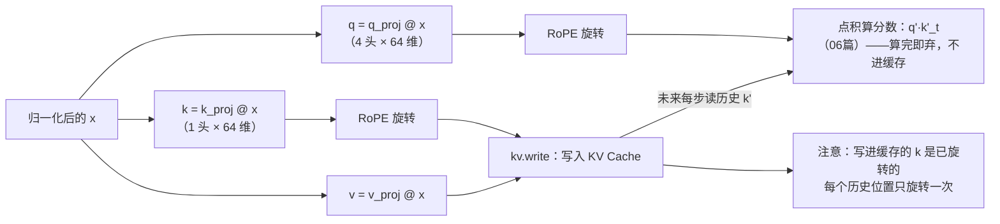

# 05 · RoPE：旋转位置编码

> 读完这篇你会知道：位置编码的三代演进、为什么"旋转"能携带位置信息、固定公式为什么没学过也能行、GPT-NeoX 交错排列是什么、cos/sin 表为什么惰性生成、以及一个让我们调试半天的经典原地别名 bug。
> 对应源码：`src/ops.cpp` 的 `RopeCache`、`py/reference_model.py` 的 `rope_apply`。

## 一、位置编码的演进（三代）

《03-嵌入与位置编码》讲了第一代：给每个绝对位置分配一个可学习向量，加到词向量上。它的问题：位置表有长度上限（我们的 256 行），超出就无法表示；而且位置 100 和位置 101 的相对关系，模型只能从数据里自行学习。

第二代（Transformer 原版论文）：用固定的正弦函数 `sin(pos / 10000^(i/d))` 生成位置向量，不学习。好处是不用存表、可外推。但它是绝对编码，词与词之间的**相对距离**仍然要靠模型自己推断。

第三代（2021 年提出，现代主流）：**RoPE（Rotary Position Embedding，旋转位置编码）**。核心洞察是——

> 与其给每个位置一个"地址牌"，不如把位置信息藏在向量本身：**两个向量的点积结果，直接由它们的相对位置差 Δ 调制**。

先解释这几个词：**点积**（内积）是衡量两个向量相似度的运算，两个词越相关，向量的点积越大；**Δ（delta）**是位置差，第 5 位的词和第 2 位的词，Δ = 3。在注意力里（《06-注意力》正式讲），参与点积的两个向量正是 **q 和 k**——query（查询）和 key（钥匙），模型用它们比较任意两个词的相关程度。

所以 RoPE 的实际效果是：**q、k 做点积时，两词相隔多远（Δ）直接写进结果**。这意味着：位置差 3 的任意两个词，无论出现在句首还是句尾，它们的内积都会被同样地"调制"。这正是相对位置编码的理想性质。

三代方案对比：

| | 第一代：可学习位置向量 | 第二代：固定正弦 | 第三代：RoPE |
|---|---|---|---|
| 位置如何表示 | 每个位置一个可学习向量 | sin/cos 公式生成向量 | 旋转 q/k 向量 |
| 要存表吗 | 要（有长度上限） | 不要 | 不要（cos/sin 惰性生成） |
| 能否外推 | 否 | 能 | 能 |
| 相对距离 (p−q) | 不直接编码，靠学 | 不直接编码，靠学 | **直接进 q·k 内积** |
| 现代模型 | — | 很少 | Gemma / LLaMA |

### 固定公式没"学过"，怎么能行？

一个高频疑问：可学习位置表好歹是从训练数据里"长"出来的，RoPE 的旋转角度是一串写死的公式——它没有学习过程，岂不是没从数据里学到东西？

要回答它，先分清**谁负责提供信息，谁负责学习解读**：

- **位置编码（无论学来的还是公式算的）只负责"提供位置信息"**——告诉模型"这个 token 在第几个位置"。没有它，注意力对词序不敏感，输入里根本没有位置信号，学无可学
- **下游整个网络负责"学会使用位置信息"**——q_proj、k_proj、注意力权重、MLP 全部从数据训练出来。训练数据教它们的，是"旋转角度差 3 意味着两个词离得近、关系更紧"，不是"位置 5 的向量是什么"

所以"RoPE 本身没学过"不假——但它只负责提供信息，真正从数据里学东西的是它下游的整个网络，一样没少。

**硬编码 ≠ 没学习。** 卷积网络里"邻近像素共享权重"的平移结构是硬编码的，RNN 的循环结构是硬编码的，没人说 CNN 没从数据学到东西。架构 = 预先设定的先验（词有顺序、近邻比远亲更相关），权重 = 从数据学习的参数。RoPE 是架构层的结构，与卷积的平移结构同级。

**学来的位置表是"背条目"，不是"学概念"。** 它把 256 个位置各背一个互不相干的向量，位置 5 和位置 6 之间没有任何被强制的关系——所以位置 257 没有条目，只能 clamp。公式则是"推导"：任意位置即时可算，相邻位置的信号结构相连，还自带"相对距离进内积"的性质。**背条目注定不能外推，学概念可以。**

**反证**：如果固定公式没用甚至有害，训练会自动把它抵消——旋转作用在 q、k 上，而 q_proj、k_proj 是学出来的，网络完全可以投影到"旋转影响很小"的子空间。它没有这么做；所有现代 LLM 都依赖 RoPE，说明训练数据验证了这个先验值得利用。

| | 可学习位置表（embed_positions） | 固定公式（RoPE） |
|---|---|---|
| 信息形态 | 逐条目记忆（字典） | 结构性计算（公式） |
| 谁从数据学 | 表格本身（背下每个位置的向量） | 下游网络（学习解读旋转角度） |
| 位置之间的关系 | 无强制关系，靠数据自己长 | 相邻位置的信号结构相连 |
| 超出训练长度 | 没有条目，clamp 或失效 | 任意位置可算，可外推 |

## 二、直觉：二维旋转

先看最简单的二维情况。平面上一个向量 (x, y)，把它**绕原点逆时针旋转角度 θ**，新坐标是（这是高中解析几何的旋转公式）：

```
x' = x·cos(θ) − y·sin(θ)
y' = x·sin(θ) + y·cos(θ)
```

关键性质：**旋转不改变向量长度**（只改变方向），所以不会破坏数值稳定性。而且旋转是可逆的、光滑的——正是把位置信息加进向量的好方式。

现在让**旋转角度与位置成正比**：位置 m 的词旋转 `m × ω`（ω 是某个"角速度"）。

两个位置分别为 m 和 n 的词，旋转后做点积，数学上可以推出：点积结果 = 原本的点积 × cos((m−n)ω) + 一个相关项。**相对距离 (m−n) 直接出现在内积公式里**——模型通过"两个向量的点积有多大"就能感知它们的距离，不需要任何显式查表。这就是 RoPE 的核心。

> 数学细节（可跳过）：旋转矩阵 `R(θ)` 满足 `R(mω)·R(nω)ᵀ = R((m−n)ω)`——旋转矩阵的乘积只依赖角度差。q·Rᵀ 与 k·Rᵀ 的内积 = q·R((m−n)ω)·kᵀ，相对位置进内积。

## 三、高维推广：多组独立旋转 + 频率递减

256 维向量没法整体"绕一个轴转"（那是三维才有的直觉）。RoPE 的做法是**两两分组**：把 256 维拆成 128 对（(x0,x1), (x2,x3), (x4,x5), ...），每对独立做二维旋转：

```
第 j 对：角度 = pos × freq[j]
freq[j] = rope_base ^ (−2j / head_dim) = 10000^(−2j/64)
```

**freq（频率）随 j 递减**：

| j | freq = 10000^(−2j/64) | 角色 |
|---|---|---|
| 0 | 1.0000 | 转得最快：位置每 +1 转 1 弧度（负责精细的局部信息） |
| 1 | ≈ 0.750 | 逐渐变慢 |
| 2 | ≈ 0.562 | |
| … | … | |
| 31 | ≈ 0.00014 | 几乎不转（负责粗糙的长距离信息） |

为什么频率要递减？类比数字的表示：低位变化快（个位），高位变化慢（十位）。**低维对（低 j）承载"精细"的局部位置信息，高维对（高 j）承载"粗糙"的长距离信息**。不同频率的组合让向量能同时区分"相邻位置"和"远距离位置"。

## 四、GPT-NeoX 交错排列（interleaved）

分组有两种常见排法：

- **相邻排列（adjacent）**（原版 RoPE）：前半向量和后半向量配对——(x0, x32), (x1, x33), ...
- **交错排列**（GPT-NeoX 风格，**我们用的**）：直接相邻配对——(x0, x1), (x2, x3), (x4, x5), ...

| | 相邻排列（原版 RoPE） | 交错排列（GPT-NeoX，我们） |
|---|---|---|
| 配对方式 | (x0, x32), (x1, x33), … | (x0, x1), (x2, x3), … |
| 读取模式 | 跨半读取 | 连续读两个元素 |
| 代码复杂度 | 稍高 | 更低 |
| 使用者 | 原版论文 | LLaMA / Gemma |

交错排列的代码更简单（连续读取两个元素就行），LLaMA、Gemma 都用它。我们的实现（`src/ops.cpp`）：

```cpp
void RopeCache::apply(float* x, uint32_t pos) const {
    const float* c = cos_t.data() + (size_t)pos * nhalf;
    const float* s = sin_t.data() + (size_t)pos * nhalf;
    for (uint32_t j = 0; j < nhalf; j++) {
        float x0 = x[2 * j], x1 = x[2 * j + 1];
        x[2 * j]     = x0 * c[j] - x1 * s[j];    // 旋转公式
        x[2 * j + 1] = x0 * s[j] + x1 * c[j];
    }
}
```

**注意 `x0`、`x1` 是局部变量的拷贝**——这行看似多余，实际是深刻的教训（见第七节）。

## 五、cos/sin 表：为什么"惰性生成（lazy）"？

每对旋转需要 cos 和 sin。如果像朴素的实现那样，启动时把 `128K 位置 × 192 对 × 2 × 4 字节 ≈ 393MB` 全部预计算，那引擎还没开始推理就先占用近 400MB——而我们整个量化模型才 900MB。

观察：**实际推理时只用到"已经到达过的位置"**。生成第 70 个 token 时，只需要位置 0~70 的表。所以 `ensure(pos)` 惰性扩展：

```cpp
void RopeCache::ensure(uint32_t pos) {
    if (pos < max_pos) return;                    // 已经生成过了
    const uint32_t new_rows = pos + 1;
    cos_t.resize((size_t)new_rows * nhalf);       // 扩容
    sin_t.resize((size_t)new_rows * nhalf);
    // 只计算 [max_pos, new_rows) 这一小段新行
    for (uint32_t p = max_pos; p < new_rows; p++) { ... }
    max_pos = new_rows;
}
```

频率 `freq[j]` 只需 32 个数，预计算一次。cos/sin 每行 32 对，用到才生成。**内存与"实际生成长度"成正比，而不是与"理论上限"成正比**——引擎里同样的哲学出现在 KV Cache（07篇）和 embed_positions 上。

## 六、RoPE 用在哪：注意力里的 q 和 k

RoPE 只施加在注意力的 **q 和 k** 上，不碰 v（06篇讲它们分别是什么）。直觉：q 和 k 做点积决定"谁看谁"，位置信息要影响这个点积；v 是注意力要取用的内容，内容本身不需要位置调制。

注意这和位置表（03篇）是两种完全不同的加入方式：`embed_positions` 是**加法**——在输入端把位置向量加到 token 向量上（`hidden = embed_tokens[tok] + embed_positions[pos]`），位移是固定查表的、与 token 无关；RoPE 是**旋转**——输入向量从头到尾不动，被旋转的是投影后的 q/k，位置藏在旋转角度里，任何位置都能算。一句话：位置表是"每个位置一个位移"，RoPE 是"每个位置一个旋转角"。

两种机制并排看：

```
位置表（加法）：位置信息写在向量值里，跟着向量传递
  token → 查表 → 加位置向量 → hidden（已带位置）→ 第 1 层 → 第 2 层 → ……
  每一层都看到被位移过的向量

RoPE（旋转）：位置信息不在向量里，在"点积"这个运算里
  hidden → q_proj → 旋转 → q' ─┐
                               ├→ 点积：score_t = q'·k'_t ← 位置只在这里显现
  hidden → k_proj → 旋转 → k' ─┘   k' 写入缓存，未来每步的点积读它
  → softmax → 加权和 Σ p·v → 注意力输出（带位置）→ o_proj → 下一层
```

`src/model.cpp` 的 `attention_block`：

```cpp
gemv_i8_f32(L.q, x, q_buf);   // 算出 q
gemv_i8_f32(L.k, x, k_buf);   // 算出 k
...
for (uint32_t h = 0; h < nh; h++) rope.apply(q_buf + h*hd, pos);  // q 旋转
for (uint32_t h = 0; h < nkv; h++) rope.apply(k_buf + h*hd, pos); // k 旋转
kv.write(pos, k_buf, v_buf);  // 旋转后的 k 写入缓存（07篇的关键约定）
```



旋转后的 q、k **不再进入任何后续网络层**：q' 当场和每个历史位置的 k' 做点积算分数，全部点积算完，q' 用完即弃——**分数本身不扔**，随即进 softmax 变概率、对 v 加权求和，得到注意力输出（详见《06-注意力》）；k' 写入缓存，供未来每一步的点积直接读取。

分数的旅程（以位置 2 为例，历史位置 0、1、2）：

```
① 算分数   score₀ = q'·k'₀   score₁ = q'·k'₁   score₂ = q'·k'₂
② softmax  p₀ p₁ p₂（和为 1）—— 分数在这里变成概率
③ 加权和   attn_out = p₀·v₀ + p₁·v₁ + p₂·v₂  ← 分数在这条式子里被真正使用
④ 继续走   attn_out → o_proj → hidden += attn_out → 下一层
```

那到底谁扔、谁留：

| 谁 | 下场 |
|---|---|
| q' | **扔**：只用一次，未来位置的注意力读的是自己的 qₘ（m > n），从不读历史 q |
| k' | **存**：未来每一步都要和新的 q' 点积，所以进 KV Cache |
| 原始分数 | 被覆盖：softmax 原地算出概率后它就用完了（06篇思考题2） |
| 概率 p | 被吸收：加权和算完即结束 |
| 注意力输出 | **继续走**：唯一进入下一层的东西 |

真正带着位置信息继续往下传递的是**注意力输出**——它是用这些"带位置的分数"对 v 加权求和拼出来的。对比位置表：位置信息写在向量值里，跟着向量传递到每一层；RoPE 的位置信息不在向量值里，而在点积这个运算里——q'、k' 单独拿出来，位置只体现在方向中，一相乘，相对距离就显现。

**约定：写进 KV Cache 的 k 是已经旋转过的。** 这样解码时读历史 k 就不用再旋转（每个历史位置只旋转一次）。NumPy 参考实现必须采用同一约定，否则测试全红——这是我们单测里专门验证的一条（`attention_scores_kv` 测试）。

## 七、我们踩过的真实 bug：原地别名（in-place aliasing）

第一版 Python 参考实现长这样（`py/reference_model.py` 的 `rope_apply`）：

```python
x0, x1 = x[..., 0::2], x[..., 1::2]   # ← 注意：这是"视图"，不是拷贝！
x[..., 0::2] = x0 * c - x1 * s
x[..., 1::2] = x0 * s + x1 * c       # ← 此时 x0 已经指向被改过的偶数位！
```

`x0` 是 x 的**视图**（view），不是拷贝。第一行把偶数位写成了旋转后的值；第二行读 `x0`（偶数位）时读到的已经是**新值**，用它去算奇数位——公式就错了。这个 bug 让所有涉及注意力的 golden 测试全红，而且错得"有规律"（差值随维度递减，因为高维对的角度小、污染小），排查时才意识到是经典的原位依赖问题。

修复就是加 `.copy()`：

```python
x0, x1 = x[..., 0::2].copy(), x[..., 1::2].copy()
```

C++ 版因为用了局部变量 `float x0, x1` 天然免疫——**写 C++ 时的局部变量写法，恰好就是正确做法**。

**教训**：凡是对数组"先读旧值、再写新值"的原地操作，必须确认读和写之间的依赖关系。这类 bug 单测能抓住（golden 对照），但前提是你有单测。

## 八、总结

1. RoPE = 把位置编码成"旋转"，相对距离 (p−q) 直接进入 q·k 内积
2. 实现：两两配对做二维旋转，频率 `10000^(-2j/d)` 随 j 递减（精细↔粗糙）
3. 我们用 GPT-NeoX 交错排列：(x0,x1), (x2,x3)...
4. cos/sin 表按到达过的位置惰性生成，内存与生成长度成正比
5. RoPE 只施加于 q 和 k；**写入 KV Cache 的 k 是已旋转的**（与 NumPy 参考完全一致）
6. 原地旋转必须先拷贝配对元素（Python 视图污染的真 bug）；C++ 局部变量天然正确

## 思考题

1. 位置 0 的旋转矩阵是什么？为什么位置 0 的 RoPE 是恒等变换（什么都不变）？我们的测试里恰好验证了这一点，找出来。
2. 为什么 freq 用指数衰减（10000 的幂）而不是线性衰减（比如 1/j）？
3. `rope.apply` 在 `q_buf` 上原地旋转。q_buf 下一次被 `gemv_i8_f32` 覆写，所以没问题。如果某个调用方想复用旋转前的 q，会怎样？这种"缓冲区生命周期"问题怎么防？（提示：见《12-测试策略》的缓冲区设计）
