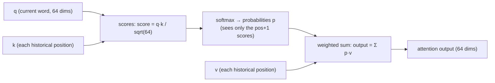
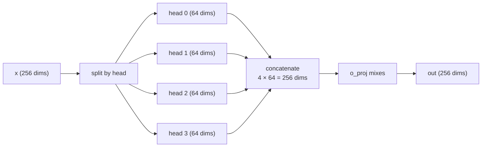

# 06 · Attention: How the Model "Reads" Context

> By the end of this article you will know: what Q/K/V are, how attention scores and softmax are computed, why you divide by sqrt(d), how the causal mask is implemented at zero cost with loop bounds, and the point of multi-head attention.
> Corresponding source: `attention_block` in `src/model.cpp`, `softmax` in `src/ops.cpp`.

## 1. Motivation: every word needs to "look at" the other words

To understand "chased" in "The cat chased the dog", you need to know who is chasing (cat) and who is being chased (dog). **Attention lets each position's vector compare itself with every other position's vector and selectively absorb information**.

The big idea, in three steps:

1. For each word, compute how related it is to every candidate word (the **scores**)
2. Normalize the scores into probabilities (**softmax**)
3. Use the probabilities as weights and **weighted-sum** the candidates' information in

We take it apart layer by layer — intuition first, formulas after.

## 2. Q/K/V: a dictionary analogy

Each word's vector (256 dims) is projected by three matrices into three new vectors:

```
q = q_proj @ x    (Query: what am I looking for?)
k = k_proj @ x    (Key: the label of "what I am")
v = v_proj @ x    (Value: what content can I offer?)
```

**The dictionary analogy**: you (the querier) hold a query and go looking for information; each dictionary entry has a key and a value attached. You compare your query against every key; the more similar, the more you take that entry's value.

```
query "I'm looking for cat-related stuff"   key "I am cat"   → high similarity → take lots of that value
                                            key "I am sky"   → low similarity  → take almost none
```

The projection matrices q_proj/k_proj/v_proj are the three per-layer `[256][256]` tensors in the weights file (k/v are `[64][256]` because of GQA — Chapter 07 explains).

## 3. Scores: dot product as similarity

q and k are vectors, and the most direct similarity measure is the **dot product** (large when two vectors point the same way, small when opposite, 0 when perpendicular):

```
score(q, k) = q · k = q[0]k[0] + q[1]k[1] + ... + q[63]k[63]
```

Then divide by **sqrt(head_dim)** (sqrt = square root, same as `std::sqrt` in the code; head_dim = 64, so sqrt(64) = 8):

```
score = (q · k) / sqrt(d)
```

**Why divide by sqrt(d)?** Assume every component of q and k is an independent random number (mean 0, variance 1). Then the dot product is a sum of 64 terms with variance ≈ 64 = d. **The larger d, the wider the score distribution** — with a big d, dot products easily hit ±20, softmax saturates (probabilities pile up at 0 and 1), gradients vanish, and the model stops learning. Dividing by sqrt(d) pulls the variance back to 1. This is a classic detail from the original Transformer paper; note we divide by **head_dim (64)**, not dim (256) — because the dot product happens inside each head.

## 4. Softmax: scores become probabilities

Scores are positive and negative, of varying magnitude; attention weights must be non-negative and sum to 1. The tool is **softmax**:

```
p[i] = exp(s[i]) / Σⱼ exp(s[j])
```

The only implementation subtlety is **numerical stability** (`softmax` in `src/ops.cpp`): `exp(large number)` overflows, so subtract the maximum before exponentiating — softmax is invariant under a global shift, so the result is unchanged:

```cpp
float mx = x[0];
for (i...) if (x[i] > mx) mx = x[i];        // find the max first
for (i...) { x[i] = std::exp(x[i] - mx); sum += x[i]; }  // subtract max, then exp
for (i...) x[i] /= sum;
```

`softmax_test` verifies this specifically with ±1000 inputs.

## 5. The weighted sum: attention output

Finally, use the probabilities p as weights for a weighted sum over v:

```
output = p[0]·v[0] + p[1]·v[1] + ... + p[pos]·v[pos]
```

Where attention "looks" (p is large), that value flows heavily into the output. That's the entire mathematics of attention:



**Scores → softmax → weighted sum.**

## 6. The causal mask: you may look at the past, never the future

When generating "The cat chased the dog", position 3 (chased) may look at positions 0, 1, 2 (The, cat, itself) but **not** at position 4 (the) — because generation happens one word at a time and the later words don't exist yet (the iron law of autoregressive models: **causal**).

A naive implementation builds a triangular mask matrix that sets "future" scores to -∞. Our implementation is smarter — **the loop bounds are themselves the mask**:

```cpp
for (uint32_t t = 0; t <= pos; t++)   // only iterates 0..pos!
    scores[t] = dot_f32_f32(qh, kv.k_row(t), hd) * score_scale;
softmax(scores, (size_t)pos + 1);     // softmax sees only pos+1 scores
```

(`score_scale` is just 1/sqrt(head_dim), precomputed at load — multiply instead of divide, the usual hot-path practice.)

Attention at position pos computes only the pos+1 scores for t=0..pos; future positions' scores **don't exist at all**, so softmax can't see them. Zero extra memory, zero extra comparisons — **with the right data structure, the mask costs nothing**.

> The other direction: if you wanted the model to "read everything, then answer" (bidirectional attention, as in BERT), this loop would have to run 0..max_len with an explicit mask matrix. An autoregressive model's causality saves exactly that cost.

## 7. Multi-head attention: several different "viewpoints"

Using one q/k/v to "look" at context is a single viewpoint. **Multi-head**: split the 256 dims into 4 heads of 64 dims each (head_dim = 256/4), each head with its own q_proj/k_proj/v_proj/o_proj — four independent little attentions running in parallel, each attending to different patterns (one watches syntax, one watches coreference, one watches locality…), then stitched back together:

```cpp
// per head, independently: scores → softmax → weighted sum
for (uint32_t h = 0; h < nh; h++) {                    // nh = 4
    ...
    out[head h] = Σ_t softmax(scores)[t] · v[t]        // 64 dims per head
}
gemv_i8_f32(L.o, heads_out, out);                      // o_proj recombines 4×64 into 256 dims
```



(k/v have only 1 head because of GQA — Chapter 07 covers it.) `o_proj` (the output projection) **mixes** the four heads' 64-dim results into a unified 256-dim vector — head-to-head information exchange happens here. The per-layer q/k/v/o tensors in the weights file are these four heads' projection matrices.

## 8. Full walkthrough (against the code)

`attention_block` in `src/model.cpp`, taking the normalized `x` (256 dims) as input:

```cpp
gemv_i8_f32(L.q, x, q_buf);    // ① q = q_proj @ x  → 4 heads × 64 dims
gemv_i8_f32(L.k, x, k_buf);    // ② k = k_proj @ x  → 1 head × 64 dims (GQA, Chapter 07)
gemv_i8_f32(L.v, x, v_buf);    // ③ v = v_proj @ x

rope.apply(q_buf + h*hd, pos); // ④ position rotation (Chapter 05)
rope.apply(k_buf + h*hd, pos);
kv.write(pos, k_buf, v_buf);   // ⑤ store k/v into the cache (Chapter 07)

for (h = 0; h < 4; h++) {      // ⑥ per head: scores → softmax → weighted sum
    for (t = 0; t <= pos; t++)
        scores[t] = dot(q[h], kv.k_row(t)) / sqrt(64);   // scores (causal bounds included)
    softmax(scores, pos + 1);
    out[h] = Σ_t scores[t] · kv.v_row(t);           // weighted sum
}
gemv_i8_f32(L.o, heads, out);  // ⑦ o_proj mixes the 4 heads
```

Back in `forward_token`: `hidden += attn_out` — the residual connection; attention learns an "increment".

## 9. Complexity intuition

Attention at position pos computes pos+1 dot products (each 64-dim). Generating the 100th token takes 101 dot products; the 1000th takes 1001. **Each step is a little more expensive than the last** — over a 100-token input, total dot products = 1+2+…+100 = 5050 per head. This is attention's inherent quadratic cost.

Note: **the KV cache does not remove this quadratic cost** — caching saves recomputing historical k/v and re-running earlier layers (Chapter 07), but "each step takes n+1 dot products against all history" is attention's very definition and cannot be avoided. That's the fundamental cost of long contexts (and why things like Flash Attention exist).

## 10. Summary

1. Attention's three beats: scores (q·k/sqrt(d)) → softmax (probabilities) → weighted sum (Σ p·v)
2. Q/K/V are three projection matrices (dictionary analogy: query/label/content)
3. The sqrt(d) scale normalizes score variance and prevents softmax saturation; softmax must subtract the max first (numerical stability)
4. The causal mask = the loop only runs to pos — zero cost
5. Multi-head = 4 independent viewpoints, mixed by o_proj
6. Attention + residual: `hidden += attn(rmsnorm(hidden))`

## Exercises

1. Remove `* score_scale` (the division by sqrt(64)) — how does the model's behavior degrade? (Hint: softmax saturation)
2. Our softmax is **in place** (it overwrites the input array). After softmax overwrites the `scores` buffer in `attention_block`, are the raw scores still around? Are they needed? (Hint: look at how our `attention_scores_kv` test recomputes the raw scores)
3. At position pos=0, what is the attention output? (Hint: only one score exists, so softmax gives 1)
4. Why doesn't v get RoPE? (Hint: RoPE influences the "who looks at whom" scores)
