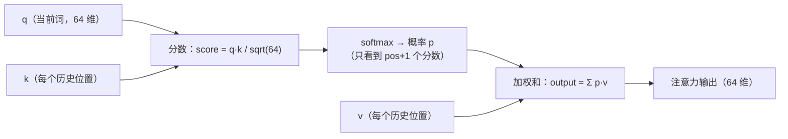
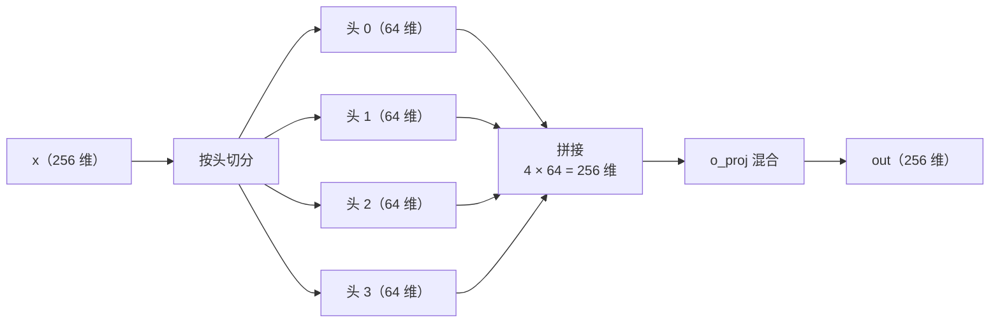

# 06 · 注意力机制：模型怎么"看"上下文

> 读完这篇你会知道：Q/K/V 分别是什么、注意力分数和 softmax 怎么算、为什么要除以 sqrt(d)、因果掩码怎么用循环边界零成本实现、多头注意力的意义。
> 对应源码：`src/model.cpp` 的 `attention_block`、`src/ops.cpp` 的 `softmax`。

## 一、动机：每个词都需要"看"其他词

处理句子 "The cat chased the dog" 时，理解 "chased" 需要知道"谁追"（cat）和"追谁"（dog）。**注意力（attention）就是让每个位置的向量和其他位置的向量比较，有选择地吸收信息**。

它的大思路是三步：

1. 对每个词，算它和"每个候选词"的相关程度（**分数**）
2. 把分数归一化成概率（**softmax**）
3. 用概率做权重，把候选词的信息**加权求和**进来

我们逐层拆开，先建立直觉再给公式。

## 二、Q/K/V：一个查字典的比喻

每个词的向量（256 维）先被三个矩阵投影，生成三个新向量：

```
q = q_proj @ x    （Query，查询：我想找什么？）
k = k_proj @ x    （Key，钥匙：我"是什么"的标签）
v = v_proj @ x    （Value，值：我能提供什么内容？）
```

**字典比喻**：你（查询者）拿着 query 找信息，每个词条挂着一把 key 和一个 value。你比较自己的 query 和每把 key 的相似度，相似度越高，就越倾向取这个 value。

```
query "我想找和猫有关的"   key "我是猫" → 相似度高 → 大量取用该 value
                          key "我是天空" → 相似度低 → 几乎不取
```

投影矩阵 q_proj/k_proj/v_proj 就是权重文件里每层的三个 `[256][256]`（k/v 因 GQA 是 `[64][256]`，07篇解释）张量。

## 三、分数：点积度量相似度

q 和 k 都是向量，最直接的相似度度量是**点积**（两个向量同向大、反向小、垂直为 0）：

```
score(q, k) = q · k = q[0]k[0] + q[1]k[1] + ... + q[63]k[63]
```

再除以 **sqrt(head_dim)**（sqrt = 开根号，和代码里的 `std::sqrt` 一个意思；head_dim = 64，所以 sqrt(64) = 8）：

```
score = (q · k) / sqrt(d)
```

**为什么除以 sqrt(d)？** 假设 q、k 的每个分量都是独立随机数（均值 0、方差 1），那么点积是 64 项之和，其方差 ≈ 64 = d。**d 越大分数分布越宽**——大 d 时点积动不动就 ±20，softmax 会饱和（概率挤向 0 和 1 两端），梯度消失，模型学不动。除以 sqrt(d) 把方差拉回 1。这是 Transformer 原版论文的经典细节，注意我们除的是 **head_dim（64）** 而不是 dim（256）——因为点积发生在每个头内部。

## 四、softmax：分数变概率

分数有正有负、幅度不一，要变成"注意力权重"（非负、和为 1）。工具是 **softmax**：

```
p[i] = exp(s[i]) / Σⱼ exp(s[j])
```

唯一的实现细节是**数值稳定**（`src/ops.cpp` 的 `softmax`）：`exp(大数)` 会溢出，所以先减最大值再 exp——softmax 对整体平移不变，结果不变：

```cpp
float mx = x[0];
for (i...) if (x[i] > mx) mx = x[i];        // 先找最大值
for (i...) { x[i] = std::exp(x[i] - mx); sum += x[i]; }  // 减去 max 再 exp
for (i...) x[i] /= sum;
```

`softmax_test` 专门用 ±1000 的大数输入验证这条。

## 五、加权求和：注意力输出

最后，用概率 p 做权重，对 v 加权求和：

```
output = p[0]·v[0] + p[1]·v[1] + ... + p[pos]·v[pos]
```

"注意"到的地方（p 大），它的 value 就被大量融入输出。这就是注意力机制的全部数学：



**分数 → softmax → 加权和**。

## 六、因果掩码：只能看过去，不能看未来

生成 "The cat chased the dog" 时，第 3 个位置（chased）可以看第 0、1、2 个位置（The、cat、自己），**不能**看第 4 个位置（the）——因为生成是逐个进行的，后面的词还不存在（这是自回归模型的铁律，叫 **causal**，因果）。

朴素实现会构造一个三角形掩码矩阵，把"未来"的分数设成 -∞。我们的实现更聪明——**循环边界本身就是掩码**：

```cpp
for (uint32_t t = 0; t <= pos; t++)   // 只遍历 0..pos！
    scores[t] = dot_f32_f32(qh, kv.k_row(t), hd) * score_scale;
softmax(scores, (size_t)pos + 1);     // softmax 只看到 pos+1 个分数
```

（`score_scale` 就是 1/sqrt(head_dim)，加载时预先算好——用乘法代替除法，热路径的一贯做法。）

位置 pos 的注意力只计算 t=0..pos 这 pos+1 个分数，未来位置的分数**根本不存在**，softmax 自然无从谈起。零额外内存、零额外比较——**数据结构选对了，掩码就零成本了**。

> 反方向的理解：如果想让模型"读完再回答"（双向注意力，如 BERT），这个循环就得变成 0..max_len 再配显式掩码矩阵。自回归模型的因果性恰好省掉了这个成本。

## 七、多头注意力：多个不同的"视角"

只用一个 q/k/v 去"看"上下文，视角单一。**多头（multi-head）**：把 256 维切成 4 个头，每个头 64 维（head_dim = 256/4），每个头有独立的 q_proj/k_proj/v_proj/o_proj——4 个独立的小注意力并行运行，各自关注不同模式（一个看语法、一个看指代、一个看局部……），最后拼起来：

```cpp
// 每个头独立做：分数 → softmax → 加权和
for (uint32_t h = 0; h < nh; h++) {                    // nh = 4
    ...
    out[头 h] = Σ_t softmax(scores)[t] · v[t]          // 每头 64 维
}
gemv_i8_f32(L.o, heads_out, out);                      // o_proj 把 4×64 拼回 256 维
```



（k/v 因为 GQA 只有 1 个头，07篇细讲。）`o_proj`（输出投影）把 4 个头的 64 维结果**混合**成统一的 256 维——头与头之间的信息在这里交流。权重文件里每层的 q/k/v/o 四个张量就是四个头的投影矩阵。

## 八、完整流程回顾（对着代码走一遍）

`src/model.cpp` 的 `attention_block`，输入是归一化后的 `x`（256 维）：

```cpp
gemv_i8_f32(L.q, x, q_buf);    // ① q = q_proj @ x  → 4 头 × 64 维
gemv_i8_f32(L.k, x, k_buf);    // ② k = k_proj @ x  → 1 头 × 64 维（GQA，07篇）
gemv_i8_f32(L.v, x, v_buf);    // ③ v = v_proj @ x

rope.apply(q_buf + h*hd, pos); // ④ 位置旋转（05篇）
rope.apply(k_buf + h*hd, pos);
kv.write(pos, k_buf, v_buf);   // ⑤ k/v 存入缓存（07篇）

for (h = 0; h < 4; h++) {      // ⑥ 每头：分数 → softmax → 加权和
    for (t = 0; t <= pos; t++)
        scores[t] = dot(q[h], kv.k_row(t)) / sqrt(64);   // 分数（含因果边界）
    softmax(scores, pos + 1);
    out[h] = Σ_t scores[t] · kv.v_row(t);           // 加权和
}
gemv_i8_f32(L.o, heads, out);  // ⑦ o_proj 混合 4 个头
```

回到 `forward_token`：`hidden += attn_out`——残差连接，注意力学的是"增量"。

## 九、复杂度直觉

当前位置 pos 的注意力要算 pos+1 个点积（每个 64 维）。生成第 100 个 token 时，要算 101 个点积；第 1000 个时算 1001 个。**每一步都比上一步贵一点**——整个输入（100 个 token）走完，全程点积数 = 1+2+…+100 = 5050 个/头，这是注意力的本质二次成本。

注意：**有了 KV Cache 后这个二次成本依然在**——缓存省掉的是历史位置的 k/v 重算和整层前向（07篇），但"每步和全部历史做 n+1 个点积"是注意力的定义本身，省不掉。长上下文的根本代价就在这里（所以才有 Flash Attention 这类专门优化）。

## 十、总结

1. 注意力三步曲：分数（q·k/sqrt(d)）→ softmax（概率）→ 加权和（Σ p·v）
2. Q/K/V 是三个投影矩阵（字典比喻：查询/标签/内容）
3. sqrt(d) 缩放把分数方差归一，防止 softmax 饱和；softmax 必须先减 max（数值稳定）
4. 因果掩码 = 循环只到 pos，零成本
5. 多头 = 4 个独立视角，o_proj 混合
6. 注意力 + 残差：`hidden += attn(rmsnorm(hidden))`

## 思考题

1. 如果去掉 `* score_scale`（除以 sqrt(64)），模型行为会怎么退化？（提示：softmax 饱和）
2. 我们的 softmax 是**原地**的（覆盖输入数组）。`attention_block` 里 `scores` 缓冲区被 softmax 覆盖后，原始分数还在吗？需要吗？（提示：看到我们的测试 `attention_scores_kv` 怎么重新计算原始分数）
3. 位置 pos=0 时，注意力输出是什么？（提示：只有一个分数，softmax 后 = 1）
4. 为什么 v 不做 RoPE？（提示：RoPE 影响的是"谁看谁"的分数）
