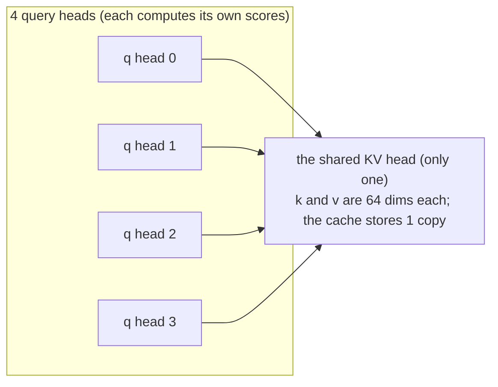

# 07 · KV Cache and GQA: The Key to Fast Decoding

> By the end of this article you will know: how wasteful generation is without a cache, why only K/V are cached and not Q, how GQA saves 3/4 of the memory, the full story of the rope-before-cache convention, and how the cache size should be chosen.
> Corresponding source: `src/kv_cache.h` (cache structure), `attention_block` in `src/model.cpp` (writes and reads).

## 1. The problem: every new word recomputes all of history

Recall autoregressive generation (Chapter 00): to generate the nth word, the model must look at the n words before it. "Looking" is attention — **the k and v of every historical position participate in the dot products**.

The naive implementation: on each generation step, push the "entire prefix" through the network again and compute every historical position's k and v.

```
Generating word 1: compute k/v at position 0                → 1 forward
Generating word 2: compute k/v at positions 0,1             → 2 forwards
Generating word 3: compute k/v at positions 0,1,2           → 3 forwards
...
Generating word n: compute k/v at positions 0..n            → n forwards
```

Total forwards for N words = 1+2+...+N = **O(N²)**. Generating 1000 words means 500K forward passes, 99.9% of which **recompute the same thing** — position 3's k/v is recomputed at every step!

| | Naive (no cache) | With KV cache |
|---|---|---|
| Forwards to generate word n | n (recompute all of 0..n) | 1 (only position n) |
| Total forwards for N words | 1+2+…+N = O(N²) | N = O(N) |
| Redundant work | position t's k/v recomputed (N−t) times | 0 |
| At N = 1000 | ≈ 500K forwards | 1000 forwards |

## 2. The key observation: historical k/v never change

Position t's k and v depend only on "that position's input vector + the weights". When generating later words:

- **The weights don't change** ✓
- **Position t's input doesn't change** (history is already generated, never rewritten) ✓
- Therefore **position t's k/v never change** — computing them once is enough!

The solution is the **KV cache**: **store** each historical position's k/v, and later steps read it instead of recomputing. Each new position computes only its own k/v and appends it to the cache:

```
When generating word n:
  the forward pass computes only position n's: q_n, k_n, v_n (one matmul each)
  attention reads the cache: k_0..k_n, v_0..v_n (read-only, no recomputation)
  append k_n, v_n to the cache
```

Total forwards drop from O(N²) to **O(N)**. That is the key to fast decoding.

**Why cache K/V and not Q?** In position n's attention, q is always "the current word's" q_n — historical words' q is **useless** in later steps (q is only used for "me looking at others", never "others looking at me"). K/V are the opposite: every future position reads them repeatedly. So: **cache what the future reads repeatedly; don't cache what is used once**.

## 3. Our cache structure: an append-only array

`src/kv_cache.h`, simple enough to be 30 lines:

```cpp
struct KVCache {
    uint32_t max_len = 0;  // allocated capacity (number of positions)
    uint32_t kv_dim = 0;   // n_kv_heads × head_dim = 1 × 64 = 64
    std::vector<float> k;  // [max_len × kv_dim], one contiguous block
    std::vector<float> v;

    void write(uint32_t pos, const float* k_in, const float* v_in) {
        memcpy(k.data() + (size_t)pos * kv_dim, k_in, kv_dim * sizeof(float));
        memcpy(v.data() + (size_t)pos * kv_dim, v_in, kv_dim * sizeof(float));
    }
    const float* k_row(uint32_t pos) const { return k.data() + (size_t)pos * kv_dim; }
    ...
};
```

How the cache grows over time (say the prompt has P tokens):

| Stage | Cache contents (append-only, write never delete) |
|---|---|
| Prefill: consumes the prompt | writes all prompt positions in one go: [k₀ \| v₀] … [kₚ₋₁ \| vₚ₋₁] |
| Generating word 1 | appends [kₚ \| vₚ] |
| Generating word 2 | appends [kₚ₊₁ \| vₚ₊₁] |
| … | one row appended per generated word |

Note: the cache holds **both the prompt's k/v and the generated words' k/v** — "history" means "all positions processed so far", not "the word generated last round". Also, the cache stores the projected k/v (64 dims each), not token vectors (the 256-dim hidden) — hidden's job ends once it has produced its own q/k/v; it never enters the cache.

Design points:

1. **Pre-allocated**: the `Model` constructor allocates once for `n_ctx` (default 8192, adjustable via `--max_cache_len`). The decode loop does **zero allocations**
2. **Append-only**: positions strictly increase; write, never delete. No fragmentation, no linked lists, no hashing — `pos × kv_dim` is the address; O(1) reads and writes
3. **Independent per layer**: in `Model`, `std::vector<KVCache> kvc` has n_layers entries; layers don't share (each layer's k/v means something different)

Read it against `attention_block`:

```cpp
kv.write(pos, k_buf, v_buf);          // write: this position's k/v appended (note: k is already rotated!)
...
for (uint32_t t = 0; t <= pos; t++)   // read: all of history
    scores[t] = dot_f32_f32(qh, kv.k_row(t) + kvh*hd, hd) * score_scale;
```

## 4. Rope-before-cache: a convention everyone must follow

Chapter 05 mentioned: **the k written to the cache is already RoPE-rotated**. Why does this convention matter?

If historical position t's k still needed rotation between "being written" and "being read", position t's k would be rotated (n−t) times — more redundant computation. The correct approach: **rotate once, write to the cache, and be read forever in the "already rotated" state**.

The danger of this convention: the C++ engine and the NumPy reference **must agree exactly**. If either side forgets to rotate (or rotates twice), every attention score is wrong. Our unit tests target this specifically (`attention_scores_kv`): the k read from the cache must equal "k_proj's output followed by RoPE" — verified element by element.

**Lesson**: any data that is "written here, read elsewhere" must have its **state** documented (here: "already rotated"). Format docs, comments, and tests, all three.

## 5. GQA: shrinking KV cache memory to 1/4

**GQA (Grouped Query Attention)**: multiple q heads **share** one k/v head.

Our 270m/1B/tiny config: 4 q heads, 1 kv head (parameter table in `src/config.h`). Meaning:

- The 4 q heads each compute their own scores and each look at context (their "viewpoints" are unaffected)
- But they share the same k and v — **k/v are stored once** (64 dims) instead of 4 times (256 dims)

```cpp
// each q head maps to the kv head it shares
const uint32_t kvh = h * nkv / nh;   // nkv=1, nh=4 → kvh is always 0
```



Memory size (270m preset, 26 layers, head_dim=384):

| Scheme | KV heads | Cache size (26 layers × 8192 positions × 384 dims × 2 (k+v) × 4 bytes) |
|---|---|---|
| MHA | 4 | 26 × 8192 × 4 × 384 × 2 × 4 ≈ 2.6 GB |
| GQA | 1 | 26 × 8192 × 1 × 384 × 2 × 4 ≈ 650 MB (3/4 saved) |

**3/4 saved.** "The KV cache only needs 1/4 of the memory, and decoding reads 3/4 less K/V bandwidth" — those are the two savings. Bandwidth matters just as much: each decode step reads all historical k/v, so a cache 4× smaller also cuts memory bandwidth 4× — and decoding is precisely bandwidth-bound (Chapter 10 explains).

## 6. Why not allocate for the full 128K?

The 270m preset's parameter table says "context 128K". Pre-allocating the KV cache for 128K:

```
270m: 26 × 128000 × 384 × 2 × 4B ≈ 10 GB
```

The whole quantized model is only ~900 MB. **The cache would be 10× the model**, and most users generate a few hundred tokens — pure waste.

Our choice (`src/main.cpp`):

```cpp
Model model(weights, std::min(cfg.max_seq_len, a.max_cache_len));  // capped at 8192 by default
```

- `--max_cache_len 8192`: caps the cache capacity at the scale of **actual need**. Actual need = the sequence length of one session (prompt + generated tokens): prompts are usually tens to a few thousand tokens and `n_dec` defaults to 250 — a typical session is hundreds to a few thousand tokens. 8192 covers the vast majority; 128K is two orders of magnitude above actual usage
- Over capacity? A prompt longer than the capacity is rejected outright; if prompt + `n_dec` exceed the remaining capacity, `n_dec` is **truncated** with a warning — `KVCache::write` has no bounds checking, so this step prevents the out-of-bounds write (there's a regression test in `tests/scripts/run_integration.sh`)

The same applies to the RoPE table (Chapter 05) and embed_positions (Chapter 03): both allocate on demand. **"Theoretical cap" and "actual usage" are different things; memory is always sized to actual usage.**

## 7. A real bug we hit: the k/v projection shapes

Early in development, k_proj/v_proj's shapes were written as `[dim][dim]` = `[256][256]`, while GQA only needs `[n_kv_heads × head_dim][dim]` = `[64][256]`.

The C++ loader computed the file size as [256][256] and the Python generator wrote [256][256] — **"consistently wrong" on both sides**. Only when the attention code's `gemv_i8_f32(L.k, x, k_buf)` wrote 256 rows of output into a buffer with 64-row capacity did the **buffer overflow** (an out-of-bounds write silently trampling adjacent memory) show up, and the NumPy reference meanwhile truncated at 64 rows — the two sides disagreed and every test went red.

The fix was a "format upgrade": Python's `tensor_shapes` and C++'s `expected_file_size` were **changed in lockstep** to the kv shape. The file-size check immediately caught old files (size mismatch → refuse to load) — Chapter 02's "zero-cost validation" proved critical here: **any format change causes old files to be rejected immediately on size mismatch, rather than silently misread**.

**Lesson**: the "source of truth" for shapes must be single-pointed on both sides of the format (writer/reader). We derive all shapes in Python from `tensor_shapes(cfg)` and in C++ from `expected_file_size(cfg)` — the two formulas are **isomorphic**; changing one means changing the other.

## 8. Summary

1. Uncached generation = O(N²) forwards; the KV cache brings it to O(N)
2. Cache K/V, not Q: K/V are read repeatedly by the future; Q is used once
3. Append-only pre-allocated array: O(1) addressing, zero fragmentation, zero runtime allocation
4. Rope-before-cache: historical k is rotated once; written state is final — both implementations must agree
5. GQA: multiple q heads share one k/v set, saving 3/4 of the cache (memory and bandwidth both)
6. Capacity capped on demand (`--max_cache_len`), never allocated to the 128K theoretical limit
7. Format shapes must be derived from a single point, isomorphic on both sides — the file-size check automatically rejects any inconsistency

## Exercises

1. Why doesn't Q need caching? Can you write a rigorous argument? (Hint: does position n's q appear in position m>n's attention computation?)
2. If `--max_cache_len` is set to 10 and the prompt has 20 tokens, what does the program do? Find the code.
3. In GQA's `kvh = h * nkv / nh`, when nkv=2 and nh=4, which q heads share which kv head? Draw it.
4. The cache is read sequentially (t from 0 to pos) — is that CPU-cache friendly? Why? (Hint: memory contiguity)
