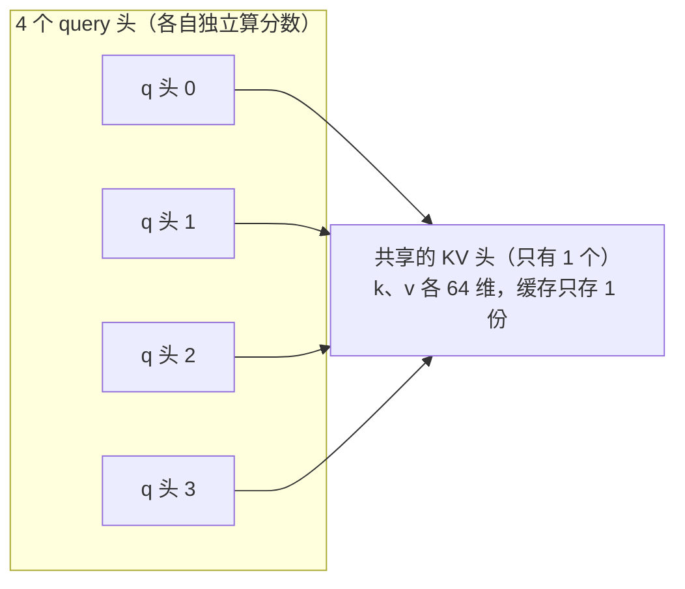

# 07 · KV Cache 与 GQA：解码提速的关键

> 读完这篇你会知道：没有缓存时生成有多浪费、为什么只缓存 K/V 不缓存 Q、GQA 怎么省 3/4 的内存、rope-before-cache 约定的来龙去脉、以及内存大小该怎么定。
> 对应源码：`src/kv_cache.h`（缓存结构）、`src/model.cpp` 的 `attention_block`（写入与读取）。

## 一、问题：每生成一个词，重算全部历史

回顾自回归生成（00篇）：生成第 n 个词时，模型要看它前面的 n 个词。看的过程就是注意力——**每个历史位置的 k 和 v 都要参与点积**。

朴素的实现：每次生成时把"整个前缀"重新过一遍网络，算出所有历史位置的 k 和 v。

```
生成第 1 个词：计算位置 0 的 k/v                    → 1 次前向
生成第 2 个词：计算位置 0,1 的 k/v                  → 2 次前向
生成第 3 个词：计算位置 0,1,2 的 k/v                → 3 次前向
...
生成第 n 个词：计算位置 0..n 的 k/v                 → n 次前向
```

生成 N 个词的总前向次数 = 1+2+...+N = **O(N²)**。生成 1000 个词要做 50 万次前向，其中 99.9% 是在**重复计算同样的东西**——位置 3 的 k/v 在每一步都被重算！

| | 朴素（无缓存） | 有 KV Cache |
|---|---|---|
| 生成第 n 词的前向次数 | n 次（重算位置 0..n 全部） | 1 次（只算位置 n） |
| 生成 N 词的总前向次数 | 1+2+…+N = O(N²) | N 次 = O(N) |
| 重复计算 | 位置 t 的 k/v 被重算 (N−t) 次 | 0 |
| N = 1000 时 | ≈ 50 万次前向 | 1000 次前向 |

## 二、关键观察：历史位置的 k/v 不会变

位置 t 的 k 和 v 只由"该位置的输入向量 + 权重"决定。生成后续词时：

- **权重不变** ✓
- **位置 t 的输入不变**（历史已经生成，永不回头改）✓
- 所以**位置 t 的 k/v 永不变**——算一次就够了！

解法就是 **KV Cache**：把每个历史位置的 k/v **存起来**，后续步骤直接读，不再重算。每个新位置只算自己的 k/v，追加进缓存：

```
生成第 n 个词时：
  前向只算位置 n 的：q_n, k_n, v_n（各一次矩阵乘）
  注意力读缓存：k_0..k_n、v_0..v_n（只读，不重算）
  把 k_n、v_n 追加进缓存
```

总前向次数从 O(N²) 降到 **O(N)**。这就是解码提速的关键。

**为什么缓存 K/V 而不是 Q？** 位置 n 的注意力里，q 永远是"当前词"的 q_n——历史词的 q 在后续步骤里**没有任何用处**（q 只用于"自己看别人"，不用于"别人看自己"）。K/V 反过来，会被所有未来位置反复读取。所以：**缓存被未来反复读的，不缓存只用一次的**。

## 三、我们的缓存结构：追加式数组

`src/kv_cache.h`，简单到只有 30 行：

```cpp
struct KVCache {
    uint32_t max_len = 0;  // 分配的容量（位置数）
    uint32_t kv_dim = 0;   // n_kv_heads × head_dim = 1 × 64 = 64
    std::vector<float> k;  // [max_len × kv_dim] 一块连续内存
    std::vector<float> v;

    void write(uint32_t pos, const float* k_in, const float* v_in) {
        memcpy(k.data() + (size_t)pos * kv_dim, k_in, kv_dim * sizeof(float));
        memcpy(v.data() + (size_t)pos * kv_dim, v_in, kv_dim * sizeof(float));
    }
    const float* k_row(uint32_t pos) const { return k.data() + (size_t)pos * kv_dim; }
    ...
};
```

缓存随时间增长的样子（假设 prompt 有 P 个 token）：

| 阶段 | 缓存内容（追加式，只写不删） |
|---|---|
| 预填充：吃 prompt | 一次性写入全部 prompt 位置：[k₀ \| v₀] … [kₚ₋₁ \| vₚ₋₁] |
| 生成第 1 个词 | 追加 [kₚ \| vₚ] |
| 生成第 2 个词 | 追加 [kₚ₊₁ \| vₚ₊₁] |
| … | 每生成一个词追加一行 |

注意：缓存里**既有 prompt 的 k/v，也有生成词的 k/v**——"历史"指"所有已经处理过的位置"，不是"上一轮生成的那个词"。另外缓存存的是投影后的 k/v（各 64 维），不是 token 向量（256 维的 hidden）——hidden 算完自己的 q/k/v 就扔了，从不进缓存。

设计要点：

1. **预分配**：`Model` 构造时按 `n_ctx`（默认 8192，可用 `--max_cache_len` 调）一次性分配。解码循环里**零内存分配**
2. **追加式（append-only）**：位置严格递增，只写不删。没有碎片、没有链表、没有哈希——`pos × kv_dim` 就是地址，O(1) 读写
3. **每层独立**：`Model` 里 `std::vector<KVCache> kvc` 有 n_layers 个，层与层不共享（每层的 k/v 含义不同）

读代码时对照 `attention_block`：

```cpp
kv.write(pos, k_buf, v_buf);          // 写：本位置的 k/v 追加进缓存（注意 k 已旋转！）
...
for (uint32_t t = 0; t <= pos; t++)   // 读：全部历史
    scores[t] = dot_f32_f32(qh, kv.k_row(t) + kvh*hd, hd) * score_scale;
```

## 四、rope-before-cache：一个必须全场一致的约定

05篇提到：**写进缓存的 k 是已经做过 RoPE 的**。为什么这个约定重要？

历史位置 t 的 k 在"写入缓存"和"被读取"之间如果还要旋转，那么位置 t 的 k 会被旋转 (n−t) 次——又一次重复计算。正确做法：**旋转一次，写入缓存，永久以"已旋转"状态被读取**。

这个约定的危险在于：C++ 引擎和 NumPy 参考实现**必须完全一致**。哪边忘了旋转（或旋转了两次），注意力分数就全错。我们的单元测试专门抓这个（`attention_scores_kv`）：从缓存里读出来的 k 必须等于"k_proj 输出再经 RoPE"的结果——逐元素验证。

**教训**：凡是"写入后被他处读取"的数据，都要文档化它的**状态**（这里是"已旋转"）。格式文档、注释、测试三管齐下。

## 五、GQA：怎么把 KV Cache 内存省到 1/4

**GQA（Grouped Query Attention，分组查询注意力）**：多个 q 头**共享**同一个 k/v 头。

我们的 270m/1B/tiny 配置：4 个 q 头、1 个 kv 头（参数表见 `src/config.h`）。含义：

- 4 个 q 头各自算分数、各自看上下文（"视角"不受影响）
- 但它们共享同一套 k 和 v——**k/v 只需存 1 份**（64 维）而不是 4 份（256 维）

```cpp
// 每个 q 头映射到它共享的 kv 头
const uint32_t kvh = h * nkv / nh;   // nkv=1, nh=4 → kvh 恒为 0
```



内存大小（270m 预设，26 层，head_dim=384）：

| 方案 | KV 头数 | 缓存大小（26 层 × 8192 位置 × 384 维 × 2 (k+v) × 4 字节） |
|---|---|---|
| MHA | 4 | 26 × 8192 × 4 × 384 × 2 × 4 ≈ 2.6 GB |
| GQA | 1 | 26 × 8192 × 1 × 384 × 2 × 4 ≈ 650 MB（省 3/4） |

**省了 3/4**。"KV Cache 内存只需要原来的 1/4，解码时加载 K/V 的带宽也少了 3/4"——省下的就是这两项。带宽同样重要：解码每步要读全部历史 k/v，缓存小了 4 倍，内存带宽消耗也小 4 倍——而解码恰恰是带宽密集的（10篇细讲）。

## 六、为什么不按 128K 全量分配？

270m 预设的参数表写"上下文 128K"。如果按 128K 预分配 KV Cache：

```
270m: 26 × 128000 × 384 × 2 × 4B ≈ 10 GB
```

而整个量化模型权重才 ~900MB。**缓存比模型大 10 倍**，而且绝大多数用户只生成几百个 token——纯浪费。

我们的选择（`src/main.cpp`）：

```cpp
Model model(weights, std::min(cfg.max_seq_len, a.max_cache_len));  // 默认封顶 8192
```

- `--max_cache_len 8192`：缓存容量封顶，与**实际需求**同量级。实际需求 = 一次会话的序列长度（prompt + 生成的 token 数）：prompt 通常几十到几千 token，`n_dec` 默认 250——典型会话几百到几千 token，8192 盖住绝大多数场景，128K 则比实际用量大两个数量级
- 超出容量？prompt 长度超过容量会直接拒绝；prompt + `n_dec` 超过剩余容量时，`n_dec` 会被**截断**并警告——`KVCache::write` 没有边界检查，这一步防止了越界写（`tests/scripts/run_integration.sh` 里有回归测试）

同理，RoPE 表（05篇）和 embed_positions（03篇）也都按需分配。**"理论上限"和"实际用量"是两回事，内存永远按实际用量配。**

## 七、我们踩过的真实 bug：k/v 投影形状

开发早期，k_proj/v_proj 的形状被写成了 `[dim][dim]` = `[256][256]`，而 GQA 只需要 `[n_kv_heads × head_dim][dim]` = `[64][256]`。

C++ 加载器按 `[256][256]` 算文件大小，Python 生成器按 `[256][256]` 写——两边"一致地错了"。直到注意力代码里 `gemv_i8_f32(L.k, x, k_buf)` 把 256 行结果写进只有 64 行容量的 `k_buf`，**缓冲区溢出**（写入越界，悄悄踩踏相邻内存），NumPy 参考又按 64 行裁剪——两边对不上，测试全红。

修复是一次"格式升级"：Python 的 `tensor_shapes` 和 C++ 的 `expected_file_size` **双侧同步改**成 kv 形状。文件大小校验立刻抓到旧文件（大小对不上 → 拒绝加载）——02篇的"零成本校验"在这里发挥了关键作用：**任何格式变更，旧文件都会因为大小不符被立刻拒绝，而不是静默读错**。

**教训**：格式两侧（写出/读取）的"形状来源"必须是一份真理。我们在 Python 用 `tensor_shapes(cfg)` 单点派生所有形状，C++ 用 `expected_file_size(cfg)` 单点派生——两处公式**同构**，改一处必须改另一处。

## 八、总结

1. 无缓存生成 = O(N²) 次前向；KV Cache 降到 O(N)
2. 缓存 K/V 不缓存 Q：K/V 被未来反复读，Q 只用一次
3. 追加式预分配数组：O(1) 寻址、零碎片、零运行时分配
4. rope-before-cache：历史 k 只旋转一次，写入即终态——两侧实现必须一致
5. GQA：多 q 头共享 1 组 k/v，缓存省 3/4（内存 + 带宽双省）
6. 容量按需封顶（--max_cache_len），不按 128K 理论极限分配
7. 格式形状必须单点派生，两侧同构——文件大小校验自动拒绝任何不一致

## 思考题

1. 为什么 Q 不用缓存，你能写出严格的论证吗？（提示：位置 n 的 q 在位置 m>n 的注意力计算里出现吗？）
2. 如果 `--max_cache_len` 设成 10，而 prompt 有 20 个 token，程序会怎样？找出对应代码。
3. GQA 的 `kvh = h * nkv / nh`，当 nkv=2、nh=4 时，哪些 q 头共享哪个 kv 头？画出来。
4. 读缓存是顺序读（t 从 0 到 pos），这对 CPU 缓存友好吗？为什么？（提示：内存连续性）
