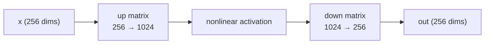
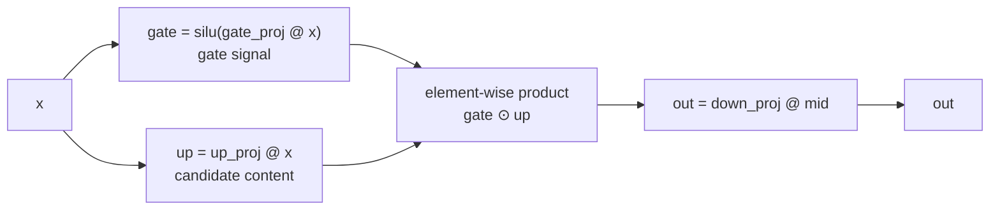

# 08 · MLP and GeGLU: Processing Each Word Independently

> By the end of this article you will know: what the other half of the computation (besides attention) does, the evolution ReLU→GELU→SiLU, the intuition behind gated GLU, and why the intermediate dimension is expanded 4×.
> Corresponding source: `mlp_block` in `src/model.cpp`, `silu` / `geglu_inplace` in `src/ops.cpp`.

## 1. Division of labor: attention exchanges information between words; the MLP processes a single word

Each Transformer block has two parts (the structure from Chapter 00):

```
h = h + attention(rmsnorm(h))   ← words exchange information with each other (Chapter 06)
h = h + mlp(rmsnorm(h))         ← each word is "processed" alone (this article)
```

Attention lets each position absorb context; the MLP (multi-layer perceptron; here meaning the feed-forward network, FFN) transforms **each position's vector independently**, ignoring the other words. Researchers have found that much of a model's knowledge (facts, grammar, patterns) is stored in the MLP's weights — attention's job is to fetch the relevant part from context.

## 2. The naive FFN: expand → nonlinearity → contract

The most classic FFN structure:



- **Expand 4×** (256 → 1024): in a higher-dimensional space, features are easier to separate linearly. Information tangled together in 256 dims may become cleanly distinguishable once mapped to 1024
- **Nonlinear activation**: with matrix multiplies only, two linear layers equal one (a matrix times a matrix is a matrix) — the network can't get "deep". Nonlinearity is indispensable
- **Contract** (1024 → 256): the processed information is restored to the model's uniform dimension, ready for the next layer

The weights file's `gate_proj [1024][256]`, `up_proj [1024][256]`, `down_proj [256][1024]` are these three steps' matrices (gate/up are the GLU variant — next section).

## 3. The evolution of activations: ReLU → GELU → SiLU

**ReLU** (the oldest): `max(0, x)`. All negatives become 0. Trivial to implement, but has the "dead neuron" problem (zero gradient on the negative side, so some neurons permanently die).

**GELU** (the BERT era): `x × Φ(x)`, where Φ is the normal distribution's CDF — a "soft" ReLU: negatives aren't hard-clipped but smoothly attenuated, keeping a little information. Works well but involves the error function, which is expensive.

**SiLU / Swish** (the modern LLM mainstream): `x × sigmoid(x)`, where sigmoid(x) = 1/(1+e^(−x)).

```
SiLU(-5) ≈ -0.03    (nearly 0 but not 0, with a hint of negative)
SiLU(0)  = 0
SiLU(2)  ≈ 1.76     (close to x itself)
SiLU(5)  ≈ 4.97     (almost exactly x)
```

Intuition: **small negatives are squashed toward zero; large positives pass through almost unchanged** — a smooth "gate" (the sigmoid part is the gating signal). Its smoothness means the gradient exists everywhere, and it's cheap to implement (just exp).

Our implementation (`src/ops.cpp`):

```cpp
float silu(float x) {
    float e = std::exp(x);
    return x * e / (1.0f + e);   // x·sigmoid(x), written in exp form
}
```

| Activation | Formula | Traits | Problem |
|---|---|---|---|
| ReLU | max(0, x) | simplest, free to compute | dead neurons (constant 0 gradient on the negative side) |
| GELU | x·Φ(x) | "soft" ReLU, negatives attenuate smoothly | involves the error function, expensive |
| SiLU / Swish | x·sigmoid(x) | smooth "soft gate", needs only exp | — |

## 4. GLU: giving the FFN a "gate"

Plain `up → SiLU → down` would work. But modern LLMs (Gemma, LLaMA) use a **GLU (Gated Linear Unit)** variant:

```
gate = silu(gate_proj @ x)     ← the gate signal (between 0 and ~x)
up   =        up_proj @ x      ← candidate content
mid  = gate ⊙ up               ← element-wise product: the gate controls how much content passes
out  = down_proj @ mid
```

Data flow:



**Intuition**: the up channel produces "candidate information"; the gate channel produces a 0–1 "pass coefficient" per dimension. Dimensions where the gate is near 0 are muted (that information doesn't matter right now); dimensions with a large gate pass through. **The model has learned selective output** — that is exactly what "gating" means.

**GeGLU** = the GLU from the GELU family; in practice the gate activation is SiLU (the paper calls it GeGLU but implementations universally use SiLU, Gemma included). The element-wise multiply step:

```cpp
void geglu_inplace(float* gate, const float* up, size_t n) {
    for (size_t i = 0; i < n; i++) gate[i] = silu(gate[i]) * up[i];
}
```

Our `mlp_block` (`src/model.cpp`) is four lines in total:

```cpp
void mlp_block(const Weights& w, const ModelConfig& cfg, uint32_t layer,
               const float* x, float* out, float* gate_buf, float* up_buf) {
    const Weights::Layer& L = w.layers[layer];
    gemv_i8_f32(L.gate, x, gate_buf);              // gate_proj @ x
    gemv_i8_f32(L.up, x, up_buf);                  // up_proj @ x
    geglu_inplace(gate_buf, up_buf, cfg.mlp_dim);  // silu(gate) ⊙ up
    gemv_i8_f32(L.down, gate_buf, out);            // down_proj @ mid
}
```

## 5. A tiny hand-computed example (2 dims → 4 dims → 2 dims)

```
x = [1, -1]
gate_proj (4×2) = [[1, 0], [0, 1], [1, 1], [-1, 1]]
up_proj (4×2)   = [[2, 0], [0, 2], [1, 1], [1, -1]]
down_proj (2×4) = [[1, 0, 0, 0], [0, 1, 1, 0]]

gate = gate_proj @ x = [1, -1, 0, -2]
up   = up_proj @ x   = [2, -2, 0, 2]
mid  = silu(gate) ⊙ up
     = [silu(1), silu(-1), silu(0), silu(-2)] ⊙ [2, -2, 0, 2]
     ≈ [0.731, -0.269, 0, -0.238] ⊙ [2, -2, 0, 2]
     = [1.462, 0.538, 0, -0.476]     ← note: the gate mutes the [0, 2] dimension to exactly 0
out  = down_proj @ mid = [1.462, 0.538]
```

Look at the third dimension: gate=0 makes silu(0)=0, so the entire dimension outputs 0 — the gate at work.

## 6. Why expand the intermediate dimension 4×?

Our 270m preset: dim=1536, mlp_dim=6144. Parameter counts:

```
q/k/v/o projections: about 4 × 1536² = 9.4M
gate/up/down:        2 × 6144×1536 + 1536×6144 = 28.3M
```

| Component | Parameters per layer (270m: dim=1536, mlp_dim=6144) | Share |
|---|---|---|
| q/k/v/o projections | 4 × 1536² ≈ 9.4M | ~25% |
| gate/up/down | 2 × 6144×1536 + 1536×6144 ≈ 28.3M | ~75% |

**The MLP accounts for roughly 75% of each layer's parameters and compute.** Why is that worth it? The empirical finding: a 4× FFN expansion is the best quality/cost trade-off (LLaMA/Gemma all use 4×). Less than 4× lacks expressiveness; more than 4× has diminishing returns. This is a practice-derived default, not a theorem.

This also explains why inference-engine optimizations (SIMD, quantization) concentrate so heavily on the MLP's matrix multiplies — that's where the bulk of the compute is.

## 7. Contrast with attention (to cement memory)

| | Attention | MLP |
|---|---|---|
| Looks at other words? | yes (global information mixing) | no (independent per position) |
| Parameters per layer (270m) | ~9.4M | ~28.3M |
| Role | communicate and route information | store knowledge, process features |
| Sensitive to position length | yes (O(pos) history) | no (looks only at itself) |

## 8. Summary

1. Each layer = attention (information exchange) + MLP (independent processing); the MLP holds 75% of the parameters
2. FFN structure: expand 4× → nonlinearity → contract
3. SiLU = x·sigmoid(x): a smooth "soft gate"
4. GeGLU: the gate channel and the up channel multiply element-wise; the model outputs selectively
5. mlp_block in four lines of code: two GEMVs + geglu + one GEMV

## Exercises

1. Why must the activation be nonlinear? (Hint: two linear layers = one linear layer)
2. `geglu_inplace` modifies `gate_buf` in place without allocating a new array. What if up and gate were the same buffer? (Hint: by the time you read up[i], it may already be modified)
3. Replace `silu` with `relu` (max(0,x)) — does `make test` go red? Which tests, and why? (Hint: golden data is generated by the NumPy reference)
4. Try replacing silu with relu in **both** `py/reference_model.py` and `src/ops.cpp`, then regenerate the golden data — the tests should stay green. What does that tell you the tests are verifying? (Hint: [12 - Testing Strategy](12-Testing-Strategy.md))
