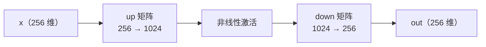
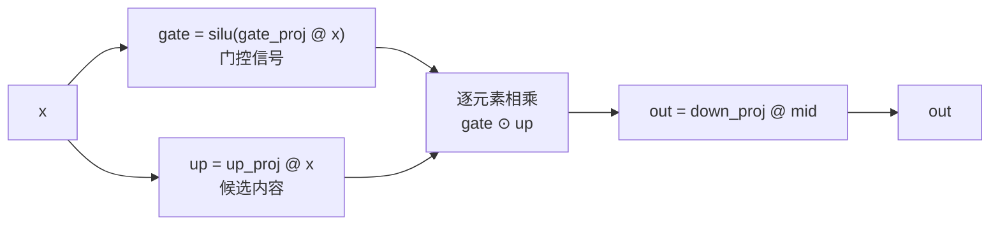

# 08 · MLP 与 GeGLU：每个词独立加工

> 读完这篇你会知道：注意力之外的另一半计算在干什么、ReLU→GELU→SiLU 的演进、门控 GLU 的直觉、为什么中间维度要放大 4 倍。
> 对应源码：`src/model.cpp` 的 `mlp_block`、`src/ops.cpp` 的 `silu` / `geglu_inplace`。

## 一、分工：注意力在词之间交换信息，MLP 处理单个词

每个 Transformer 层由两块组成（00篇的结构）：

```
h = h + attention(rmsnorm(h))   ← 词与词之间交换信息（06篇）
h = h + mlp(rmsnorm(h))         ← 每个词独自"加工"（本篇）
```

注意力让每个位置吸收上下文；而 MLP（多层感知机，这里指前馈网络 FFN）对**每个位置的向量独立地**做一轮变换，不管其他词。研究者发现模型的知识（事实、语法、模式）大量储存在 MLP 的权重里——注意力负责从上下文里取出相关的部分。

## 二、朴素 FFN：放大 → 非线性 → 缩回

最经典的 FFN 结构：



- **放大 4 倍**（256 → 1024）：在高维空间里，特征更容易被线性分开。256 维里纠缠在一起的信息，映射到 1024 维后可能变得清晰可辨
- **非线性激活**：如果只有矩阵乘，两层线性变换等价于一层（矩阵乘矩阵还是矩阵）——网络就"深"不起来。非线性是不可或缺的一环
- **缩回**（1024 → 256）：加工完的信息还原回模型的统一维度，准备进入下一层

权重文件里的 `gate_proj [1024][256]`、`up_proj [1024][256]`、`down_proj [256][1024]` 就是这三步的矩阵（gate/up 是 GLU 变体，见下节）。

## 三、激活函数演进：ReLU → GELU → SiLU

**ReLU**（最老）：`max(0, x)`。负值全部置 0。实现简单，但"死神经元"问题（负区间梯度为 0，某些神经元永久失活）。

**GELU**（BERT 时代）：`x × Φ(x)`，Φ 是正态分布的累积概率——"软"版 ReLU，负值不是硬切而是平滑衰减，保留了少量信息。效果好但计算含误差函数，贵。

**SiLU / Swish**（现代 LLM 主流）：`x × sigmoid(x)`，其中 sigmoid(x) = 1/(1+e^(−x))。

```
SiLU(-5) ≈ -0.03    （接近 0 但不为 0，带一点点负号）
SiLU(0)  = 0
SiLU(2)  ≈ 1.76     （接近 x 本身）
SiLU(5)  ≈ 4.97     （几乎等于 x）
```

直觉：**小的负值被压到近零，大的正值几乎原样放行**——一条平滑的"门"（sigmoid 部分就是门控信号）。它的平滑性让梯度处处存在，且实现便宜（只有 exp）。

我们的实现（`src/ops.cpp`）：

```cpp
float silu(float x) {
    float e = std::exp(x);
    return x * e / (1.0f + e);   // x·sigmoid(x)，写成 exp 形式
}
```

| 激活函数 | 公式 | 特点 | 问题 |
|---|---|---|---|
| ReLU | max(0, x) | 最简单，计算免费 | 死神经元（负区间梯度恒 0） |
| GELU | x·Φ(x) | "软"版 ReLU，负值平滑衰减 | 含误差函数，计算贵 |
| SiLU / Swish | x·sigmoid(x) | 平滑"软门"，只需 exp | — |

## 四、GLU：给 FFN 加一扇"门"

直接 `up → SiLU → down` 也可以。但现代 LLM（Gemma、LLaMA）用 **GLU（Gated Linear Unit，门控线性单元）**变体：

```
gate = silu(gate_proj @ x)     ← 门控信号（0 到 ~x 之间）
up   =        up_proj @ x      ← 候选内容
mid  = gate ⊙ up               ← 逐元素相乘：门控制内容通过多少
out  = down_proj @ mid
```

数据流：



**直觉**：up 通道生成"候选信息"，gate 通道对每个维度生成一个 0~1 的"通过系数"。gate 接近 0 的维度被静音（这个信息现在不重要），gate 大的维度放行。**模型学会了选择性输出**——这正是"门控"的含义。

**GeGLU** = GELU 家族的 GLU，实际用 SiLU 作门控激活（论文里叫 GeGLU 但业界实现普遍用 SiLU，Gemma 正是如此）。逐元素相乘那一步：

```cpp
void geglu_inplace(float* gate, const float* up, size_t n) {
    for (size_t i = 0; i < n; i++) gate[i] = silu(gate[i]) * up[i];
}
```

我们的 `mlp_block`（`src/model.cpp`）总共四行：

```cpp
void mlp_block(const Weights& w, const ModelConfig& cfg, uint32_t layer,
               const float* x, float* out, float* gate_buf, float* up_buf) {
    const Weights::Layer& L = w.layers[layer];
    gemv_i8_f32(L.gate, x, gate_buf);              // gate_proj @ x
    gemv_i8_f32(L.up, x, up_buf);                  // up_proj @ x
    geglu_inplace(gate_buf, up_buf, cfg.mlp_dim);  // silu(gate) ⊙ up
    gemv_i8_f32(L.down, gate_buf, out);            // down_proj @ mid
}
```

## 五、手算迷你例子（2 维 → 4 维 → 2 维）

```
x = [1, -1]
gate_proj（4×2）= [[1, 0], [0, 1], [1, 1], [-1, 1]]
up_proj（4×2）  = [[2, 0], [0, 2], [1, 1], [1, -1]]
down_proj（2×4）= [[1, 0, 0, 0], [0, 1, 1, 0]]

gate = gate_proj @ x = [1, -1, 0, -2]
up   = up_proj @ x   = [2, -2, 0, 2]
mid  = silu(gate) ⊙ up
     = [silu(1), silu(-1), silu(0), silu(-2)] ⊙ [2, -2, 0, 2]
     ≈ [0.731, -0.269, 0, -0.238] ⊙ [2, -2, 0, 2]
     = [1.462, 0.538, 0, -0.476]     ← 注意：gate 把 [0, 2] 那维直接静音成 0
out  = down_proj @ mid = [1.462, 0.538]
```

观察第 3 维：gate=0 恰好使 silu(0)=0，整维输出 0——门控在工作。

## 六、为什么中间维度放大 4 倍？

我们的 270m 预设：dim=1536，mlp_dim=6144。参数量：

```
q/k/v/o 投影：约 4 × 1536² = 9.4M
gate/up/down：2 × 6144×1536 + 1536×6144 = 28.3M
```

| 组件 | 每层参数量（270m：dim=1536, mlp_dim=6144） | 占比 |
|---|---|---|
| q/k/v/o 投影 | 4 × 1536² ≈ 9.4M | ~25% |
| gate/up/down | 2 × 6144×1536 + 1536×6144 ≈ 28.3M | ~75% |

**MLP 占了每层约 75% 的参数和计算量**。为什么值得？经验结论：FFN 中间维度放大 4 倍是"效果/成本"最平衡的选择（LLaMA/Gemma 全用 4 倍）。小于 4 倍表达能力不够，大于 4 倍收益递减。这是实践总结出来的默认值，不是推导出来的定理。

这也解释了为什么推理引擎的优化重点（SIMD、量化）大量落在 MLP 的矩阵乘上——它们就是计算量的大头。

## 七、和注意力的对比（加深记忆）

| | 注意力 | MLP |
|---|---|---|
| 看别的词吗 | 看（全局信息混合） | 不看（逐位置独立） |
| 每层参数量（270m） | ~9.4M | ~28.3M |
| 作用 | 交流、路由信息 | 存储知识、加工特征 |
| 对位置长度敏感 | 是（O(pos) 历史） | 否（每次只看自己） |

## 八、总结

1. 每层 = 注意力（交换信息）+ MLP（独立加工），MLP 占 75% 参数
2. FFN 结构：放大 4 倍 → 非线性 → 缩回
3. SiLU = x·sigmoid(x)：平滑的"软门"
4. GeGLU：gate 通道和 up 通道逐元素相乘，模型选择性输出
5. mlp_block 四行代码：两个 GEMV + geglu + 一个 GEMV

## 思考题

1. 为什么激活函数必须是非线性的？（提示：两层线性 = 一层线性）
2. `geglu_inplace` 就地修改 `gate_buf`，没有分配新数组。如果 up 和 gate 是同一个缓冲区会怎样？（提示：读 up[i] 时它可能已被修改）
3. 把 `silu` 换成 `relu`（max(0,x)），`make test` 会红吗？哪些测试红？为什么？（提示：golden 由 NumPy 参考生成）
4. 试着在 `py/reference_model.py` 和 `src/ops.cpp` 里同时把 silu 换成 relu，重新生成 golden——测试应该依然全绿。这说明测试在验证什么？（提示：《12-测试策略》）
