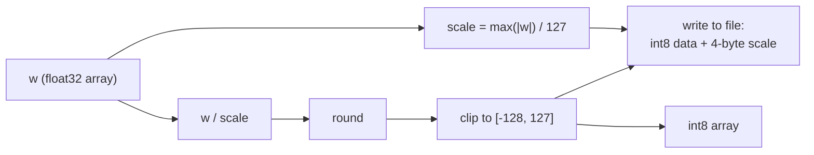

# 09 · INT8 Quantization: Compressing 1 GB into 250 MB

> By the end of this article you will know: how float32 and int8 differ in memory, the complete symmetric-quantization formulas, where quantization error comes from, the `(x·w8)×scale` "multiply once" trick, and two real pitfalls we hit (clip and zero protection).
> Corresponding source: `quantize` in `py/common.py`, `dot_i8_f32` in `src/kernel.cpp`.

## 1. Premise: floating point is "expensive"

The weights' original format is **float32**: 4 bytes per number, stored per IEEE 754 (1 sign bit + 8 exponent bits + 23 mantissa bits), about 7 significant digits, range about ±3.4×10³⁸.

**int8** is a one-byte integer: range −128 to 127, constant precision of 1.

A 270M-parameter model:

```
float32: 270M × 4 bytes ≈ 1.08 GB
int8:    270M × 1 byte  ≈ 270 MB   (+ one scale per tensor, negligible)
```

| Type | Bytes per value | Precision and range | 270M-parameter model |
|---|---|---|---|
| float32 | 4 | ~7 significant digits, ±3.4×10³⁸ | ≈ 1.08 GB |
| int8 | 1 | integers −128 to 127, constant precision 1 | ≈ 270 MB (+ one scale per tensor) |

**One quarter.** The savings aren't just on disk: it fits in memory, fits even better in CPU caches, and each decode step reads 3/4 fewer bytes from memory — decode speed is capped by memory bandwidth (Chapter 10), so quantization **saves memory and speeds things up at the same time**.

## 2. Symmetric quantization: finding each tensor's "ruler"

int8 can't represent decimals and can't exceed ±127. What to do? Give each tensor a "ruler" (the scale) that **linearly maps** floats into int8:

```
w8[i] = round( w[i] / scale )    then clamp to [-128, 127]
scale = max(|w|) / 127
```

These are two different operations: **round** turns decimals into integers, and **clip** pushes out-of-range integers back to the boundary (128 → 127). In theory the rounded result can't overflow, but floating-point rounding can produce 128, and numpy's conversion to int8 **wraps around** on overflow (128 → −128) — so you must clip before converting. That's pitfall #1 in the next section.

Why `max(|w|)/127`? Because the largest-magnitude element then maps to exactly ±127 — **the range is used to the last tick, nothing wasted**. This is symmetric quantization (symmetric about zero, zero point = 0).

The actual code from `py/common.py`:

```python
def quantize(w):
    w = np.ascontiguousarray(w, dtype=np.float32)
    scale = max(float(np.max(np.abs(w))), 1e-9) / 127.0   # the ruler
    q = np.clip(np.round(w / scale), -128, 127).astype(np.int8)
    return q, np.float32(scale)
```

The quantization pipeline:



**One scale per tensor** (not one for the whole model): different tensors' value ranges differ enormously, and a single ruler for everything would waste most of the precision. In the weights file, each tensor is immediately followed by its scale (the format from Chapter 02).

## 3. Two details: clip and zero protection (both real pitfalls we hit)

### Detail 1: clip is not optional

In theory `np.round(w/scale)` already lands within ±127. But floating-point rounding can produce **128** (e.g. 127.4999999 rounds to 127 — fine; 127.5 rounds to 128). numpy's `astype(np.int8)` handles out-of-range values by **wrapping**, not saturating: 128 becomes −128, 129 becomes −127…

**A ±0.5 rounding error becomes a 255-magnitude quantization error** (127.5 should mean "near the maximum"; after wrapping it's the minimum). So you must `np.clip(..., -128, 127)` before astype. This is a well-known numpy trap, and it's written into our code comments.

### Detail 2: an all-zero tensor's scale is 0 → NaN

If a tensor happens to be all zeros (real models can have pruned/masked blocks): `max(|w|) = 0` → `scale = 0` → dequantization `0 × 0`… and note: `w8 = round(w/0)` is already a division by zero → NaN.

The `max(..., 1e-9)` in the code is the "zero protection": the scale bottoms out at 1e-9/127 ≈ 7.9e-12, so an all-zero tensor dequantizes to all zeros (correct!). One of our unit tests verifies this explicitly (the zero-weights assertion in `matmul_i8`).

## 4. Dequantization: how is it "restored" for computation?

What's stored is int8; computation needs floats:

```
w[i] ≈ w8[i] × scale
```

For example, w8 = 63, scale = 0.0377 → restored ≈ 2.375. **Error** comes from two places: rounding in round (at most half a tick) and the precision of scale itself. Maximum relative error ≈ 1/(2×127) ≈ 0.4% — roughly a few tenths of a percent of noise per weight. Papers and practice both show the impact on inference quality is usually small (models already experience all sorts of noise during training; this much perturbation of the weights matters little).

## 5. The core trick: (x · w8) × scale — scale multiplied once

For the matrix multiply `out = x · w`, the naive dequantizing version **dequantizes every weight first, then dot-products**:

```cpp
// naive: multiply by scale at every step — dim float multiplications
float result = 0;
for (int i = 0; i < dim; i++)
    result += x[i] * (float)w8[i] * scale;   // scale multiplied every iteration!
```

Multiplication is associative and distributive: `Σ (x[i] · w8[i] · scale) = (Σ x[i] · w8[i]) · scale`. So:

```cpp
// optimized: integer dot product first, one scale multiply at the end — 1 float multiplication
float sum = 0;
for (int i = 0; i < dim; i++)
    sum += x[i] * (float)w8[i];   // no scale in the loop
return sum * scale;               // dim multiplications → 1
```

**dim (256 or 1536) float multiplications become 1**, and the loop body is simpler (easier for the compiler/SIMD to optimize). That's the "integer dot product first, scale once at the end" — the closing line of our `dot_i8_f32` (see the full SIMD version in Chapter 10).

## 6. Why "quantize in Python, read-only in C++"?

This is an architectural decision worth stating on its own. The core operation of quantization is `round`. The problem: **numpy's round and C++'s round disagree on 0.5** (numpy uses banker's rounding — 0.5 rounds to the nearest even; C++ rounds away from zero — 0.5 always rounds up).

If C++ also quantized, the two sides' round semantics would differ, and the tests' reference values would be systematically biased — making it look like the engine computed something wrong. Our approach: **round happens exactly once, in the Python conversion script**. At load time, C++ reads already-fixed int8 values and the scale; it only multiplies, never rounds — **the rounding-semantics minefield is isolated entirely outside C++**.

This echoes Chapter 02's division of labor: complexity lives on the conversion side (Python may be slow and use libraries); the hot path stays simple (C++ only reads, only multiplies, makes no decisions).

## 7. What quantization looks like in the file (recap)

Chapter 02's format is now complete:

```
[tensor data: rows×cols int8 bytes] [4-byte float32 scale]
```

For example, embed_tokens `[1024][256]`: 262144 bytes of int8 + 4 bytes of scale = 262148 bytes. The whole tiny model is 2.7 MB; the 270m preset is 908 MB. At load time, `Cursor::next` walks the bytes and fills the scale straight into the descriptor — zero parsing cost.

## 8. "Visualizing" the quantization error

A 4-element example by hand:

```
w      = [0.9, -1.3, 0.05, 2.0]
max|w| = 2.0 → scale = 2.0/127 ≈ 0.01575
w8     = round([57.1, -82.5, 3.17, 127.0]) = [57, -83, 3, 127] (assuming consistent round semantics)
restored = [0.898, -1.307, 0.047, 2.000]
error    = [0.002, 0.007, 0.003, 0]      ← all ≤ half a tick (0.0079)
```

The error is strictly bounded by ±scale/2 — **predictable and bounded**. That's why quantization can be used with confidence.

## 9. Summary

1. int8 saves 3/4 of memory and bandwidth; the cost is ≤0.4% error per weight
2. Symmetric quantization: `scale = max(|w|)/127`, `w8 = clip(round(w/scale), -128, 127)`
3. Two mandatory pitfalls: numpy's astype **wraps** on overflow (clip first); an all-zero tensor's scale=0 produces NaN (the max(...,1e-9) guard)
4. `(x·w8)×scale`: dim multiplications → 1 multiplication
5. Quantization happens once, in Python — the cross-language difference in round semantics is isolated
6. The error is bounded (≤ half a tick), and the tests assert it specifically

## Exercises

1. Why one scale per tensor rather than one for the whole model? Find a counterexample: two tensors whose value ranges differ by 100× share a scale — what happens?
2. `w8 = 127` and `scale = 0.01575` dequantize to 2.000. Why can the maximum be represented losslessly while other values can't?
3. Why don't we use int4 (4-bit)? Think about how int4 would be "packed" in memory, and what extra operations C++ reads would need.
4. Find the NEON implementation of `dot_i8_f32` and confirm the scale multiplication really appears exactly once, at the end.
