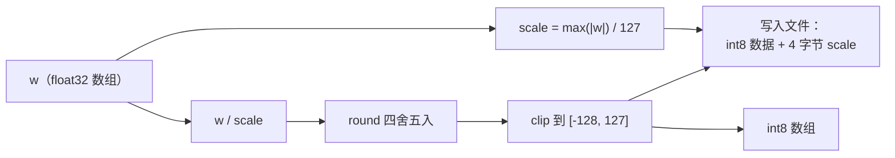

# 09 · INT8 量化：把 1GB 压缩到 250MB

> 读完这篇你会知道：float32 和 int8 在内存里的区别、对称量化的完整公式、量化误差从哪来、`(x·w8)×scale` 这个"只乘一次"的技巧、以及两个真实踩过的坑（clip 和零保护）。
> 对应源码：`py/common.py` 的 `quantize`、`src/kernel.cpp` 的 `dot_i8_f32`。

## 一、前提：浮点数很"贵"

权重文件的原始格式是 **float32**：每个数占 4 字节，按 IEEE 754 标准存储（1 位符号 + 8 位指数 + 23 位尾数），能表示约 7 位有效数字、范围约 ±3.4×10³⁸。

**int8** 则是一个字节的整数：范围 −128 ~ 127，精度恒为 1。

一个 270M 参数的模型：

```
float32: 270M × 4 字节 ≈ 1.08 GB
int8:    270M × 1 字节 ≈ 270 MB   （+ 每张量一个 scale，忽略不计）
```

| 类型 | 每数占用 | 精度与范围 | 270M 参数模型 |
|---|---|---|---|
| float32 | 4 字节 | ~7 位有效数字，±3.4×10³⁸ | ≈ 1.08 GB |
| int8 | 1 字节 | 整数 −128 ~ 127，精度恒 1 | ≈ 270 MB（+ 每张量一个 scale） |

**四分之一。** 省下的不只是磁盘：内存里装得下、CPU 缓存里装得更多、每步解码从内存读的字节少 3/4——解码的速度上限由内存带宽决定（10篇细讲），所以量化**同时省内存和提速**。

## 二、对称量化（symmetric quantization）：找到每个张量的"标尺"

int8 表示不了小数，也超不出 ±127。怎么办？给每个张量找一把"标尺" scale，把浮点值**线性映射**到 int8：

```
w8[i] = round( w[i] / scale )    然后限制在 [-128, 127]
scale = max(|w|) / 127
```

这两步是两个不同操作：**round（取整）**把小数变成整数，**限制/clip**把越界的整数压回边界（128 压回 127）。理论上取整结果不会越界，但浮点舍入可能给出 128，而 numpy 转 int8 对越界是回绕（128 → −128）——所以必须先限制再转换，这就是下一节的坑一。

为什么是 `max(|w|)/127`？因为绝对值最大的元素映射后恰好落在 ±127——**范围刚好用满，一个刻度都不浪费**。这叫对称量化（正负对称，零点为 0）。

`py/common.py` 的实际代码：

```python
def quantize(w):
    w = np.ascontiguousarray(w, dtype=np.float32)
    scale = max(float(np.max(np.abs(w))), 1e-9) / 127.0   # 标尺
    q = np.clip(np.round(w / scale), -128, 127).astype(np.int8)
    return q, np.float32(scale)
```

量化流水线：



**scale 每个张量一个**（不是整个模型一个）：不同张量的数值范围差异巨大，一张标尺管全部会浪费大部分精度。权重文件里每个张量后紧跟它的 scale（02篇的格式）。

## 三、两个细节：clip 和零保护（都是真实踩过的坑）

### 细节 1：clip 不是可选项

`np.round(w/scale)` 理论上已经落在 ±127 内。但浮点舍入可能给出 **128**（比如 127.4999999 舍入成 127 没事，127.5 舍入成 128）。numpy 的 `astype(np.int8)` 对越界值的处理是**回绕（wrap）**而不是饱和：128 变成 −128，129 变成 −127……

**±0.5 的舍入误差会变成 255 的严重量化错误**（127.5 本该是"接近最大值"，回绕后成了最小值）。所以必须先 `np.clip(..., -128, 127)` 再 astype。这是 numpy 的知名坑，我们写进代码注释里了。

### 细节 2：全零张量的 scale 是 0 → NaN

如果某个张量恰好全 0（真实模型里可能有被剪枝/屏蔽的块）：`max(|w|) = 0` → `scale = 0` → 反量化 `0 × 0`……注意：`w8 = round(w/0)` 首先就是除零 → NaN。

代码里的 `max(..., 1e-9)` 就是"零保护"：scale 最低为 1e-9/127 ≈ 7.9e-12，全零张量反量化后是全零（正确！）。我们的单测专门验证了这条（`matmul_i8` 里的零权重断言）。

## 四、反量化：计算时怎么"还原"？

存的是 int8，算的时候要变回浮点：

```
w[i] ≈ w8[i] × scale
```

比如 w8 = 63，scale = 0.0377 → 还原 ≈ 2.375。**误差**来自两步：round 的舍入（最多 0.5 个刻度）和 scale 本身的精度。最大相对误差 ≈ 1/(2×127) ≈ 0.4%——每个权重约有千分之几的噪声。论文和实践都表明：对推理质量的影响通常很小（模型训练时本就经历过各种噪声，权重上这点扰动影响很小）。

## 五、核心技巧：(x · w8) × scale，scale 只乘一次

矩阵乘 `out = x · w`，朴素反量化写法是**先反量化每个权重，再点积**：

```cpp
// 朴素：每一步都乘 scale —— dim 次浮点乘法
float result = 0;
for (int i = 0; i < dim; i++)
    result += x[i] * (float)w8[i] * scale;   // 每次迭代都乘 scale！
```

乘法有结合律和分配律：`Σ (x[i] · w8[i] · scale) = (Σ x[i] · w8[i]) · scale`。所以：

```cpp
// 优化：先做整数点积，最后乘一次 scale —— 1 次浮点乘法
float sum = 0;
for (int i = 0; i < dim; i++)
    sum += x[i] * (float)w8[i];   // 循环里没有 scale
return sum * scale;               // dim 次乘法 → 1 次
```

**dim（256 或 1536）次浮点乘法省成 1 次**，还让循环体更简单（编译器/SIMD 更好优化）。这就是"先做整数点积，最后乘一次 scale"——我们 `dot_i8_f32` 的结尾就是这一句（10篇看 SIMD 版全貌）。

## 六、为什么"量化在 Python 做，C++ 只读"？

这是架构决策，值得单独说。量化的核心操作是 `round`。问题：**numpy 的 round 和 C++ 的 round 对 0.5 的处理不同**（numpy 是银行家舍入（banker's rounding）——0.5 舍到最近的偶数；C++ 是远离零——0.5 恒进位）。

如果 C++ 也参与量化，两边的 round 语义不一致，测试的参考值就会系统性偏差，让人以为引擎算错了。我们的做法：**round 只在 Python 转换脚本里做一次**。C++ 加载时读到的是已经定好的 int8 和 scale，只做乘法不做舍入——**舍入语义的坑被整个隔离在 C++ 之外**。

这也呼应 02篇的分工：复杂度留在转换侧（Python 可以慢、可以用库），热路径保持简单（C++ 只读、只乘、不决策）。

## 七、量化在文件里长什么样（回顾）

02篇的格式现在完整了：

```
[张量数据：rows×cols 个 int8 字节] [4 字节 float32 scale]
```

比如 embed_tokens `[1024][256]`：262144 字节 int8 + 4 字节 scale = 262148 字节。整个 tiny 模型 2.7MB，270m 预设 908MB。加载时 `Cursor::next` 数着字节走，读到 scale 直接填进描述符——零解析成本。

## 八、量化误差的"可视化"

手算一个 4 元素的例子：

```
w      = [0.9, -1.3, 0.05, 2.0]
max|w| = 2.0 → scale = 2.0/127 ≈ 0.01575
w8     = round([57.1, -82.5, 3.17, 127.0]) = [57, -83, 3, 127]（假设 round 语义一致）
还原    = [0.898, -1.307, 0.047, 2.000]
误差    = [0.002, 0.007, 0.003, 0]      ← 全部 ≤ 半个刻度（0.0079）
```

误差被严格限制在 ±scale/2 内——**可预测、有界**，这是量化能放心使用的原因。

## 九、总结

1. int8 省 3/4 内存和带宽；代价是每个权重 ≤0.4% 的误差
2. 对称量化：`scale = max(|w|)/127`，`w8 = clip(round(w/scale), -128, 127)`
3. 两个必踩的坑：numpy astype 越界**回绕**（必须先 clip）；全零张量 scale=0 产生 NaN（max(...,1e-9) 保护）
4. `(x·w8)×scale`：dim 次乘法 → 1 次乘法
5. 量化只在 Python 做一次——round 语义的跨语言差异被隔离
6. 误差有界（≤ 半个刻度），测试有专门断言

## 思考题

1. 为什么 scale 每张量一个，而不是整个模型一个？找个反例：两个张量的数值范围差 100 倍，共用 scale 会怎样？
2. `w8 = 127` 且 `scale = 0.01575`，反量化是 2.000。为什么最大值能无损表示，其他值不能？
3. 我们为什么不用 int4（4 位）？想想 int4 在内存里怎么"打包"，以及 C++ 读取会多出什么操作。
4. 查找 `dot_i8_f32` 的 NEON 实现，确认 scale 的乘法确实只在结尾出现一次。
