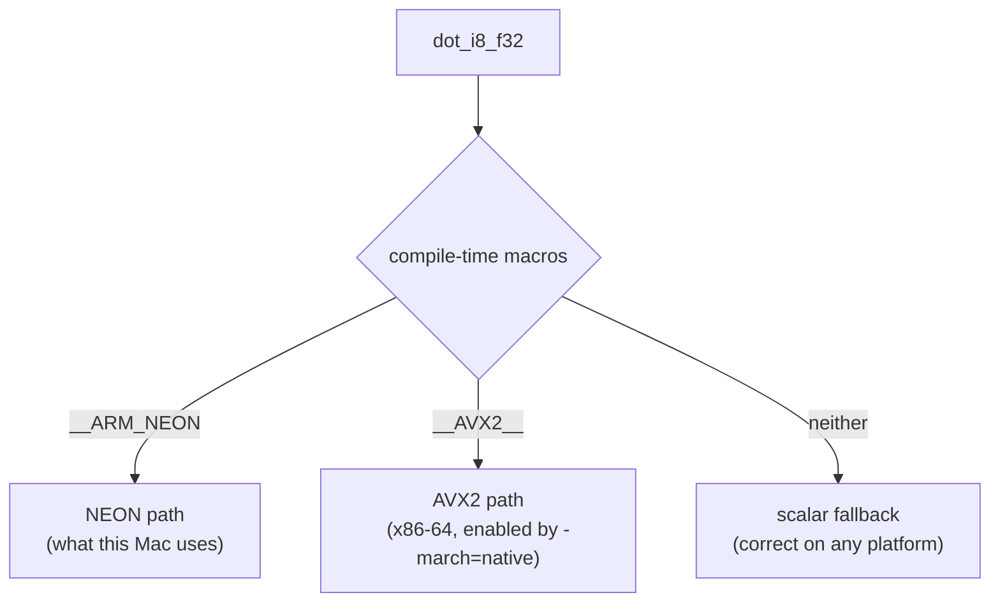

# 10 · SIMD and Matrix Multiplication: Why It's Fast

> By the end of this article you will know: how many numbers one CPU instruction can compute, how int8 becomes float32 step by step, what FMA is, how NEON and AVX2 differ — and why "memory bandwidth" is the real bottleneck.
> Corresponding source: `src/kernel.cpp` (the whole file; read alongside), the layout parts of `src/weights.cpp`.

## 1. Why matrix multiplication is the bottleneck

Decoding one token — how many multiply-adds do the MLP and attention do? Using the 270m preset (dim=1536, mlp=6144), one layer:

```
q/k/v/o projections: 4 × 1536 × 1536 ≈ 9.4M multiply-adds
gate/up/down:        3 × 6144 × 1536  ≈ 28.3M multiply-adds
per layer ≈ 37.7M; 26 layers ≈ 980M multiply-adds = about 2 billion float ops per token
```

That's the price of generating one word. To hit 50 tokens/s you need 100 billion operations per second — scalar code that "computes one per loop iteration" is nowhere near enough. That's why we hand-write SIMD.

## 2. Where does the scalar loop waste?

The most direct dot-product code (scalar):

```cpp
float sum = 0;
for (int i = 0; i < dim; i++)
    sum += x[i] * w[i];
```

Each iteration: read x[i], read w[i], multiply, add — 4 instructions for 1 multiply-add. A modern CPU can only compute 1 number per scalar instruction, yet it has **a dozen-plus parallel pipelines** sitting idle.

**SIMD (Single Instruction Multiple Data)**: one instruction computes several numbers at once. CPUs have dedicated **vector registers** (128 or 256 bits wide) that hold, simultaneously:

```
128 bits (one NEON register):  4 float32, or 8 int16, or 16 int8
256 bits (one AVX2 register):  8 float32, or 16 int16, or 32 int8
```

| Execution mode | Register width | Per instruction |
|---|---|---|
| Scalar | — | 1 float32 |
| NEON (arm64) | 128 bits | 4 float32 / 8 int16 / 16 int8 |
| AVX2 (x86-64) | 256 bits | 8 float32 / 16 int16 / 32 int8 |

One vector instruction (e.g. `vfmaq_f32`) multiply-adds **all lanes simultaneously**: 1 instruction = 4 multiply-adds. Combined with pipelining, throughput approaches 4×.

## 3. Mixed types: how do int8 weights multiply float32 activations?

SIMD requires both operands to have the same type. We hold int8 weights and float32 activations — **the types must be unified first**. The choice: **widen** int8 to float32 (activations can't be losslessly shrunk to int8; they only exist at runtime).

Widening is an "ascent chain", doubling the bit width at each step with sign extension:

```
int8    (8 bits,  -128 ~ 127)      vld1_s8    ← load 8 int8
  │ sign-extend (a negative's sign bit must fill the high bits, or -1 becomes 255)
int16   (16 bits, -32768 ~ 32767)  vmovl_s8
  │
int32   (32 bits)                   vmovl_s16
  │ integer → float (same value, different representation)
float32 (32 bits)                   vcvtq_f32_s32
```

Each step is a standard instruction. Why go through int16 instead of int8→int32 directly? Because the CPU only provides "adjacent-width" widening instructions (8→16, 16→32); there is no 8→32 direct route.

**Sign extension is the concept beginners get wrong most**: int8's −1 is binary `11111111`. Treated directly as 255 (zero extension), the dot product is completely wrong. The "s" in `vmovl_s8` stands for signed — sign-extending. Our test model's weights are half positive and half negative, so this bug, once made, turns every test red immediately.

## 4. FMA: fused multiply-add

The scalar path is "multiply, then add" — two instructions, two roundings. FMA (Fused Multiply-Add) computes `a×b+c` in one instruction:

```
NEON:  vfmaq_f32(acc, x, w)   → acc = acc + x*w   (4 lanes at once)
AVX2:  _mm256_fmadd_ps(x, w, acc)                 (8 lanes at once)
```

Benefits: one fewer rounding (slightly more accurate), one fewer instruction (lower latency). "One instruction computes a*b+c with one fewer rounding than multiply-then-add" — that's this.

## 5. Our NEON kernel, line by line (src/kernel.cpp)

```cpp
float dot_i8_f32(const int8_t* w, const float* x, size_t n, float scale) {
    float32x4_t acc0 = vdupq_n_f32(0.0f);   // two accumulators, initialized to 0
    float32x4_t acc1 = vdupq_n_f32(0.0f);
    size_t i = 0;
    for (; i + 8 <= n; i += 8) {            // 8 elements per iteration
        int8x8_t w8 = vld1_s8(w + i);       // ① load 8 int8
        int16x8_t w16 = vmovl_s8(w8);       // ② widen to int16
        float32x4_t wf0 = vcvtq_f32_s32(vmovl_s16(vget_low_s16(w16)));   // ③ low 4
        float32x4_t wf1 = vcvtq_f32_s32(vmovl_s16(vget_high_s16(w16)));  //    high 4
        float32x4_t xf0 = vld1q_f32(x + i);      // ④ load activations (already f32)
        float32x4_t xf1 = vld1q_f32(x + i + 4);
        acc0 = vfmaq_f32(acc0, xf0, wf0);        // ⑤ FMA: acc += x*w
        acc1 = vfmaq_f32(acc1, xf1, wf1);
    }
    float sum = vaddvq_f32(vaddq_f32(acc0, acc1));   // ⑥ horizontal sum
    for (; i < n; i++) sum += (float)w[i] * x[i];    // ⑦ tail (fewer than 8)
    return sum * scale;                              // ⑧ scale multiplied once (Chapter 09)
}
```

Point by point:

- **① 8 int8 loaded at once**. Why 8 per iteration and not 16? Because after a 128-bit NEON register holds 16 int8, widening to float32 gives 16×4 bytes = 4 registers — **processing 16 at a time doubles register pressure**; 8 per iteration (2 f32 registers) is the balance point. AVX2's 256-bit registers hold exactly 8 f32, so the x86 version is also 8 elements per iteration — both sides' loop shapes align
- **③ Low/high split**: `vget_low_s16`/`vget_high_s16` split 8 int16 into two groups of 4, each widened to f32. NEON registers are 128 bits (4 f32) and can't hold 8 — this is the physical difference between arm64 and AVX2 (128 vs 256 bits)
- **⑤ Two accumulators `acc0/acc1`**: FMA latency is about 4 cycles (from inputs to result available). With one accumulator, every FMA must wait for the previous one — the pipeline stalls on the "dependency chain". Two independent accumulators fed alternately hide half the latency. This is a fundamental of hand-written SIMD: **accumulator count ≥ instruction latency**
- **⑥ Horizontal sum**: `vaddvq_f32` adds the 4 numbers inside a register ("vertical" is per-lane parallelism; "horizontal" is summing across lanes). Adding acc0+acc1 gives the scalar sum
- **⑦ The tail**: when dim isn't a multiple of 8 (1536 % 8 == 0 happens to divide evenly, but stay general), the last few elements go through the scalar loop. **Always handle the non-divisible tail** — our unit tests include a 9-element (8+1) case for exactly this
- **⑧ Multiply by scale last**: Chapter 09's trick

## 6. Three-way dispatch: the philosophy of #if

`kernel.cpp` selects the path with compile-time macros:

```cpp
#if defined(__ARM_NEON)      // arm64 (this Mac): the code above
#elif defined(__AVX2__)      // x86-64: the _mm256 version
#else                        // everything else: pure scalar fallback
```



- **Compile-time selection, zero runtime overhead** — no if/else, no function pointers
- **The macros are defined by the compiler**: on Apple Silicon, clang defines `__ARM_NEON` automatically (NEON is part of the arm64 baseline; no `-march=native` needed); on x86-64 the Makefile adds `-march=native`, which turns on `__AVX2__` (AVX2 is not an x86 baseline and must be enabled explicitly)
- The scalar fallback guarantees "any platform computes correctly at least" — slow but correct, and also the reference point for testing the other paths

That's the concrete landing of the "AVX2 approach" on our machine: **one algorithm (widening chain + FMA + two accumulators + scalar tail), two instruction sets, one fallback**.

## 7. Storage layout and cache: why [output][input] row-major (Chapter 02 revisited)

The dot-product loop reads `w + i` — **contiguous memory**. Contiguous access = the CPU prefetcher pulls future data into cache ahead of time = every byte of each cache line (64 bytes) is used.

If the matrix were stored [input][output], one output row's elements would sit `dim×4` bytes apart in memory: each cache line contributes 4 usable bytes (94% wasted), amplifying memory bandwidth 16×. **Layout is performance** — hence Chapter 02's "the storage layout serves the compute pattern".

## 8. The real bottleneck: memory bandwidth

Decoding one token — how much data must memory deliver? **Every token must read the entire weights at least once** (~900 MB). The reason is that decode's batch size is 1: one token at a time, each weight participating in exactly one dot product, used and discarded, with no reuse. Contrast prefill and training: when a batch of N tokens is processed together, the weights are reused N times and the read cost is amortized N-fold; decoding can't amortize — **per-token memory traffic = total weight size, a hard floor**. Optimization can only shrink the weights (quantization); "read all weights once" itself cannot be saved.

How fast data arrives is decided by memory bandwidth; no matter how fast the CPU computes, it waits for data. The M4 Pro's total bandwidth is ~200 GB/s (multi-core), but a single thread realistically gets ~30-60 GB/s: saturating bandwidth requires many concurrent outstanding memory requests, and one CPU core can only have so many in flight.

```
Time floor = 900MB / 40GB/s ≈ 22ms/token ≈ 45 tokens/s (pure bandwidth cap)
Measured  = 11 tokens/s (90ms/token, including int8→f32 widening overhead)
```

| Weight format | Read per token | Bandwidth-capped speed (at 40 GB/s single-thread) |
|---|---|---|
| float32 (no quantization) | 3.6 GB | ≈ 11 tok/s |
| int8 (quantized) | 900 MB | ≈ 45 tok/s (measured 11, widening overhead included) |

Note the measurement is still 4× from the cap — compute costs like the int8→f32 widening and cache behavior also consume time; the single-threaded kernel hasn't saturated bandwidth. This doesn't change the hard floor of "read all weights once per token": **decoding cannot be faster than reading all the weights once**; the smaller the weights, the higher the cap. As models grow and threads multiply, bandwidth becomes the dominant constraint (llama.cpp's 58.8 tok/s is bandwidth-dominated).

Understanding these numbers explains two things:

1. **Why quantization speeds things up**: int8 weights cut per-token reads from 3.6 GB to 900 MB — bandwidth is the hard limit; less reading is faster
2. **Why single-threaded has a cap**: one thread can't saturate total bandwidth. llama.cpp's single-thread 19.2 tok/s vs 58.8 tok/s is essentially "who uses the single thread's bandwidth more fully" (fewer wasted reads, better cache behavior). Normalized by per-MAC throughput, our kernel sits at the same level as the 58.8 tok/s figure (which was on a model 4× smaller)

> Clarifying one number: "single-threaded decode at 58.8 tokens/second" is a **real 270M model** (about 245M multiply-adds/token) on a Ryzen 5. Our 270m preset (parameter table in Chapter 02) does about 980M multiply-adds per token — 4× the work; 11 tok/s normalized comes out at the same throughput.

## 9. Summary

1. Matrix multiply is the absolute bottleneck; SIMD computes 4/8 numbers per instruction
2. int8→f32 goes through the "sign-extension ascent chain": int8→int16→int32→f32, doubling in width each step
3. FMA fuses multiply-add: one fewer rounding, lower latency; multiple accumulators break the dependency chain
4. NEON (128 bits, 4 f32) and AVX2 (256 bits, 8 f32) are two implementations of one algorithm, selected at compile time with #if
5. The tail (non-divisible remainder) must be handled scalar; the [output][input] contiguous layout gives 100% cache-line utilization
6. Decoding must read all weights once per token (batch=1, no reuse), so bandwidth caps speed; quantization saves 3/4 of the reads — single-threaded 11 tok/s is still 4× from the cap, with int8→f32 widening and similar overheads taking the largest share

## Exercises

1. Merge the two accumulators in `dot_i8_f32` into one (delete the acc1 lines). Does the speed change? Time it on the 270m model. (Hint: dependency chain)
2. Why does NEON process 8 int8 per iteration rather than 16? Count the registers: how many 128-bit registers does widening 16 int8 to f32 require?
3. The big buffer in `weights.cpp` is 64-byte aligned. What does that have to do with "cache lines"?
4. If weights used int16 instead of int8, how would per-token memory traffic change? How are speed and memory affected respectively?
