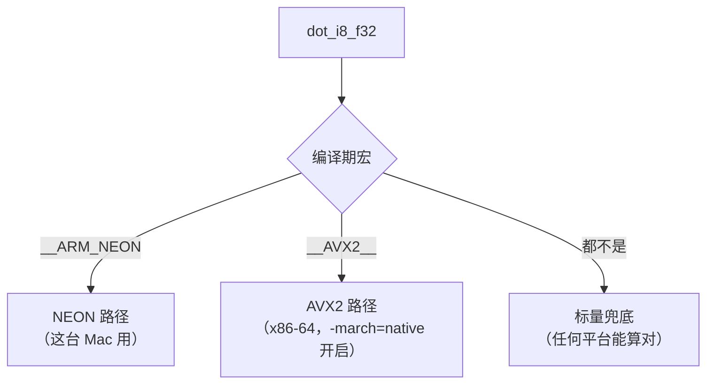

# 10 · SIMD 与矩阵乘法：为什么能快

> 读完这篇你会知道：CPU 一条指令能算几个数、int8 怎么一步步变成 float32、FMA 是什么、NEON 和 AVX2 的区别、以及为什么"内存带宽"才是真正的瓶颈。
> 对应源码：`src/kernel.cpp`（全文，建议对着读）、`src/weights.cpp` 的布局部分。

## 一、矩阵乘法为什么是瓶颈

解码一个 token，MLP 和注意力要做多少次乘加？以 270m 预设（dim=1536，mlp=6144）一层为例：

```
q/k/v/o 投影：4 × 1536 × 1536 ≈ 9.4M 次乘加
gate/up/down：3 × 6144 × 1536  ≈ 28.3M 次乘加
每层合计 ≈ 37.7M，26 层 ≈ 980M 次乘加 = 每个 token 约 20 亿次浮点运算
```

这是每生成一个词的价格。想达到 50 token/s，就需要每秒 1000 亿次运算——单靠"每次循环算一次"的标量代码远远不够。这就是为什么要手写 SIMD。

## 二、标量循环浪费在哪？

最直白的点积代码（标量版）：

```cpp
float sum = 0;
for (int i = 0; i < dim; i++)
    sum += x[i] * w[i];
```

每次迭代：读 x[i]、读 w[i]、乘、加——4 条指令只算 1 个乘加。现代 CPU 一条指令最多算 1 个数，但 CPU 内部有**十几条并行流水线**闲着。

**SIMD（Single Instruction Multiple Data，单指令多数据）**：用一条指令同时算多个数。CPU 有专门的**向量寄存器**（128 位或 256 位宽），可以同时装下：

```
128 位（NEON 一个寄存器）: 4 个 float32，或 8 个 int16，或 16 个 int8
256 位（AVX2 一个寄存器）: 8 个 float32，或 16 个 int16，或 32 个 int8
```

| 执行方式 | 寄存器宽度 | 一条指令同时算 |
|---|---|---|
| 标量 | — | 1 个 float32 |
| NEON（arm64） | 128 位 | 4 个 float32 / 8 个 int16 / 16 个 int8 |
| AVX2（x86-64） | 256 位 | 8 个 float32 / 16 个 int16 / 32 个 int8 |

一条向量指令（如 `vfmaq_f32`）对寄存器里**所有通道同时**做乘加：1 条指令 = 4 个乘加。配合流水线，吞吐接近 4 倍。

## 三、混合类型：int8 权重怎么和 float32 激活值相乘？

SIMD 指令要求两个操作数类型一致。我们手里是 int8 的权重和 float32 的激活值——**必须先统一类型**。选择：把 int8 **扩展**成 float32（激活值没法无损缩成 int8，因为它在运行时才产生）。

扩展是一条"升链"，每一步位宽翻倍、有符号扩展：

```
int8    (8 位,  -128 ~ 127)      vld1_s8    ← 加载 8 个 int8
  │ 符号扩展（负数的符号位要铺满高位，否则 -1 会变成 255）
int16   (16 位, -32768 ~ 32767)  vmovl_s8
  │
int32   (32 位)                   vmovl_s16
  │ 整数 → 浮点（值不变，表示方式变）
float32 (32 位)                   vcvtq_f32_s32
```

每一步都是标准指令。为什么走 int16 中转而不直接 int8→int32？因为 CPU 只提供了"相邻位宽"的扩展指令（8→16、16→32），没有 8→32 直达。

**"符号扩展"是初学者最容易错的概念**：int8 的 −1 是二进制 `11111111`。如果直接当 255 用（零扩展），点积结果就全错。`vmovl_s8` 的 "s" 就是 signed——有符号扩展。我们的测试模型权重正负各半，这个 bug 一旦犯，测试立刻全红。

## 四、FMA：乘加融合

标量路径是"先乘再加"，两条指令、两次舍入。FMA（Fused Multiply-Add，融合乘加）一条指令完成 `a×b+c`：

```
NEON:  vfmaq_f32(acc, x, w)   → acc = acc + x*w   （4 通道同时）
AVX2:  _mm256_fmadd_ps(x, w, acc)                 （8 通道同时）
```

好处：少一次舍入（精度略高）、少一条指令（延迟更低）。"一条指令完成 a*b+c，比先乘后加少一次舍入误差"说的就是它。

## 五、我们的 NEON 内核逐行读（src/kernel.cpp）

```cpp
float dot_i8_f32(const int8_t* w, const float* x, size_t n, float scale) {
    float32x4_t acc0 = vdupq_n_f32(0.0f);   // 两个累加器，初始 0
    float32x4_t acc1 = vdupq_n_f32(0.0f);
    size_t i = 0;
    for (; i + 8 <= n; i += 8) {            // 每轮 8 个元素
        int8x8_t w8 = vld1_s8(w + i);       // ① 加载 8 个 int8
        int16x8_t w16 = vmovl_s8(w8);       // ② 扩展 int16
        float32x4_t wf0 = vcvtq_f32_s32(vmovl_s16(vget_low_s16(w16)));   // ③ 低 4 个
        float32x4_t wf1 = vcvtq_f32_s32(vmovl_s16(vget_high_s16(w16)));  //    高 4 个
        float32x4_t xf0 = vld1q_f32(x + i);      // ④ 加载激活值（本来就是 f32）
        float32x4_t xf1 = vld1q_f32(x + i + 4);
        acc0 = vfmaq_f32(acc0, xf0, wf0);        // ⑤ FMA：acc += x*w
        acc1 = vfmaq_f32(acc1, xf1, wf1);
    }
    float sum = vaddvq_f32(vaddq_f32(acc0, acc1));   // ⑥ 水平求和
    for (; i < n; i++) sum += (float)w[i] * x[i];    // ⑦ 尾巴（不足 8 个）
    return sum * scale;                              // ⑧ scale 只乘一次（09篇）
}
```

逐点讲解：

- **① 8 个 int8 一次加载**。为什么是 8 个一轮而不是 16？因为 128 位的 NEON 寄存器装 16 个 int8 后，扩展成 float32 是 16×4 字节 = 4 个寄存器——**一次处理 16 个会让寄存器压力翻倍**；8 个一轮（2 个 f32 寄存器）是平衡点。AVX2 的 256 位寄存器装 8 个 f32 恰好，所以 x86 版本一轮也是 8 个元素——两边循环形状对齐
- **③ 高低半分**：`vget_low_s16`/`vget_high_s16` 把 8 个 int16 拆成两组 4 个，各自扩成 f32。NEON 寄存器是 128 位（4 个 f32），装不下 8 个 f32——这是 arm64 和 AVX2 的物理差异（128 vs 256 位）
- **⑤ 两个累加器 `acc0/acc1`**：FMA 的延迟约 4 个周期（从输入到结果可用）。如果只有一个累加器，每次 FMA 都要等上一个完成——流水线被"依赖链"卡住。两个独立累加器轮流喂，延迟被掩盖一半。这是手写 SIMD 的基本功：**累加器数量 ≥ 指令延迟**
- **⑥ 水平求和**：`vaddvq_f32` 把寄存器里 4 个数加起来（"垂直"是通道并行，"水平"是跨通道求和）。加上 acc0+acc1，得到标量 sum
- **⑦ 尾巴**：dim 不是 8 的倍数时（比如 1536 % 8 == 0 恰好整除，但通用起见），剩下的几个走标量循环。**永远要处理不整除的尾巴**——我们的单测专门有 9 元素（8+1）的用例
- **⑧ 最后乘 scale**：呼应 09篇的技巧

## 六、三路分支：#if 的哲学

`kernel.cpp` 用编译期宏选路径：

```cpp
#if defined(__ARM_NEON)      // arm64（这台 Mac）：上面的代码
#elif defined(__AVX2__)      // x86-64：_mm256 版本
#else                        // 其他：纯标量兜底
```



- **编译期选择，零运行时开销**——没有 if/else，没有函数指针
- **宏由编译器自动定义**：Apple Silicon 上 clang 自动定义 `__ARM_NEON`（NEON 是 arm64 基线指令集，无需 `-march=native`）；x86-64 上 Makefile 加 `-march=native` 后 `__AVX2__` 生效（AVX2 不是 x86 基线，必须显式开）
- 标量兜底保证"任何平台至少能算对"——慢但正确，也是测试其他路径的参照系

这就是"AVX2 思路"在我们机器上的落地方案：**同一套算法（升链扩展 + FMA + 两累加器 + 尾部标量），两个指令集，一个 fallback**。

## 七、存储布局与缓存：为什么 [输出][输入] 行主序（呼应 02篇）

点积循环读 `w + i` 是**连续内存**。连续访问 = CPU 预取器能提前把后面的数据拉进缓存 = 每个缓存行（64 字节）里的数据全被用上。

如果矩阵按 [输入][输出] 存，某行输出的元素在内存里隔 `dim×4` 字节一跳：每个缓存行只用 4 字节（浪费 94%），内存带宽放大 16 倍。**布局即性能**——所以 02篇说"存储布局要为计算模式服务"。

## 八、真正的瓶颈：内存带宽

解码一个 token，内存要送多少数据？**每 token 必须把全部权重至少读一遍**（~900MB）。原因是解码的 batch 是 1：一次只处理一个 token，每个权重恰好参与一次点积，读完即弃，没有任何复用。对比预填充和训练：一批 N 个 token 同时处理时，权重被 N 次复用，读量摊薄 N 倍；解码摊不了，**每 token 的内存流量 = 权重总量，这是硬下限**——优化只能减小权重（量化），"读一遍全部权重"本身省不掉。

数据送得快慢由内存带宽决定，CPU 算得再快也得等数据。M4 Pro 的总带宽 ~200GB/s（多核），但单线程实际只能吃到 ~30-60GB/s：带宽要打满需要大量并发未完成的内存请求，单个 CPU 核能同时发出的请求数量有限。

```
时间下限 = 900MB / 40GB/s ≈ 22ms/token ≈ 45 token/s（纯带宽上限）
实测 = 11 token/s（90ms/token，含 int8→f32 扩展等开销）
```

| 权重格式 | 每 token 读量 | 带宽上限速度（按单线程 40 GB/s 估） |
|---|---|---|
| float32（不量化） | 3.6 GB | ≈ 11 tok/s |
| int8（量化后） | 900 MB | ≈ 45 tok/s（实测 11，含扩展开销） |

注意实测离上限还有 4 倍——int8→f32 扩展、缓存行为等计算开销也占时间，单线程内核还没吃满带宽。这不改变"每 token 读一遍权重"这个硬下限：**解码不可能比"读一遍全部权重"更快**，权重越小上限越高；模型越大、线程越多，带宽越接近主约束（llama.cpp 的 58.8 tok/s 就是带宽主导的）。

看懂这组数字就能理解两件事：

1. **为什么量化能提速**：int8 权重把每 token 的读量从 3.6GB 降到 900MB——带宽是硬限制，读得少就是快
2. **为什么单线程有上限**：单线程吃不满总带宽。llama.cpp 单线程 19.2 tok/s vs 58.8 tok/s，本质是"谁把单线程的带宽利用得更满"（更少的无效读取、更好的缓存行为）。按每 MAC 吞吐折算，我们的内核与 58.8 tok/s 处于同一水平（那是小 4 倍的模型跑出来的）

> 澄清一个数字："单线程解码 58.8 token/秒"是**真实 270M 模型**（约 245M 次乘加/token）在 Ryzen 5 上的成绩。我们的 270m 预设（参数表见 02篇）每 token 约 980M 次乘加——工作量大 4 倍，11 tok/s 折算后吞吐相当。

## 九、总结

1. 矩阵乘是绝对瓶颈；SIMD 用一条指令算 4/8 个数
2. int8→f32 走"符号扩展升链"：int8→int16→int32→f32，每步位宽翻倍
3. FMA 融合乘加：少一次舍入、低延迟；多累加器打破依赖链
4. NEON（128 位，4 f32）与 AVX2（256 位，8 f32）是同一算法的两个实现，编译期 #if 选择
5. 尾巴（不整除部分）必须标量处理；[输出][输入] 连续布局让缓存行利用率 100%
6. 解码每 token 必须读一遍全部权重（batch=1，无复用），带宽给出速度上限；量化省 3/4 的读取量——单线程 11 tok/s 距上限还有 4 倍，int8→f32 扩展等开销占了大头

## 思考题

1. 把 `dot_i8_f32` 里的两个累加器合并成一个（删掉 acc1 相关行），速度会变吗？用 `time` 测一下 270m 模型。（提示：依赖链）
2. 为什么 NEON 一轮处理 8 个 int8，而不是 16 个？数一下寄存器：16 个 int8 扩成 f32 需要几个 128 位寄存器？
3. `weights.cpp` 里大缓冲区是 64 字节对齐的。这与"缓存行"什么关系？
4. 如果权重不用 int8 而用 int16，每 token 内存流量会怎样变化？速度和内存各受什么影响？
