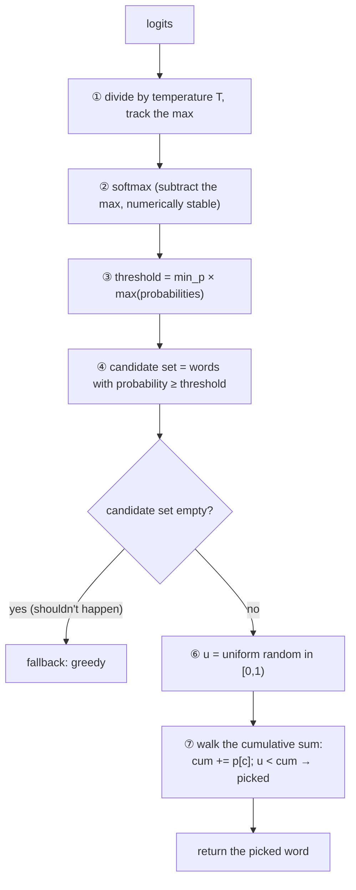

# 11 · Sampling: How the Model "Picks Words"

> By the end of this article you will know: how logits become probabilities, what temperature does, the flaws of greedy/top-k/top-p, why Min-P suits small models, and how random sampling stays reproducible.
> Corresponding source: `src/sampler.cpp` (the whole file), `SplitMix64` / `min_p_sample` in `py/reference_model.py` (bit-identical).

## 1. Starting point: the model outputs "scores", not probabilities

The forward pass ends at the **logits**: 1024 vocabulary words, one score each (positive or negative; higher = "more should be picked").

The first step is always **softmax to probabilities** (formula in Chapter 06):

```
p[i] = exp(logits[i]) / Σⱼ exp(logits[j])
```

Now there are 1024 probabilities summing to 1. **Sampling is picking one word from this pile of probabilities according to some strategy.** The strategy directly determines output style: rigid vs. diverse, fluent vs. gibberish.

## 2. Greedy: always take the highest probability

```cpp
uint32_t Sampler::greedy(std::span<const float> logits) const {
    uint32_t best = 0;
    for (size_t i = 1; i < logits.size(); i++)
        if (logits[i] > logits[best]) best = (uint32_t)i;   // strict >; ties go to the first
    return best;
}
```

Pros: deterministic, simplest to implement. Cons: **always the same answer**, and it easily falls into repetition loops ("and then and then and then…"). Generative AI wants "different every time but always reasonable" — greedy can't deliver that.

## 3. Temperature: why scale logits before softmax?

Temperature acts on softmax **before** it:

```
p[i] = softmax(logits[i] / T)
```

```
T = 0.5: logits are enlarged → gaps widen → sharper distribution → more conservative, more certain
T = 1.0: unchanged
T = 2.0: logits are shrunk → gaps flattened → flatter distribution → more random, more diverse
```

Intuition: T controls randomness. As T → 0 it degenerates into greedy (the largest logit takes all the probability). That's why the code branches straight to greedy when `temp <= 0` (preventing division by zero, and the natural semantic limit anyway).

## 4. Top-K and Top-P: two "pruning" strategies and their flaws

**Top-K**: keep only the K highest-probability words, zero the rest, renormalize. Flaw: K is fixed. With a sharp distribution (the answer is obvious) K=40 lets in a pile of junk; with a flat distribution (100 words are all reasonable) K=40 cuts away reasonable diversity.

**Top-P (nucleus sampling)**: keep the smallest set whose cumulative probability reaches P. More adaptive than Top-K, but still flawed: with a **long-tail distribution**, reaching P requires admitting many tiny-probability words — each almost never chosen, but when one is, it's gibberish.

## 5. Min-P: a dynamic threshold (our choice)

Min-P in one sentence: **use "the highest probability" as the reference and cut every word that falls far short of it**.

```cpp
// 1. find the maximum probability
max_p = max(p);
// 2. threshold = max probability × the min_p coefficient
thr = max_p * min_p;          // min_p=0.1 → threshold = 0.1 × max_p
// 3. keep only p >= thr, renormalize, then sample
```

Example: highest probability 0.3, min_p=0.1 → threshold 0.03; every word with probability < 0.03 is excluded outright.

Why this fixes the previous two's flaws:

- Sharp distribution (max_p=0.9): threshold 0.09, all low-probability words excluded, only the most likely few remain — **equivalent to a very small top-k**
- Flat distribution (max_p=0.02, 100 words all ~0.01): threshold 0.002, everything kept — **equivalent to a very large top-k**
- **K is computed automatically and is always "relative to the current distribution"**, rather than hard-coding a fixed value in advance

For small models with limited expressiveness (like 270M), careless picks are far more damaging, and Min-P's "relative pruning" is steadier than Top-K/P — that's why we chose it.

The complete implementation (`min_p` in `src/sampler.cpp`; every detail has a counterpart in the Python reference — see Section 7):

```cpp
uint32_t Sampler::min_p(std::span<const float> logits, double temp, double min_p) {
    scratch.resize(n);
    const float t = (float)temp;
    float mx = logits[0] / t;
    for (...) mx = max(mx, logits[i]/t);          // ① temperature + max (numerical stability)
    float sum = 0;
    for (...) { scratch[i] = std::exp(logits[i]/t - mx); sum += scratch[i]; }  // ② softmax
    for (...) scratch[i] /= sum;
    float thr = (float)min_p * max(scratch);      // ③ Min-P threshold
    cands = { i : scratch[i] >= thr };            // ④ candidate set
    if (cands.empty()) cands = { greedy(logits) };// ⑤ fallback (shouldn't happen in theory)
    double u = rng.uniform();                     // ⑥ a uniform random number in [0,1)
    double cum = 0;
    for (c : cands) { cum += (double)scratch[c];  // ⑦ walk the cumulative sum
                      if (u < cum) return c; }
    return cands.back();
}
```

Min-P's full flow:



All the strategies together:

| Strategy | How it picks | Flaw | Min-P's answer |
|---|---|---|---|
| Greedy | always the highest probability | same answer forever, repetition loops | — |
| Temperature | scales logits before softmax | only reshapes the distribution, prunes nothing | stacks with Min-P |
| Top-K | keep the K highest | fixed K: junk gets in when sharp, diversity lost when flat | K computed automatically |
| Top-P | smallest set reaching cumulative P | long tails admit many tiny-probability words | relative threshold excludes them |
| Min-P | keep p ≥ max_p × min_p | — | threshold adapts to the distribution |

## 6. Random sampling: cumulative sum + uniform random (hand-computed example)

Say the candidate set is just 3 words with probabilities [0.5, 0.3, 0.2]. How do you "draw by probability"?

```
Cumulative sum (CDF):  word0: [0, 0.5)
                       word1: [0.5, 0.8)
                       word2: [0.8, 1.0)
Draw a uniform random u ∈ [0,1); whichever interval it lands in → that word
u = 0.3 → word0 (probability 0.5); u = 0.62 → word1; u = 0.95 → word2
```

Each interval's width equals that word's probability, so **in the long run the selection frequency equals the probability**. The implementation doesn't store intervals explicitly; it just "accumulates until passing u" (loop ⑦). This is classic inverse transform sampling.

## 7. Determinism: splitmix64 and bit-for-bit agreement

Random sampling uses random numbers, and random numbers make tests unreproducible. The fix: **use a deterministic PRNG — fix the seed and the sequence is fixed**. Our `SplitMix64`:

```cpp
uint64_t next() {
    s += 0x9E3779B97F4A7C15ull;                 // the golden-ratio constant
    uint64_t z = s;
    z = (z ^ (z >> 30)) * 0xBF58476D1CE4E5B9ull; // bit mixing (shift + xor + multiply)
    z = (z ^ (z >> 27)) * 0x94D049BB133111EBull;
    return z ^ (z >> 31);
}
double uniform() { return (double)(next() >> 11) * (1.0/9007199254740992.0); }
```

splitmix64 is only 5 lines, and its quality is ample for sampling. `uniform()` takes the **high 53 bits** of the 64-bit random number (right-shift 11) and multiplies by 2⁻⁵³ to get a double in [0,1) — 53 bits is what a double represents exactly.

**The key engineering decision**: the `SplitMix64` and `min_p_sample` in `py/reference_model.py` replicate these 5 lines **bit for bit** in numpy/Python (same overflow behavior, same 53-bit extraction, same double cumulative walk). So C++ and Python, starting from the same seed, produce **exactly identical** per-token sampling sequences. Our `sampler_test` can therefore assert "sampled results are exactly equal", not "approximately close".

**Watch out for cross-language integer overflow**: Python's int has infinite precision; C++'s uint64_t overflows and wraps. When replicating, you must explicitly truncate with `& 0xFFFFFFFFFFFFFFFF` — omitting that & is the most classic bug in this kind of code.

## 8. The combination: actual CLI usage

`src/main.cpp`:

```cpp
if (a.min_p < 0.0 || a.temp <= 0.0)
    next = sampler.greedy(logits);            // no --minp, or temp≤0 → greedy
else
    next = sampler.min_p(logits, a.temp, a.min_p);  // temperature + Min-P
```

The engine defaults to `temp = 0.7`, `min_p = -1.0` — **omitting `--minp` means greedy** (a negative min_p takes the greedy branch). Random sampling requires explicitly passing `--minp 0.1` (`--temp 0.7 --minp 0.1` is the recommended chat configuration, but it is not the engine default).

Each step of the generation loop calls sampling once, and the picked word is **fed back into the model** (`forward_token`) before sampling the next — the autoregressive loop is just the sampler and the forward pass alternating.

## 9. Summary

1. logits → softmax → probabilities → a sampling strategy picks the word
2. Greedy: most deterministic but repetitive; temperature: scales logits before softmax, reshaping the distribution
3. Top-K is rigid, Top-P leaks long-tail junk; Min-P uses max_p×min_p as a relative threshold, K adapting automatically
4. Drawing by probability = cumulative sum + a uniform random number (interval width = probability)
5. Determinism: splitmix64 with a fixed seed; C++/Python must agree bit-for-bit to assert per-token equality
6. The sampler is the "style" layer: swap strategies without touching the model — only the output distribution changes

## Exercises

1. `greedy` uses a strict `>`, so ties pick the **first** maximum. Change it to `>=` and ties pick the last — what would change? (Hint: np.argmax's behavior, and whether tests still pass)
2. Why does temperature act before softmax rather than after (multiplying probabilities directly)? How do the two differ in shaping the distribution?
3. `scratch` in `min_p` is a reused member buffer. What if two threads called the same Sampler simultaneously? (Hint: our engine is single-threaded — coincidence or design?)
4. Find the verification method in the hand-computed example: what does u=0.999 pick? What if u sits exactly on the boundary 0.5? (Hint: the code is `u < cum`)
