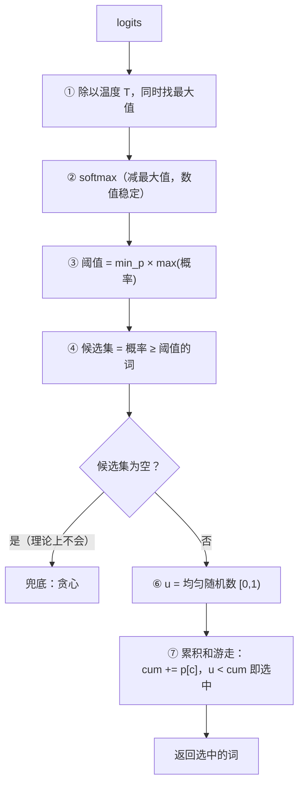

# 11 · 采样策略：模型怎么"选词"

> 读完这篇你会知道：logits 怎么变概率、温度的作用、贪心/top-k/top-p 各自的缺陷、Min-P 为什么适合小模型、以及随机采样怎么做到可复现。
> 对应源码：`src/sampler.cpp`（全文）、`py/reference_model.py` 的 `SplitMix64` / `min_p_sample`（位级一致）。

## 一、起点：模型输出的是"分数"，不是概率

前向计算的终点是 **logits**：词表 1024 个词，每个词一个分数（可正可负，越大越"该选"）。

第一步永远是 **softmax 转概率**（公式见 06篇）：

```
p[i] = exp(logits[i]) / Σⱼ exp(logits[j])
```

现在有 1024 个概率，和恒为 1。**采样（sampling）就是按某种策略从这堆概率里选出一个词。** 策略的选择直接决定输出风格：死板 vs 多样、流畅 vs 胡言乱语。

## 二、贪心：永远选概率最高的

```cpp
uint32_t Sampler::greedy(std::span<const float> logits) const {
    uint32_t best = 0;
    for (size_t i = 1; i < logits.size(); i++)
        if (logits[i] > logits[best]) best = (uint32_t)i;   // 严格 >，平局取先者
    return best;
}
```

优点：确定性、实现最简单。缺点：**永远给出同一个答案**，且容易陷入重复循环（"然后然后然后……"）。生成式 AI 要的是"每次不同但都合理"，贪心给不了。

## 三、温度：为什么先缩放 logits 再 softmax？

温度 temperature 作用在 softmax **之前**：

```
p[i] = softmax(logits[i] / T)
```

```
T = 0.5：logits 被放大 → 高低差距拉大 → 分布尖锐 → 更保守、更确定
T = 1.0：原样
T = 2.0：logits 被缩小 → 高低差距抹平 → 分布平坦 → 更随机、更多样
```

直觉：T 控制随机程度。T → 0 时退化为贪心（最大 logit 独占全部概率）。所以代码里 `temp <= 0` 直接走贪心（防除零，也是语义上的自然极限）。

## 四、Top-K 和 Top-P：两种"修剪"策略及其缺陷

**Top-K**：只保留概率最高的 K 个词，其余清零，重归一化。缺陷：K 是固定值。分布尖锐时（答案很明显）K=40 会放进一堆垃圾；分布平坦时（有 100 个词都合理）K=40 又砍掉了合理的多样性。

**Top-P（核采样）**：保留累计概率达到 P 的最小集合。比 Top-K 自适应，但仍有缺陷：**长尾分布**下，为了凑够 P 会放进大量极小概率的词——每个都几乎不会中，但偶尔抽中就是胡言乱语。

## 五、Min-P：动态阈值（我们的选择）

Min-P 的思路一句话：**以"最高概率"为参照物，砍掉所有远不如它的词**。

```cpp
// 1. 找最大概率
max_p = max(p);
// 2. 阈值 = 最大概率 × min_p 系数
thr = max_p * min_p;          // min_p=0.1 → 阈值 = 0.1 × max_p
// 3. 只保留 p >= thr 的词，重归一化后采样
```

例子：最高概率 0.3，min_p=0.1 → 阈值 0.03，所有概率 < 0.03 的词直接排除。

为什么这解决了前两者的缺陷：

- 分布尖锐时（max_p=0.9）：阈值 0.09，低概率词全部排除，只留最可能的几个——**等价于一个很小的 top-k**
- 分布平坦时（max_p=0.02，100 个词都 ~0.01）：阈值 0.002，全部保留——**等价于一个很大的 top-k**
- **K 是自动算出来的，永远"相对于当下分布"**，而不是事先硬编码一个固定值

对表达能力有限的小模型（如 270M），"乱选"的破坏力大，Min-P 的"相对修剪"比 Top-K/P 更稳——这也是选它的理由。

完整实现（`src/sampler.cpp` 的 `min_p`，注意每个细节都能在 Python 参考里找到对应，见第七节）：

```cpp
uint32_t Sampler::min_p(std::span<const float> logits, double temp, double min_p) {
    scratch.resize(n);
    const float t = (float)temp;
    float mx = logits[0] / t;
    for (...) mx = max(mx, logits[i]/t);          // ① 温度 + 最大值（数值稳定）
    float sum = 0;
    for (...) { scratch[i] = std::exp(logits[i]/t - mx); sum += scratch[i]; }  // ② softmax
    for (...) scratch[i] /= sum;
    float thr = (float)min_p * max(scratch);      // ③ Min-P 阈值
    cands = { i : scratch[i] >= thr };            // ④ 候选集
    if (cands.empty()) cands = { greedy(logits) };// ⑤ 兜底（理论上不会发生）
    double u = rng.uniform();                     // ⑥ [0,1) 均匀随机数
    double cum = 0;
    for (c : cands) { cum += (double)scratch[c];  // ⑦ 累积和游走
                      if (u < cum) return c; }
    return cands.back();
}
```

Min-P 的完整流程：



全部策略放在一起对比：

| 策略 | 怎么选 | 缺陷 | Min-P 的应对 |
|---|---|---|---|
| 贪心 | 恒选概率最高 | 永远同一答案，容易重复循环 | — |
| 温度 | softmax 前缩放 logits | 只调分布形状，不修剪候选 | 与 Min-P 叠加使用 |
| Top-K | 保留概率最高的 K 个 | K 固定：尖锐时混入垃圾，平坦时砍掉多样性 | K 自动算出 |
| Top-P | 保留累计概率达 P 的最小集合 | 长尾分布下放进大量极小概率词 | 相对阈值排除 |
| Min-P | 保留 p ≥ max_p × min_p 的词 | — | 阈值随分布自适应 |

## 六、随机采样：累积和 + 均匀随机数（手算例子）

假设候选集就 3 个词，概率 [0.5, 0.3, 0.2]。怎么"按概率抽"？

```
累积和（CDF）:  词0: [0, 0.5)
                词1: [0.5, 0.8)
                词2: [0.8, 1.0)
取均匀随机数 u ∈ [0,1)，看它落在哪个区间 → 选哪个词
u = 0.3 → 词0（概率 0.5）；u = 0.62 → 词1；u = 0.95 → 词2
```

每个区间宽度 = 该词的概率，所以**长期来看选中频率 = 概率**。实现上不必显式存区间，直接"累加直到超过 u"（⑦的循环）。这就是经典的逆变换采样（inverse transform sampling）。

## 七、确定性：splitmix64 与逐位一致

随机采样靠随机数，随机数让测试不可复现。解法：**用确定性的伪随机数生成器（PRNG），种子固定则序列固定**。我们的 `SplitMix64`：

```cpp
uint64_t next() {
    s += 0x9E3779B97F4A7C15ull;                 // 黄金比例常量
    uint64_t z = s;
    z = (z ^ (z >> 30)) * 0xBF58476D1CE4E5B9ull; // 位混合（移位+异或+乘）
    z = (z ^ (z >> 27)) * 0x94D049BB133111EBull;
    return z ^ (z >> 31);
}
double uniform() { return (double)(next() >> 11) * (1.0/9007199254740992.0); }
```

splitmix64 只有 5 行，质量足以用于采样。`uniform()` 取 64 位随机数的**高 53 位**（右移 11 位），再乘 2⁻⁵³ 得到 [0,1) 的 double——53 位是 double 能精确表示的位数。

**关键工程决策**：`py/reference_model.py` 里的 `SplitMix64` 和 `min_p_sample` 用 numpy/Python 把这 5 行**逐位照搬**（同样的溢出行为、同样的 53 位提取、同样的 double 累积走），于是 C++ 和 Python 从同一个种子出发，生成**逐 token 完全相同**的采样序列。我们的 `sampler_test` 因此可以断言"采样结果精确相等"，而不是"大致接近"。

**小心跨语言的整数溢出**：Python 的 int 是无限精度的，C++ 的 uint64_t 会溢出回绕。照搬时必须 `& 0xFFFFFFFFFFFFFFFF` 显式截断——漏掉这个 & 是这类代码最经典的 bug。

## 八、组合拳：CLI 里的实际用法

`src/main.cpp`：

```cpp
if (a.min_p < 0.0 || a.temp <= 0.0)
    next = sampler.greedy(logits);            // 不给 --minp 或 temp≤0 → 贪心
else
    next = sampler.min_p(logits, a.temp, a.min_p);  // 温度 + Min-P
```

引擎默认 `temp = 0.7`、`min_p = -1.0`——**不传 `--minp` 就是贪心**（min_p 为负走贪心分支）。要随机采样必须显式传 `--minp 0.1`（`--temp 0.7 --minp 0.1` 是推荐的对话配置，但引擎默认不是它）。

生成循环每步调一次采样，选出的词**喂回模型**（`forward_token`），再采样下一个词——自回归的循环就是采样器和前向计算的交替。

## 九、总结

1. logits → softmax → 概率 → 采样策略选词
2. 贪心：最确定但重复；温度：softmax 前缩放 logits，调节分布形状
3. Top-K 死板、Top-P 长尾漏垃圾；Min-P 用 max_p×min_p 做相对阈值，K 自适应
4. 按概率抽样 = 累积和 + 均匀随机数（区间宽度 = 概率）
5. 确定性：splitmix64 固定种子；C++/Python 逐位一致才能逐 token 断言相等
6. 采样器是"风格"层：换策略不改模型，只改输出分布

## 思考题

1. `greedy` 用 `>` 严格比较，平局取**第一个**最大值。如果改成 `>=`，平局取最后一个——会改变什么？（提示：np.argmax 的行为、测试是否还能通过）
2. 温度为什么作用在 softmax 之前而不是之后（直接乘概率）？两者对分布形状的影响有什么不同？
3. `min_p` 里 `scratch` 是复用的成员缓冲区。如果两个线程同时调用同一个 Sampler 会怎样？（提示：我们的引擎是单线程的——这是巧合还是设计？）
4. 找出手算例子里的验证方法：u=0.999 选什么词？u 恰好在边界 0.5 上呢？（提示：代码是 `u < cum`）
