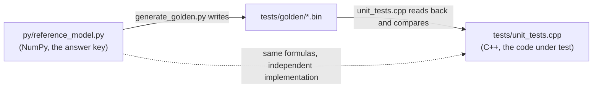

# 12 · Testing Strategy: How to Prove "the Math Is Right"

> By the end of this article you will know: why an inference engine must be tested layer by layer, how the golden-file scheme is built, how floating-point tolerances are chosen, why some assertions must be "exactly equal" — and complete retrospectives of three real bugs, all of which the tests caught.
> Corresponding source: `py/generate_golden.py` `py/reference_model.py` (reference side), `tests/unit_tests.cpp` `tests/integration.cpp` (assertion side).

## 1. Why isn't end-to-end testing enough?

Beginners often think: "Run one inference; if the output looks reasonable, we're done."

The problem: an inference engine is 26 layers × a dozen operators in series. **When the end-to-end result is wrong, you only know "it's wrong" — not which layer** — and debugging means peeling it layer by layer, which is extremely inefficient. And "the output looks reasonable" is a very weak signal: a random-weight model outputting gibberish is reasonable, and a quantization error of ±1% also "looks reasonable" — but the latter may be a bug.

The industrial approach: **compare each layer against a reference implementation**. Every operator's output is checked against an "absolutely correct" reference answer, so any layer's error is localized to that layer immediately.

## 2. The golden-file scheme: Python computes once, C++ reads back and compares

The scheme has three steps:

**Step 1: write the "answer key"** — `py/reference_model.py` reimplements the entire forward pass in NumPy (about 150 lines). It uses the **same formulas** as the C++ but is an independent implementation — two codebases making the same mistake is far less likely than one.

**Step 2: generate golden data** — `py/generate_golden.py` runs the reference and saves every intermediate result to disk:

```
tests/golden/
  embedding_out.bin   embedding layer output [8, 256]
  norm_a.bin          per-layer normalization output before attention [2, 8, 256]
  attn_out.bin        per-layer attention output
  norm_f.bin / mlp_out.bin   the MLP side
  final_norm_out.bin / logits.bin
  rope_out.bin, softmax_out.bin, mm_i8.bin ...  standalone per-operator cases
```

**Step 3: C++ tests read back and compare** — the 13 tests in `tests/unit_tests.cpp`, each covering one operator or one layer.



One key detail: **the golden data is generated with "dequantized weights"**. C++ computes with `int8 × scale`, and the Python reference also does `q.astype(f32) * scale` first — both sides are fed **the same source data**. That way the tests' differences reflect only "implementation differences" (accumulation order, etc.), not quantization differences. Quantization itself (the Python script) is covered by the two-sides format consistency checks (Chapter 02) and separate assertions.

## 3. Where tolerances come from: fp32 accumulation order

Same formulas, same source data — yet C++ and NumPy still won't agree **exactly**: floating-point addition isn't associative — `(a+b)+c ≠ a+(b+c)` (different rounding moments, different final bits).

- C++: sequential FMA accumulation (`acc = acc + x*w`, one chain)
- NumPy: blocked pairwise summation (`np.sum`'s internal algorithm)

How do you estimate the magnitude? One addition's relative error ≤ machine epsilon ≈ 1.2e-7 (fp32). For n accumulations the worst case is ~n·ε·Σ|terms|, with typical values far below the worst. Measured on our config: a 256-dim dot product differs by ~3e-5; a 1024-dim MLP dot product can hit ~1% relative on **heavily canceling elements** (many positive and negative terms canceling), with typical elements two orders of magnitude smaller.

Hence the tiered tolerances (`tests/unit_tests.cpp`):

```cpp
CHECK_NEAR(x, y, 2e-3f, 1e-3f);   // ordinary operators: |x−y| ≤ atol + rtol·|y|
CHECK_NEAR(x, y, 2e-3f, 3e-3f);   // attn_out: worst-case ~0.2% relative at heavy cancellation
CHECK_NEAR(x, y, 2e-3f, 2e-2f);   // mlp_out: largest magnitude (~100), GeGLU amplifies noise, worst ~1% relative
CHECK_NEAR(x, y, 1e-4f, 1e-5f);   // softmax probabilities: bounded output, small error
```

| Compared quantity | Tolerance (atol, rtol) | Basis |
|---|---|---|
| Ordinary operators | 2e-3, 1e-3 | noise estimate + margin |
| attn_out | 2e-3, 3e-3 | measured worst ~0.2% relative at heavy cancellation |
| mlp_out | 2e-3, 2e-2 | measured worst ~1% relative (GeGLU amplification + 1024-term dot product) |
| softmax probabilities | 1e-4, 1e-5 | bounded output, small error |
| sampling / token sequences | exact equality | integer path, no float noise |

**The tolerance basis is "noise estimate + measured margin"**, not arbitrary. Too tight → false alarms (treating float noise as a bug); too loose → missed bugs. Our integration test's measured max deviation is 3.4e-5 against a tolerance of 2e-3 — a 60× margin: no false alarms, still sensitive.

## 4. When must it be "exactly equal"?

Two kinds of assertions can't carry a tolerance:

1. **Integer paths**: token sequences, sampling results — no float noise, so they should be **exactly equal, id for id**. `sampler_test` asserts 8 Min-P samples match Python exactly (via the bit-for-bit agreement of Section 7), and `integration.cpp` asserts the 64 greedy tokens are identical to the reference sequence
2. **Exactly derivable floats**: int8 → f32 multiplication is on both sides "integer converted to float × the same scale", which IEEE 754 guarantees to be **bit-identical**. `dequant_row_test` uses a direct `CHECK_EQ` (==) — not because we didn't want a tolerance, but because it's mathematically exact

**Tolerance is for order-dependent float accumulation, not an excuse for every float comparison.**

## 5. End-to-end testing and near-tie diagnostics

All layer tests green ≠ the assembly is right (the **wiring** between layers is still unverified). That's `integration.cpp`'s job: run 64 steps of greedy decoding end to end and compare the token sequence against `py/e2e_reference.py` id for id.

A useful diagnostic design: when a greedy token mismatches, print **the logit difference between both sides**:

```cpp
if (next != ref_tokens[step]) {
    float own = logits[next], ref = logits[ref_tokens[step]];
    printf("MISMATCH ... margin=%g%s\n", ref - own,
           fabs(ref - own) < 2e-4f ? " (near-tie, benign)" : "");
}
```

**Why?** Greedy is argmax. If first and second place differ by only 1e-5 (a "near-tie"), the noise from fp32 accumulation order is enough for the two sides to pick different argmaxes — a **benign difference**, not a bug. A large margin (say 80) is the real problem. The diagnostic output directly separates the two cases: noise-level differences (tolerate / change the seed) versus structural errors (go find the bug). During development it quickly localized the "duplicate entry" bug for us: the margin was 80+, instantly showing state divergence rather than float noise.

## 6. Retrospectives of three real bugs (all really happened in this repo's development)

### Bug 1: RoPE in-place aliasing (detailed in Chapter 05)

```python
x0, x1 = x[..., 0::2], x[..., 1::2]   # views, not copies
x[..., 0::2] = x0 * c - x1 * s
x[..., 1::2] = x0 * s + x1 * c       # x0 is already contaminated!
```

**Caught by**: `rope_test` — C++ results mismatched the golden data, and the deviation rose and fell with dimension (high-dim pairs have small angles, less contamination); that "patterned" deviation was itself the clue.
**Lesson**: for in-place operations, ask about read/write dependencies first; view/pointer reuse is where errors happen most.

### Bug 2: the k/v projection shapes (detailed in Chapter 07)

Under GQA, k_proj should be `[64][256]`; the first version wrote `[256][256]`. Generator and loader were "consistently wrong" until the attention code overflowed its buffer and every golden test went red.
**Caught by**: the file-size check + per-layer golden data — if either side changes a shape without the other following, the size check rejects immediately.
**Lesson**: the format's shape source must be derived from a single point; "consistently wrong on both sides" is exposed only by disagreeing with the third-party reference (NumPy).

### Bug 3: duplicate entries (detailed in Chapter 01)

`" "` was both a word piece and a byte token. C++'s map keeps the first; Python's dict keeps the last — the same prompt encoded into different token sequences on each side.
**Caught by**: the integration test's token mismatch + the near-tie diagnostic showing a huge margin (real divergence).
**Lesson**: key uniqueness is an iron law of vocabularies; when two languages implement the same data structure, duplicate-key semantics must be aligned.

| Bug | Essence | Caught by | Lesson |
|---|---|---|---|
| RoPE in-place aliasing | Python view contamination (read old values, then write new) | rope_test: deviation patterned by dimension | ask about read/write dependencies before in-place ops |
| k/v projection shapes | generator and loader "consistently wrong" | file-size check + all golden tests red | single-point shape derivation, isomorphic on both sides |
| Duplicate entries | C++/Python duplicate-key semantics differ | integration test token divergence (huge margin) | key uniqueness is an iron law; align cross-language semantics |

The three bugs share one trait: **all are inconsistencies "between two implementations"** (C++ vs Python reference, generator vs loader, map vs dict). That is precisely what golden testing is designed to find — it specifically targets "each side is right on its own, wrong together".

## 7. Hot-path discipline: engineering habits pushed by tests

For tests to be reproducible, **every input must be deterministic**: fixed random seeds (weight-generation seed 20260818, sampling seed 42), fixed prompt, no clock dependency. A side effect was an engineering discipline: **zero allocations on the decode hot path** (all buffers pre-allocated at construction). Tests make "fully deterministic state at every step" possible, and determinism makes "exact equality" assertions possible. Good tests aren't a burden — they feed back into better design.

## 8. Hands-on challenge

Having finished all 12 articles, here's how to check whether you've truly mastered it:

1. **Swap the activation**: replace SiLU with GELU (the approximation `0.5x(1+tanh(sqrt(2/π)(x+0.044715x³)))`), changing **both** `src/ops.cpp` and `py/reference_model.py`, then `make test` — it should stay all green. This verifies you understand "reference and implementation must agree"
2. **Change only one side**: change only the C++, not the Python — `make test` should go red, and you should be able to identify the operator from the failing test's name alone
3. **Add an operator**: add a Dropout layer to the model (identity at inference), walking the full chain: change the format (tensor_order + expected_file_size on both sides) → change the model → change the reference → regenerate golden → all tests green. Walk this chain end to end and you've mastered every skill needed to "extend an inference engine"

## 9. Summary

1. Per-layer golden comparison: localized to the operator, not just "the output is wrong"
2. The reference uses dequantized weights (same source data), leaving accumulation order as the only difference
3. Tiered tolerances = noise estimate + margin; integer paths and bit-derivable floats must be exactly equal
4. Near-tie diagnostics separate "float noise" from "true divergence"
5. All three real bugs were "two implementations disagreeing" — exactly golden testing's target
6. Determinism (fixed seeds) is the precondition for "exact assertions", and it pushed the zero-allocation hot-path design

## Exercises

1. Why must `sampler_test`'s 8 sampling assertions be exactly equal, while the `logits` comparison uses a tolerance? What are each one's error sources?
2. If tomorrow someone changed `kernel.cpp`'s accumulation order to "accumulate two segments, then merge", which tests would go red and which wouldn't? Why?
3. Why didn't we use a test framework like GoogleTest? (Hint: the zero-dependency principle; is a 40-line macro enough?)
