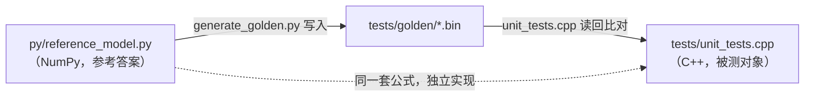

# 12 · 测试策略：怎么证明"算对了"

> 读完这篇你会知道：为什么推理引擎必须逐层测试、golden 文件方案怎么搭、浮点误差怎么定容差、为什么有些断言必须"精确相等"、以及三个真实 bug 的完整回顾——它们都是被测试抓住的。
> 对应源码：`py/generate_golden.py` `py/reference_model.py`（参考侧）、`tests/unit_tests.cpp` `tests/integration.cpp`（断言侧）。

## 一、为什么端到端测试不够？

初学者常想："跑一次推理，输出看着合理不就完了？"

问题：推理引擎是 26 层 × 十几个算子的串联。**端到端结果错了一层，你只知道"错了"，不知道错在哪层**——排查要一层层拆，效率极低。而且"输出看着合理"是个极弱的信号：随机权重的模型输出乱码是合理的，量化误差 ±1% 也是"看起来合理"的，但后者可能就是 bug。

工业级的做法：**逐层对照参考实现**。每个算子的输出都和一个"绝对正确"的参考答案比对，任何一层出错立刻定位到层。

## 二、Golden 文件方案：Python 算一遍，C++ 读回来比

整个方案三步：

**第 1 步：写一个"参考答案"**——`py/reference_model.py`，用 NumPy 把整个前向计算再实现一遍（约 150 行）。它和 C++ 用的是**同一套公式**，但独立实现——两套代码犯同样错误的概率远低于一套。

**第 2 步：生成 golden 数据**——`py/generate_golden.py` 跑参考答案，把每个中间结果存盘：

```
tests/golden/
  embedding_out.bin   嵌入层输出 [8, 256]
  norm_a.bin          每层注意力前归一化输出 [2, 8, 256]
  attn_out.bin        每层注意力输出
  norm_f.bin / mlp_out.bin   MLP 侧
  final_norm_out.bin / logits.bin
  rope_out.bin、softmax_out.bin、mm_i8.bin ...  各算子的独立用例
```

**第 3 步：C++ 测试读回比对**——`tests/unit_tests.cpp` 的 13 个测试，每个覆盖一个算子或一层。



关键细节：**golden 用"反量化后的权重"生成**。C++ 算的是 `int8 × scale`，Python 参考也先做 `q.astype(f32) * scale` 再算——两边喂的是**同源数据**。这样测试的差异只反映"实现差异"（累加顺序等），不反映量化差异。量化本身（Python 脚本）由格式两侧一致性校验（02篇）和单独断言覆盖。

## 三、容差从哪来：fp32 累加顺序

同一公式、同源数据，C++ 和 NumPy 的结果也不会**完全相同**——浮点加法不满足结合律：`(a+b)+c ≠ a+(b+c)`（舍入时机不同，末尾位不同）。

- C++：顺序 FMA 累加（`acc = acc + x*w` 一条链）
- NumPy：分块两两求和（pairwise summation，`np.sum` 的内部算法）

差异量级怎么估？一次加法的相对误差 ≤ 机器精度 ε ≈ 1.2e-7（fp32）。n 次累加最坏 ~n·ε·Σ|项|，典型值远小于最坏值。实测我们的配置：256 维点积差 ~3e-5；1024 维 MLP 点积在**重抵消元素**（大量正负项相消）上最坏可达 ~1% 相对，典型元素小两个数量级。

于是容差分级（`tests/unit_tests.cpp`）：

```cpp
CHECK_NEAR(x, y, 2e-3f, 1e-3f);   // 一般算子：|x−y| ≤ atol + rtol·|y|
CHECK_NEAR(x, y, 2e-3f, 3e-3f);   // attn_out：点积重抵消处最坏 ~0.2% 相对
CHECK_NEAR(x, y, 2e-3f, 2e-2f);   // mlp_out：幅度最大（~100），GeGLU 放大噪声，最坏 ~1% 相对
CHECK_NEAR(x, y, 1e-4f, 1e-5f);   // softmax 概率：输出有界，误差小
```

| 比较对象 | 容差 (atol, rtol) | 依据 |
|---|---|---|
| 一般算子 | 2e-3, 1e-3 | 噪声估计 + 余量 |
| attn_out | 2e-3, 3e-3 | 重抵消处实测最坏 ~0.2% 相对 |
| mlp_out | 2e-3, 2e-2 | 实测最坏 ~1% 相对（GeGLU 放大 + 1024 项点积） |
| softmax 概率 | 1e-4, 1e-5 | 输出有界，误差小 |
| 采样 / token 序列 | 精确相等 | 整数路径，无浮点噪声 |

**容差的依据是"噪声估计 + 实测余量"**，不是随意定的。过紧 → 误报（把浮点噪声当 bug）；过松 → 漏报（真 bug 溜过去）。我们的集成测试实测最大偏差 3.4e-5，容差 2e-3——60 倍余量，既不会误报也足够灵敏。

## 四、什么时候必须"精确相等"？

两类断言不能带容差：

1. **整数路径**：token 序列、采样结果——没有浮点噪声，就该**逐 id 完全相等**。`sampler_test` 断言 8 次 Min-P 采样与 Python 完全一致（靠第七节说的逐位一致），`integration.cpp` 断言 64 个贪心 token 与参考序列逐 id 相同
2. **精确可推导的浮点**：int8 → f32 的乘法在两边都是"整数转浮点 × 同值 scale"，IEEE 754 保证结果**位级相同**。`dequant_row_test` 直接 `CHECK_EQ`（== 比较）——不是不想给容差，是数学上就该精确

**容差是给"顺序相关"的浮点累加用的，不是给所有浮点比较的借口。**

## 五、端到端测试与 near-tie 诊断

逐层测试全绿 ≠ 拼起来一定对（层与层之间的**接线**还没验证）。`integration.cpp` 干这个：完整跑 64 步贪心解码，和 `py/e2e_reference.py` 的 token 序列逐 id 比对。

一个有用的诊断设计：贪心 token 对不上时，打印**两侧 logits 的差值**：

```cpp
if (next != ref_tokens[step]) {
    float own = logits[next], ref = logits[ref_tokens[step]];
    printf("MISMATCH ... margin=%g%s\n", ref - own,
           fabs(ref - own) < 2e-4f ? " (near-tie, benign)" : "");
}
```

**为什么？** 贪心是 argmax。如果第一名和第二名只差 1e-5（"near-tie"，近似并列），fp32 累加顺序的噪声就足以让两边选出不同的 argmax——这是**良性差异**，不是 bug。margin 大（比如 80）才是真问题。诊断输出直接区分两种情况：噪声级差异（宽容对待/换种子）还是结构性错误（去查 bug）。开发中它帮我们迅速定位了"重复词条"bug：margin 高达 80+，一眼看出是状态分叉而非浮点噪声。

## 六、三个真实 bug 的回顾（都在本仓库的开发中真实发生）

### Bug 1：RoPE 原地别名（05篇详述）

```python
x0, x1 = x[..., 0::2], x[..., 1::2]   # 视图，不是拷贝
x[..., 0::2] = x0 * c - x1 * s
x[..., 1::2] = x0 * s + x1 * c       # x0 已被污染！
```

**被谁抓住**：`rope_test`——C++ 结果与 golden 对不上，且差值随维度递增递减（高维对角度小、污染小），这个"有规律"的模式本身就是线索。
**教训**：原地操作先问"读写依赖"；视图/指针复用是最容易出错的地方。

### Bug 2：k/v 投影形状（07篇详述）

GQA 下 k_proj 应是 `[64][256]`，第一版写成了 `[256][256]`。生成器和加载器"一致地错"，直到注意力代码缓冲区溢出、golden 全红。
**被谁抓住**：文件大小校验 + 逐层 golden——任何一侧想改形状，另一侧不跟进，大小校验立刻拒绝。
**教训**：格式的形状来源必须单点派生；"两侧一致地错"要靠"与第三方参照（NumPy 参考）对不上"来暴露。

### Bug 3：重复词条（01篇详述）

`" "` 同时是 word piece 和 byte token。C++ 的 map 保留第一个，Python 的 dict 保留最后一个——同一个 prompt 两边编码出不同 token 序列。
**被谁抓住**：集成测试 token 对不上 + near-tie 诊断显示 margin 巨大（真分叉）。
**教训**：键的唯一性是词表铁律；跨语言实现同一数据结构时，重复键的语义必须对齐。

| Bug | 本质 | 被谁抓住 | 教训 |
|---|---|---|---|
| RoPE 原地别名 | Python 视图污染（先读旧值、再写新值） | rope_test：差值随维度有规律 | 原地操作先问读写依赖 |
| k/v 投影形状 | 生成器与加载器"一致地错" | 文件大小校验 + golden 全红 | 形状单点派生，两侧同构 |
| 重复词条 | C++/Python 重复键语义不同 | 集成测试 token 分叉（margin 巨大） | 键唯一性铁律，跨语言语义对齐 |

这三个 bug 有一个共同点：**全是"两个实现之间"的不一致**（C++ vs Python 参考、生成器 vs 加载器、map vs dict）。这正是 golden 测试的设计目标——它专门定位这类"各自都对、合起来错"的问题。

## 七、热路径纪律：测试推动的工程习惯

测试要可复现，就要求**一切输入确定**：固定随机种子（权重生成 seed 20260818、采样 seed 42）、固定 prompt、无时钟依赖。顺带收获了一个工程纪律：**解码热路径零内存分配**（所有缓冲区构造时预分配）——测试让"每步状态完全确定"成为可能，确定性又让"精确相等"断言成为可能。好测试不是负担，它能反过来改进设计。

## 八、动手实验：给你的挑战

学完 12 篇，怎么检验你是否真正掌握：

1. **换激活函数**：把 SiLU 换成 GELU（近似版 `0.5x(1+tanh(sqrt(2/π)(x+0.044715x³)))`），**同时改** `src/ops.cpp` 和 `py/reference_model.py`，重新 `make test`——应该全绿。这验证你理解了"参考与实现必须一致"
2. **只改一边**：只改 C++ 不改 Python，`make test` 应该红——并且你能从红的测试名直接定位到算子
3. **加一个算子**：给模型加一个 Dropout（推理时恒等）层，走完整流程：改格式（tensor_order + expected_file_size 双侧）→ 改模型 → 改参考 → 重新生成 golden → 测试全绿。走通这条链路，你就完整掌握了"扩展一个推理引擎"的全部技能

## 九、总结

1. 逐层 golden 对照：定位到算子，而不是"输出不对"
2. 参考用反量化后的权重（同源数据），差异只剩累加顺序
3. 容差分级 = 噪声估计 + 余量；整数路径和位级可推导的浮点必须精确相等
4. near-tie 诊断区分"浮点噪声"和"真分叉"
5. 三个真实 bug 全是"两个实现不一致"——正是 golden 测试的目标
6. 确定性（固定种子）是"精确断言"的前提，也推动了热路径零分配的好设计

## 思考题

1. 为什么 `sampler_test` 的 8 次采样断言必须精确相等，而 `logits` 的比对用容差？两者的误差来源分别是什么？
2. 如果明天有人把 `kernel.cpp` 的累加顺序改成"两段累加再合并"，哪些测试会红、哪些不会？为什么？
3. 我们为什么没有用 GoogleTest 等测试框架？（提示：零依赖原则；40 行宏够不够用）
